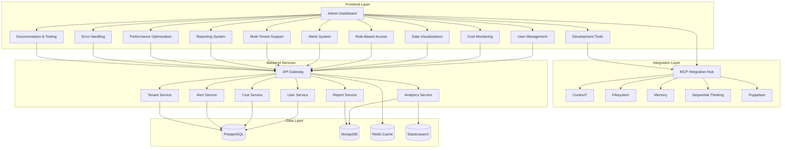
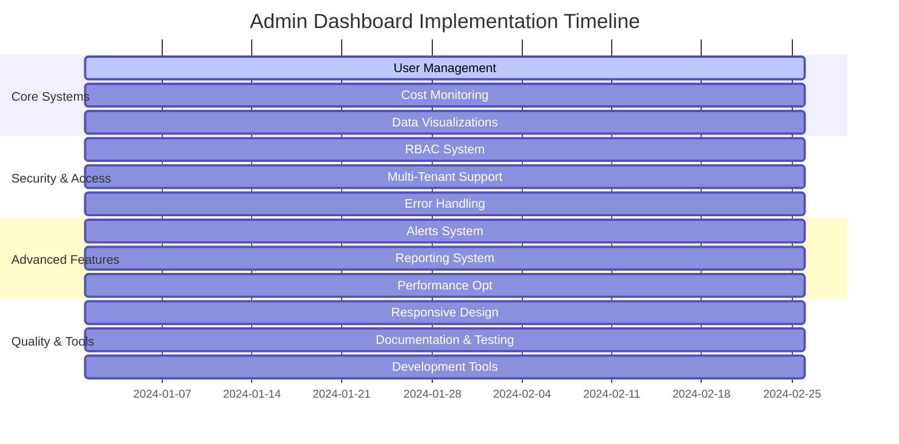

.# Enterprise-Grade Admin Dashboard Implementation Summary

## Overview

This document provides a comprehensive summary of the enterprise-grade admin dashboard implementation plan, integrating all major components and systems into a cohesive architecture. The dashboard will provide advanced user management, real-time monitoring, interactive analytics, and comprehensive administrative capabilities.

## Architecture Overview

### System Architecture Diagram

## Core Components Summary

### 1. Advanced User Management System
**Documentation:** [`admin-dashboard-user-management.md`](admin-dashboard-user-management.md)

**Key Features:**
- Comprehensive user CRUD operations
- Bulk user management capabilities
- Advanced filtering and search
- Role-based user assignments
- User analytics and reporting
- Multi-factor authentication support

**Implementation Timeline:** 8 weeks
**Success Metrics:** User management efficiency, bulk operation success rate, user satisfaction

### 2. Real-Time Cost Monitoring
**Documentation:** [`admin-dashboard-cost-monitoring.md`](admin-dashboard-cost-monitoring.md)

**Key Features:**
- Real-time cost tracking for APIs, hosting, databases
- Budget management and alerts
- Cost optimization recommendations
- Predictive cost modeling
- Multi-tenant cost allocation
- Cost analytics and reporting

**Implementation Timeline:** 8 weeks
**Success Metrics:** Cost visibility improvement, budget adherence, optimization savings

### 3. Interactive Data Visualizations
**Documentation:** [`admin-dashboard-data-visualizations.md`](admin-dashboard-data-visualizations.md)

**Key Features:**
- Advanced chart library integration
- Real-time data streaming
- Interactive exploration tools
- Custom visualization builder
- Mobile-responsive charts
- Export and sharing capabilities

**Implementation Timeline:** 8 weeks
**Success Metrics:** User engagement, data exploration depth, visualization performance

### 4. Role-Based Access Control
**Documentation:** [`admin-dashboard-role-based-access.md`](admin-dashboard-role-based-access.md)

**Key Features:**
- Granular permission system
- Role hierarchy management
- Attribute-based access control
- Just-in-time access
- Delegated administration
- Comprehensive audit logging

**Implementation Timeline:** 8 weeks
**Success Metrics:** Access control accuracy, security incident reduction, compliance adherence

### 5. Automated Alerts System
**Documentation:** [`admin-dashboard-alerts-system.md`](admin-dashboard-alerts-system.md)

**Key Features:**
- Intelligent alerting with AI
- Multi-channel notifications
- Alert correlation and grouping
- Escalation workflows
- Alert suppression rules
- Performance monitoring

**Implementation Timeline:** 8 weeks
**Success Metrics:** Alert accuracy, MTTR reduction, user satisfaction

### 6. Multi-Tenant Support
**Documentation:** [`admin-dashboard-multi-tenant.md`](admin-dashboard-multi-tenant.md)

**Key Features:**
- Tenant isolation strategies
- Resource allocation management
- Tenant-specific configurations
- Billing and subscriptions
- Compliance and security
- Tenant analytics

**Implementation Timeline:** 8 weeks
**Success Metrics:** Tenant isolation effectiveness, resource utilization, tenant satisfaction

### 7. Comprehensive Reporting System
**Documentation:** [`admin-dashboard-reporting-system.md`](admin-dashboard-reporting-system.md)

**Key Features:**
- Interactive report builder
- Multi-format export capabilities
- Scheduled report generation
- Business intelligence features
- Distribution management
- Report collaboration

**Implementation Timeline:** 8 weeks
**Success Metrics:** Report generation speed, user satisfaction, export success rates

### 8. Performance Optimization
**Documentation:** [`admin-dashboard-performance-optimization.md`](admin-dashboard-performance-optimization.md)

**Key Features:**
- Lazy loading strategies
- Multi-level caching system
- Intelligent preloading
- Performance monitoring
- Resource optimization
- Scalability architecture

**Implementation Timeline:** 8 weeks
**Success Metrics:** Page load time reduction, cache hit rate, system performance

### 9. Cross-Browser Compatibility & Responsive Design
**Documentation:** [`admin-dashboard-responsive-design.md`](admin-dashboard-responsive-design.md)

**Key Features:**
- Mobile-first responsive design
- Cross-browser compatibility
- Touch and gesture support
- Progressive enhancement
- Performance optimization
- Accessibility compliance

**Implementation Timeline:** 8 weeks
**Success Metrics:** Browser compatibility score, mobile usability, performance consistency

### 10. Comprehensive Error Handling
**Documentation:** [`admin-dashboard-error-handling.md`](admin-dashboard-error-handling.md)

**Key Features:**
- Advanced error boundaries
- Intelligent recovery mechanisms
- User-friendly error messages
- Real-time error monitoring
- Error analytics and reporting
- Automated error resolution

**Implementation Timeline:** 8 weeks
**Success Metrics:** Error detection rate, recovery success rate, user satisfaction

### 11. Documentation and Testing
**Documentation:** [`admin-dashboard-documentation-testing.md`](admin-dashboard-documentation-testing.md)

**Key Features:**
- Interactive documentation system
- Automated testing pipelines
- Component-level testing
- Quality assurance tools
- Performance testing
- Accessibility testing

**Implementation Timeline:** 8 weeks
**Success Metrics:** Documentation completeness, test coverage, code quality

### 12. Development Tools and MCP Integration
**Documentation:** [`admin-dashboard-development-tools.md`](admin-dashboard-development-tools.md)

**Key Features:**
- MCP integration hub
- AI-powered development assistant
- Code generation tools
- Performance profiling
- Development analytics
- Advanced debugging tools

**Implementation Timeline:** 8 weeks
**Success Metrics:** Developer productivity, code quality enhancement, tool adoption

## Implementation Strategy

### Phase-Based Implementation

**Phase 1: Foundation (Weeks 1-2)**
- Core architecture setup
- Basic user management
- Simple cost monitoring
- Foundation components

**Phase 2: Core Features (Weeks 3-4)**
- Advanced user management
- Real-time cost monitoring
- Basic data visualizations
- Role-based access control

**Phase 3: Advanced Features (Weeks 5-6)**
- Alerts system
- Multi-tenant support
- Reporting system
- Performance optimization

**Phase 4: Polish and Integration (Weeks 7-8)**
- Responsive design
- Error handling
- Documentation and testing
- Development tools

### Parallel Development Approach

## Technology Stack

### Frontend Technologies
- **Framework:** Next.js 14 with React 18
- **Language:** TypeScript
- **Styling:** Tailwind CSS with custom design system
- **State Management:** Zustand with React Query
- **Charts:** D3.js, Recharts, Victory
- **Testing:** Jest, React Testing Library, Cypress
- **Documentation:** Storybook with MDX

### Backend Technologies
- **API:** RESTful APIs with GraphQL support
- **Authentication:** OAuth 2.0, JWT, SAML
- **Database:** PostgreSQL (primary), MongoDB (analytics)
- **Cache:** Redis with multi-level caching
- **Search:** Elasticsearch for advanced search
- **Queue:** Redis Bull for background jobs

### Integration Technologies
- **MCP Servers:** Context7, Filesystem, Memory, Sequential Thinking
- **AI/ML:** OpenAI API, custom ML models
- **Monitoring:** DataDog, New Relic
- **Analytics:** Google Analytics, Mixpanel
- **Notifications:** SendGrid, Twilio, Slack

## Security Architecture

### Security Layers
1. **Authentication Layer**
   - Multi-factor authentication
   - SSO integration
   - Session management
   - Token-based security

2. **Authorization Layer**
   - Role-based access control
   - Attribute-based access control
   - Permission inheritance
   - Dynamic permissions

3. **Data Protection Layer**
   - Encryption at rest and in transit
   - Data masking
   - Audit logging
   - Compliance enforcement

4. **Network Security Layer**
   - API rate limiting
   - DDoS protection
   - SSL/TLS encryption
   - Secure headers

## Performance Architecture

### Performance Optimization Strategies
1. **Frontend Optimization**
   - Code splitting and lazy loading
   - Image optimization
   - Bundle optimization
   - Caching strategies

2. **Backend Optimization**
   - Database optimization
   - API response caching
   - Connection pooling
   - Query optimization

3. **Infrastructure Optimization**
   - CDN integration
   - Load balancing
   - Auto-scaling
   - Geographic distribution

## Monitoring and Analytics

### Monitoring Stack
1. **Application Monitoring**
   - Real-time performance metrics
   - Error tracking and alerting
   - User experience monitoring
   - System health monitoring

2. **Business Analytics**
   - User behavior tracking
   - Feature usage analytics
   - Conversion tracking
   - Revenue analytics

3. **Infrastructure Monitoring**
   - Server performance
   - Database performance
   - Network monitoring
   - Resource utilization

## Quality Assurance

### Testing Strategy
1. **Unit Testing**
   - Component testing
   - Function testing
   - Utility testing
   - Coverage requirements

2. **Integration Testing**
   - API integration
   - Component integration
   - Database integration
   - Third-party integration

3. **End-to-End Testing**
   - User flow testing
   - Cross-browser testing
   - Mobile testing
   - Performance testing

### Quality Metrics
- Code coverage > 90%
- Performance scores > 95
- Accessibility compliance WCAG 2.1 AA
- Security vulnerability score < 5
- User satisfaction > 4.5/5

## Deployment Strategy

### CI/CD Pipeline
1. **Development Pipeline**
   - Automated testing
   - Code quality checks
   - Security scanning
   - Documentation generation

2. **Staging Pipeline**
   - Integration testing
   - Performance testing
   - User acceptance testing
   - Security validation

3. **Production Pipeline**
   - Blue-green deployment
   - Canary releases
   - Rollback capabilities
   - Monitoring integration

### Infrastructure as Code
- Terraform for infrastructure
- Docker for containerization
- Kubernetes for orchestration
- Ansible for configuration

## Success Metrics and KPIs

### Technical Metrics
- **Performance:** Page load time < 2s, API response time < 500ms
- **Reliability:** Uptime > 99.9%, Error rate < 0.1%
- **Scalability:** Handle 10x traffic growth, Auto-scaling efficiency
- **Security:** Zero critical vulnerabilities, Compliance score > 95%

### Business Metrics
- **User Adoption:** 80% user adoption within 3 months
- **Productivity:** 50% reduction in administrative tasks
- **Cost Efficiency:** 30% reduction in operational costs
- **User Satisfaction:** NPS score > 70

### Development Metrics
- **Code Quality:** Test coverage > 90%, Code review rate 100%
- **Development Velocity:** 2x faster feature delivery
- **Bug Reduction:** 60% reduction in production bugs
- **Documentation:** 100% API documentation coverage

## Risk Management

### Technical Risks
1. **Performance Risks**
   - Mitigation: Comprehensive performance testing
   - Monitoring: Real-time performance monitoring
   - Contingency: Auto-scaling and caching

2. **Security Risks**
   - Mitigation: Security-first development approach
   - Monitoring: Continuous security scanning
   - Contingency: Incident response plan

3. **Scalability Risks**
   - Mitigation: Scalable architecture design
   - Monitoring: Load testing and capacity planning
   - Contingency: Horizontal scaling capabilities

### Business Risks
1. **Adoption Risks**
   - Mitigation: User-centric design approach
   - Monitoring: User feedback and analytics
   - Contingency: Training and support programs

2. **Integration Risks**
   - Mitigation: Comprehensive integration testing
   - Monitoring: Integration health monitoring
   - Contingency: Fallback mechanisms

## Future Roadmap

### Short-term Enhancements (3-6 months)
- AI-powered features and automation
- Advanced analytics and insights
- Enhanced mobile experience
- Additional integrations

### Medium-term Enhancements (6-12 months)
- Machine learning models for predictions
- Advanced automation workflows
- Enhanced security features
- Global expansion support

### Long-term Vision (1-2 years)
- Full AI-driven administration
- Predictive analytics and insights
- Advanced automation capabilities
- Industry-specific solutions

## Conclusion

This comprehensive implementation plan provides a robust foundation for an enterprise-grade admin dashboard that meets modern business requirements. The modular architecture ensures scalability, maintainability, and extensibility while the phased approach allows for iterative development and continuous improvement.

The integration of advanced technologies like MCP servers, AI-powered features, and comprehensive monitoring ensures the dashboard will remain cutting-edge and provide significant value to users and stakeholders.

Key success factors include:
- Strong focus on user experience and accessibility
- Comprehensive security and compliance measures
- Performance optimization at all levels
- Thorough testing and quality assurance
- Continuous monitoring and improvement

With this implementation plan, the admin dashboard will serve as a powerful tool for enterprise administration, providing the functionality, reliability, and scalability required for modern business operations.