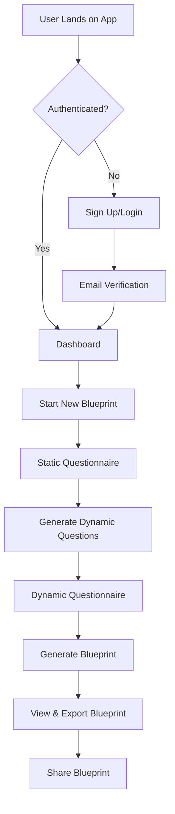

# Application Flow Documentation

## Overview

SmartSlate Polaris v3 implements a sophisticated two-phase questionnaire system that generates personalized AI-powered learning blueprints. This document provides a comprehensive overview of the complete application flow, from user onboarding through blueprint generation and sharing.

## Table of Contents

1. [User Journey Overview](#user-journey-overview)
2. [Authentication Flow](#authentication-flow)
3. [Static Questionnaire Phase](#static-questionnaire-phase)
4. [AI Dynamic Question Generation](#ai-dynamic-question-generation)
5. [Dynamic Questionnaire Phase](#dynamic-questionnaire-phase)
6. [Blueprint Generation](#blueprint-generation)
7. [Post-Generation Features](#post-generation-features)
8. [State Management Flow](#state-management-flow)
9. [Error Handling & Recovery](#error-handling--recovery)
10. [Technical Implementation Details](#technical-implementation-details)

## User Journey Overview



## Authentication Flow

### 1. User Registration/Login

#### Initial Access
```typescript
// Location: frontend/app/(auth)/auth/callback/route.ts
// Supabase Auth handles the complete authentication flow

// User signs up with email
const { data, error } = await supabase.auth.signUp({
  email: 'user@example.com',
  password: 'securePassword',
  options: {
    emailRedirectTo: `${process.env.NEXT_PUBLIC_APP_URL}/auth/callback`
  }
});
```

#### Automatic Profile Creation
```sql
-- Location: supabase/migrations/0026_add_subscription_and_roles.sql
-- Trigger automatically creates user profile on auth.users insert

CREATE OR REPLACE FUNCTION public.handle_new_user()
RETURNS TRIGGER AS $$
BEGIN
  INSERT INTO public.user_profiles (
    user_id,
    subscription_tier,
    user_role,
    subscription_metadata,
    role_assigned_at
  ) VALUES (
    NEW.id,
    'explorer',           -- Default free tier
    'explorer',           -- Default role
    jsonb_build_object(
      'plan_id', 'explorer',
      'billing_cycle', 'monthly',
      'usage', jsonb_build_object(
        'generations_this_month', 0,
        'saved_starmaps', 0,
        'last_reset', NOW()
      ),
      'limits', jsonb_build_object(
        'max_generations_monthly', 2,
        'max_saved_starmaps', 2
      )
    ),
    NOW()
  );
  RETURN NEW;
END;
$$ LANGUAGE plpgsql SECURITY DEFINER;
```

#### Session Management
```typescript
// Location: frontend/lib/supabase/server.ts
// Server-side session handling with Next.js cookies

export async function getServerSession() {
  const supabase = await getSupabaseServerClient();
  const {
    data: { session },
    error,
  } = await supabase.auth.getSession();

  return { session, error: null } as const;
}
```

### 2. Middleware Protection

#### Route Protection
```typescript
// Location: frontend/lib/auth/middleware.ts
// Comprehensive authentication and authorization middleware

export async function requireAuth(request: NextRequest): Promise<AuthResult> {
  try {
    const supabase = await createClient();
    const { data: { user }, error } = await supabase.auth.getUser();

    if (error || !user) {
      return {
        success: false,
        error: 'Authentication required: No user found',
      };
    }

    return { success: true, user };
  } catch (error) {
    return {
      success: false,
      error: 'Authentication error: ' + (error as Error).message,
    };
  }
}
```

## Static Questionnaire Phase

### 1. Questionnaire Structure

#### Question Categories
The static questionnaire consists of 30+ questions across these domains:

```typescript
// Location: frontend/lib/schemas/questionnaire.ts
interface StaticAnswers {
  // Personal Information
  personalInfo: {
    name: string;
    email: string;
    age: number;
    location: string;
  };

  // Learning Goals
  learningGoals: {
    primaryGoals: string[];
    timeframe: string;
    priorityLevel: string;
    motivation: string;
  };

  // Current Skills & Experience
  currentSkills: {
    technicalSkills: string[];
    experienceLevel: string;
    industry: string;
    education: string;
  };

  // Learning Preferences
  learningPreferences: {
    learningStyle: string;
    timeCommitment: string;
    preferredResources: string[];
    budgetConstraints: string;
  };

  // Career Objectives
  careerObjectives: {
    targetRole: string;
    industryTarget: string;
    salaryExpectations: string;
    timeline: string;
  };
}
```

#### Component Architecture
```typescript
// Location: frontend/components/wizard/static-questions/QuestionnaireLayout.tsx
// Multi-step wizard with progress tracking

export function StaticQuestionnaireWizard() {
  const [currentStep, setCurrentStep] = useState(0);
  const [answers, setAnswers] = useState<StaticAnswers>({});
  const [isSubmitting, setIsSubmitting] = useState(false);

  const steps = [
    { id: 'personal-info', title: 'Personal Information' },
    { id: 'learning-goals', title: 'Learning Goals' },
    { id: 'current-skills', title: 'Current Skills & Experience' },
    { id: 'learning-preferences', title: 'Learning Preferences' },
    { id: 'career-objectives', title: 'Career Objectives' }
  ];

  // Auto-save every 30 seconds
  useEffect(() => {
    const timer = setInterval(() => {
      if (Object.keys(answers).length > 0) {
        savePartialAnswers(answers);
      }
    }, 30000);

    return () => clearInterval(timer);
  }, [answers]);
}
```

### 2. Real-time Data Persistence

#### Auto-save Mechanism
```typescript
// Location: frontend/app/api/questionnaire/save/route.ts
// Real-time questionnaire data persistence

export async function POST(req: NextRequest): Promise<NextResponse> {
  try {
    // Authenticate user
    const { session } = await getServerSession();
    if (!session?.user?.id) {
      return NextResponse.json({ error: 'Unauthorized' }, { status: 401 });
    }

    const userId = session.user.id;
    const body = await req.json();

    // Validate input
    const { staticAnswers, blueprintId } = SaveQuestionnaireSchema.parse(body);

    // Save to database
    const supabase = await getSupabaseServerClient();
    const { data, error } = await supabase
      .from('blueprint_generator')
      .upsert({
        user_id: userId,
        static_answers: staticAnswers,
        status: 'draft',
        updated_at: new Date().toISOString(),
        // Update existing or create new blueprint
        ...(blueprintId && { id: blueprintId })
      })
      .select()
      .single();

    if (error) {
      logger.error('questionnaire_save_failed', 'Failed to save questionnaire', {
        userId,
        error: error.message,
        blueprintId
      });

      return NextResponse.json(
        { success: false, error: 'Failed to save questionnaire' },
        { status: 500 }
      );
    }

    return NextResponse.json({
      success: true,
      blueprintId: data.id,
      message: 'Questionnaire saved successfully'
    });

  } catch (error) {
    logger.error('questionnaire_save_error', 'Unexpected error during save', {
      error: (error as Error).message
    });

    return NextResponse.json(
      { success: false, error: 'Internal server error' },
      { status: 500 }
    );
  }
}
```

#### Usage Limit Enforcement
```typescript
// Location: frontend/lib/services/blueprintUsageService.ts
// Check and enforce usage limits before allowing actions

export class BlueprintUsageService {
  async checkCreationLimit(userId: string): Promise<{
    canCreate: boolean;
    currentUsage: number;
    limit: number;
    remaining: number;
  }> {
    const supabase = await createClient();

    // Get user's current usage and limits
    const { data: profile } = await supabase
      .from('user_profiles')
      .select('blueprint_creation_count, blueprint_creation_limit')
      .eq('user_id', userId)
      .single();

    const currentUsage = profile?.blueprint_creation_count || 0;
    const limit = profile?.blueprint_creation_limit || 2;
    const remaining = Math.max(0, limit - currentUsage);

    return {
      canCreate: remaining > 0,
      currentUsage,
      limit,
      remaining
    };
  }

  async incrementUsage(userId: string): Promise<void> {
    const supabase = await createClient();

    // Atomic increment using database function
    await supabase.rpc('increment_blueprint_creation_count', {
      user_id: userId
    });
  }
}
```

## AI Dynamic Question Generation

### 1. Question Generation Request

#### API Endpoint
```typescript
// Location: frontend/app/api/generate-dynamic-questions/route.ts
// AI-powered dynamic question generation

export async function POST(req: NextRequest): Promise<NextResponse> {
  try {
    const { session } = await getServerSession();
    if (!session?.user?.id) {
      return NextResponse.json({ error: 'Unauthorized' }, { status: 401 });
    }

    const { blueprintId, staticAnswers } = await req.json();

    // Check usage limits
    const usageService = new BlueprintUsageService();
    const limitCheck = await usageService.checkCreationLimit(session.user.id);

    if (!limitCheck.canCreate) {
      return NextResponse.json({
        error: 'Usage limit reached',
        upgradeUrl: '/pricing',
        currentUsage: limitCheck.currentUsage,
        limit: limitCheck.limit
      }, { status: 429 });
    }

    // Update blueprint status to generating
    const supabase = await getSupabaseServerClient();
    await supabase
      .from('blueprint_generator')
      .update({ status: 'generating' })
      .eq('id', blueprintId);

    // Generate dynamic questions using AI
    const dynamicQuestionService = new DynamicQuestionGenerationService();
    const result = await dynamicQuestionService.generate({
      staticAnswers,
      context: {
        userId: session.user.id,
        blueprintId,
        userLevel: determineUserLevel(staticAnswers),
        goals: staticAnswers.learningGoals?.primaryGoals || []
      }
    });

    if (!result.success) {
      await supabase
        .from('blueprint_generator')
        .update({ status: 'error' })
        .eq('id', blueprintId);

      return NextResponse.json({
        error: 'Failed to generate dynamic questions',
        details: result.error
      }, { status: 500 });
    }

    // Save generated questions
    await supabase
      .from('blueprint_generator')
      .update({
        dynamic_questions: result.questions,
        status: 'draft'
      })
      .eq('id', blueprintId);

    return NextResponse.json({
      success: true,
      questions: result.questions,
      sections: result.sections
    });

  } catch (error) {
    logger.error('dynamic_question_generation_failed', 'AI question generation failed', {
      error: (error as Error).message
    });

    return NextResponse.json({
      error: 'Failed to generate questions'
    }, { status: 500 });
  }
}
```

### 2. AI Service Implementation

#### Question Generation Service
```typescript
// Location: frontend/lib/services/dynamicQuestionGenerationV2.ts
// Sophisticated AI question generation with context awareness

export class DynamicQuestionGenerationService {
  private claudeClient: ClaudeClient;
  private config: ClaudeConfig;

  constructor() {
    this.claudeClient = new ClaudeClient();
    this.config = getClaudeConfig();
  }

  async generate(context: DynamicQuestionContext): Promise<GenerationResult> {
    const systemPrompt = DYNAMIC_QUESTIONS_SYSTEM_PROMPT;
    const userPrompt = this.buildQuestionPrompt(context);

    try {
      // Use Claude API with fallback
      const response = await this.claudeClient.createMessage({
        model: 'claude-sonnet-4-5',
        maxTokens: 4000,
        system: systemPrompt,
        messages: [{ role: 'user', content: userPrompt }]
      });

      // Validate and parse response
      const questions = this.parseAndValidateQuestions(response.content);

      // Organize into sections
      const sections = this.organizeQuestionsIntoSections(questions);

      return {
        success: true,
        questions,
        sections,
        metadata: {
          model: 'claude-sonnet-4-5',
          generatedAt: new Date().toISOString(),
          totalQuestions: questions.length,
          sections: sections.length
        }
      };

    } catch (error) {
      logger.error('question_generation_failed', 'AI service failed', {
        error: (error as Error).message,
        context
      });

      // Fallback to predefined questions if AI fails
      return this.generateFallbackQuestions(context);
    }
  }

  private buildQuestionPrompt(context: DynamicQuestionContext): string {
    const { staticAnswers, userLevel, goals } = context;

    return `
Based on the user's static questionnaire responses, generate personalized dynamic questions:

User Level: ${userLevel}
Primary Goals: ${goals.join(', ')}

Static Answers Summary:
${this.summarizeStaticAnswers(staticAnswers)}

Generate 50-70 dynamic questions across 10 sections:
1. Learning Style & Preferences
2. Time Management & Schedule
3. Resource Preferences
4. Skill Gap Analysis
5. Learning Environment
6. Motivation & Discipline
7. Career Integration
8. Practical Application
9. Progress Tracking
10. Success Metrics

Each question should:
- Be tailored to the user's experience level
- Address their specific goals
- Help create a more personalized blueprint
- Include appropriate question types (multiple choice, scale, text, etc.)

Format the response as structured JSON with clear section organization.
    `;
  }

  private parseAndValidateQuestions(content: string): DynamicQuestion[] {
    try {
      const parsed = JSON.parse(content);

      // Validate structure using Zod
      const validated = DynamicQuestionsSchema.parse(parsed);

      return validated.questions;
    } catch (error) {
      logger.error('question_parsing_failed', 'Failed to parse AI response', {
        content: content.substring(0, 500),
        error: (error as Error).message
      });

      throw new Error('Invalid question format from AI service');
    }
  }
}
```

#### Question Types and Structure
```typescript
// Location: frontend/types/questionnaire.ts
// Comprehensive question type definitions

export interface DynamicQuestion {
  id: string;
  section: string;
  sectionId: string;
  question: string;
  type: QuestionType;
  required: boolean;
  options?: QuestionOption[];
  validation?: QuestionValidation;
  dependencies?: QuestionDependency[];
  metadata?: QuestionMetadata;
}

export type QuestionType =
  | 'multiple_choice'
  | 'checkbox'
  | 'scale'
  | 'text'
  | 'textarea'
  | 'number'
  | 'date'
  | 'ranking'
  | 'slider'
  | 'currency'
  | 'file_upload';

export interface QuestionOption {
  id: string;
  label: string;
  value: string;
  description?: string;
  icon?: string;
}

export interface QuestionValidation {
  min?: number;
  max?: number;
  pattern?: string;
  minLength?: number;
  maxLength?: number;
  required?: boolean;
}
```

## Dynamic Questionnaire Phase

### 1. Dynamic Question Renderer

#### Component Implementation
```typescript
// Location: frontend/components/demo-dynamicv2/DynamicQuestionRenderer.tsx
// Advanced dynamic questionnaire with intelligent rendering

export function DynamicQuestionRenderer({
  blueprintId,
  questions,
  onSave,
  onComplete
}: DynamicQuestionRendererProps) {
  const [currentSection, setCurrentSection] = useState(0);
  const [answers, setAnswers] = useState<Record<string, any>>({});
  const [isSubmitting, setIsSubmitting] = useState(false);
  const [progress, setProgress] = useState(0);

  // Organize questions by sections
  const sections = useMemo(() => {
    return questions.reduce((acc, question) => {
      if (!acc[question.sectionId]) {
        acc[question.sectionId] = {
          id: question.sectionId,
          title: question.section,
          questions: []
        };
      }
      acc[question.sectionId].questions.push(question);
      return acc;
    }, {} as Record<string, QuestionSection>);
  }, [questions]);

  const sectionList = Object.values(sections);
  const currentSectionData = sectionList[currentSection];

  // Auto-save every 30 seconds
  useEffect(() => {
    const timer = setInterval(() => {
      if (Object.keys(answers).length > 0) {
        handleAutoSave();
      }
    }, 30000);

    return () => clearInterval(timer);
  }, [answers, currentSection]);

  // Calculate progress
  useEffect(() => {
    const totalQuestions = questions.length;
    const answeredQuestions = Object.keys(answers).length;
    setProgress((answeredQuestions / totalQuestions) * 100);
  }, [answers, questions]);

  const handleAutoSave = async () => {
    try {
      await saveDynamicAnswers(blueprintId, answers, currentSection);
    } catch (error) {
      logger.error('auto_save_failed', 'Failed to auto-save dynamic answers', {
        blueprintId,
        section: currentSection,
        error: (error as Error).message
      });
    }
  };

  const handleAnswerChange = (questionId: string, value: any) => {
    setAnswers(prev => ({
      ...prev,
      [questionId]: value
    }));

    // Handle dependent questions
    handleDependencies(questionId, value);
  };

  const handleSectionNext = async () => {
    // Validate current section
    const isValid = await validateSection(currentSectionData, answers);
    if (!isValid) {
      return;
    }

    // Save current section
    await saveDynamicAnswers(blueprintId, answers, currentSection);

    if (currentSection < sectionList.length - 1) {
      setCurrentSection(currentSection + 1);
    } else {
      // Complete questionnaire
      await handleComplete();
    }
  };

  return (
    <div className="dynamic-questionnaire">
      {/* Progress Bar */}
      <QuestionnaireProgress
        progress={progress}
        currentSection={currentSection + 1}
        totalSections={sectionList.length}
      />

      {/* Section Navigation */}
      <SectionNavigation
        sections={sectionList}
        currentSection={currentSection}
        onSectionChange={setCurrentSection}
        completedSections={getCompletedSections()}
      />

      {/* Current Section */}
      <div className="question-section">
        <h2>{currentSectionData.title}</h2>
        <div className="questions-container">
          {currentSectionData.questions.map(question => (
            <QuestionComponent
              key={question.id}
              question={question}
              value={answers[question.id]}
              onChange={(value) => handleAnswerChange(question.id, value)}
              error={getQuestionError(question.id)}
            />
          ))}
        </div>
      </div>

      {/* Navigation Buttons */}
      <div className="navigation-buttons">
        <button
          onClick={() => setCurrentSection(currentSection - 1)}
          disabled={currentSection === 0}
          className="prev-button"
        >
          Previous Section
        </button>

        <button
          onClick={handleSectionNext}
          disabled={isSubmitting}
          className="next-button"
        >
          {currentSection === sectionList.length - 1 ? 'Complete' : 'Next Section'}
        </button>
      </div>
    </div>
  );
}
```

#### Question Component Factory
```typescript
// Location: frontend/components/demo-dynamicv2/QuestionComponent.tsx
// Intelligent question component rendering based on type

export function QuestionComponent({
  question,
  value,
  onChange,
  error
}: QuestionComponentProps) {
  const renderQuestionInput = () => {
    switch (question.type) {
      case 'multiple_choice':
        return (
          <MultipleChoiceQuestion
            question={question}
            value={value}
            onChange={onChange}
          />
        );

      case 'scale':
        return (
          <ScaleQuestion
            question={question}
            value={value}
            onChange={onChange}
            min={question.validation?.min || 1}
            max={question.validation?.max || 10}
          />
        );

      case 'checkbox':
        return (
          <CheckboxQuestion
            question={question}
            value={value || []}
            onChange={onChange}
          />
        );

      case 'text':
        return (
          <TextQuestion
            question={question}
            value={value || ''}
            onChange={onChange}
            validation={question.validation}
          />
        );

      case 'textarea':
        return (
          <TextareaQuestion
            question={question}
            value={value || ''}
            onChange={onChange}
            validation={question.validation}
          />
        );

      case 'slider':
        return (
          <SliderQuestion
            question={question}
            value={value || question.validation?.min || 0}
            onChange={onChange}
            min={question.validation?.min || 0}
            max={question.validation?.max || 100}
          />
        );

      default:
        return (
          <div className="unsupported-question">
            Unsupported question type: {question.type}
          </div>
        );
    }
  };

  return (
    <div className="question-component" data-question-id={question.id}>
      <label className="question-label">
        {question.question}
        {question.required && <span className="required">*</span>}
      </label>

      {question.description && (
        <p className="question-description">{question.description}</p>
      )}

      <div className="question-input">
        {renderQuestionInput()}
      </div>

      {error && (
        <div className="question-error">{error}</div>
      )}
    </div>
  );
}
```

### 2. Answer Persistence

#### Save Dynamic Answers API
```typescript
// Location: frontend/app/api/dynamic-answers/save/route.ts
// Real-time dynamic answer persistence

export async function POST(req: NextRequest): Promise<NextResponse> {
  try {
    const { session } = await getServerSession();
    if (!session?.user?.id) {
      return NextResponse.json({ error: 'Unauthorized' }, { status: 401 });
    }

    const { blueprintId, answers, currentSection } = await req.json();

    const supabase = await getSupabaseServerClient();

    // Save dynamic answers with section tracking
    const { data, error } = await supabase
      .from('blueprint_generator')
      .update({
        dynamic_answers: answers,
        current_section: currentSection,
        answering_status: 'in_progress',
        updated_at: new Date().toISOString()
      })
      .eq('id', blueprintId)
      .eq('user_id', session.user.id)
      .select()
      .single();

    if (error) {
      logger.error('dynamic_answers_save_failed', 'Failed to save dynamic answers', {
        userId: session.user.id,
        blueprintId,
        error: error.message
      });

      return NextResponse.json({
        success: false,
        error: 'Failed to save answers'
      }, { status: 500 });
    }

    return NextResponse.json({
      success: true,
      message: 'Answers saved successfully',
      currentSection
    });

  } catch (error) {
    logger.error('dynamic_answers_save_error', 'Unexpected error during save', {
      error: (error as Error).message
    });

    return NextResponse.json({
      success: false,
      error: 'Internal server error'
    }, { status: 500 });
  }
}
```

## Blueprint Generation

### 1. Generation Request Processing

#### Blueprint Generation API
```typescript
// Location: frontend/app/api/blueprints/generate/route.ts
// Comprehensive blueprint generation with AI integration

export async function POST(req: NextRequest): Promise<NextResponse> {
  const startTime = Date.now();

  try {
    const { session } = await getServerSession();
    if (!session?.user?.id) {
      return NextResponse.json({ error: 'Unauthorized' }, { status: 401 });
    }

    const { blueprintId, staticAnswers, dynamicAnswers } = await req.json();

    // Check usage limits again before generation
    const usageService = new BlueprintUsageService();
    const limitCheck = await usageService.checkCreationLimit(session.user.id);

    if (!limitCheck.canCreate) {
      return NextResponse.json({
        error: 'Usage limit reached',
        upgradeUrl: '/pricing'
      }, { status: 429 });
    }

    // Update status to generating
    const supabase = await getSupabaseServerClient();
    await supabase
      .from('blueprint_generator')
      .update({
        status: 'generating',
        updated_at: new Date().toISOString()
      })
      .eq('id', blueprintId);

    // Initialize blueprint generation service
    const blueprintService = new BlueprintGenerationService();

    const context: BlueprintContext = {
      blueprintId,
      userId: session.user.id,
      staticAnswers,
      dynamicAnswers,
      userTier: await getUserTier(session.user.id)
    };

    // Generate blueprint with dual-fallback AI
    const result = await blueprintService.generate(context);

    if (!result.success) {
      // Update status to error
      await supabase
        .from('blueprint_generator')
        .update({ status: 'error' })
        .eq('id', blueprintId);

      logger.error('blueprint_generation_failed', 'AI blueprint generation failed', {
        blueprintId,
        userId: session.user.id,
        error: result.error
      });

      return NextResponse.json({
        success: false,
        error: 'Failed to generate blueprint',
        details: result.error
      }, { status: 500 });
    }

    // Save generated blueprint
    const { data: savedBlueprint, error: saveError } = await supabase
      .from('blueprint_generator')
      .update({
        blueprint_json: result.blueprint,
        blueprint_markdown: result.markdown,
        status: 'completed',
        generated_at: new Date().toISOString(),
        updated_at: new Date().toISOString()
      })
      .eq('id', blueprintId)
      .select()
      .single();

    if (saveError) {
      logger.error('blueprint_save_failed', 'Failed to save generated blueprint', {
        blueprintId,
        error: saveError.message
      });

      return NextResponse.json({
        success: false,
        error: 'Failed to save blueprint'
      }, { status: 500 });
    }

    // Increment usage count
    await usageService.incrementUsage(session.user.id);

    const duration = Date.now() - startTime;

    logger.info('blueprint_generation_completed', 'Blueprint generated successfully', {
      blueprintId,
      userId: session.user.id,
      duration,
      model: result.metadata.model,
      fallbackUsed: result.metadata.fallbackUsed
    });

    return NextResponse.json({
      success: true,
      blueprint: savedBlueprint,
      generationTime: duration,
      metadata: result.metadata
    });

  } catch (error) {
    const duration = Date.now() - startTime;

    logger.error('blueprint_generation_error', 'Unexpected error during generation', {
      error: (error as Error).message,
      duration
    });

    return NextResponse.json({
      success: false,
      error: 'Internal server error'
    }, { status: 500 });
  }
}
```

### 2. AI Blueprint Generation Service

#### Dual-Fallback AI Implementation
```typescript
// Location: frontend/lib/services/blueprintGenerationService.ts
// Advanced blueprint generation with intelligent fallbacks

export class BlueprintGenerationService {
  private claudeClient: ClaudeClient;
  private config: ClaudeConfig;

  constructor() {
    this.config = getClaudeConfig();
    this.claudeClient = new ClaudeClient();
  }

  async generate(context: BlueprintContext): Promise<GenerationResult> {
    const endTimer = performanceMonitor.startTimer(
      'blueprint_generation',
      { blueprintId: context.blueprintId, userId: context.userId }
    );

    try {
      // Check cache first for identical inputs
      const cachedBlueprint = await getCachedBlueprint(context.staticAnswers);
      if (cachedBlueprint) {
        const metric = endTimer();

        return {
          success: true,
          blueprint: cachedBlueprint.content,
          markdown: cachedBlueprint.markdown,
          metadata: {
            model: 'claude-sonnet-4-5',
            duration: metric.duration,
            timestamp: new Date().toISOString(),
            fallbackUsed: false,
            attempts: 0,
            cacheHit: true
          }
        };
      }

      // Try primary model (Claude Sonnet 4.5)
      let result = await this.generateWithModel(context, 'claude-sonnet-4-5');

      if (!result.success && shouldFallbackToSonnet4(result.error)) {
        logger.info('blueprint_fallback', 'Falling back to Claude Sonnet 4', {
          blueprintId: context.blueprintId,
          primaryError: result.error
        });

        result = await this.generateWithModel(context, 'claude-sonnet-4');
      }

      if (!result.success) {
        // Last resort: fallback to Ollama if available
        if (this.config.ollamaEnabled) {
          logger.info('blueprint_ollama_fallback', 'Falling back to Ollama', {
            blueprintId: context.blueprintId
          });

          result = await this.generateWithOllama(context);
        }
      }

      if (result.success) {
        // Cache successful result
        await cacheBlueprint(context.staticAnswers, {
          content: result.blueprint,
          markdown: result.markdown
        });

        const metric = endTimer();
        result.metadata.duration = metric.duration;
      }

      return result;

    } catch (error) {
      const metric = endTimer();

      logger.error('blueprint_generation_unexpected', 'Unexpected error in blueprint generation', {
        blueprintId: context.blueprintId,
        error: (error as Error).message,
        duration: metric.duration
      });

      return {
        success: false,
        error: 'Unexpected error during blueprint generation',
        metadata: {
          model: 'claude-sonnet-4-5',
          duration: metric.duration,
          timestamp: new Date().toISOString(),
          fallbackUsed: false,
          attempts: 1
        }
      };
    }
  }

  private async generateWithModel(
    context: BlueprintContext,
    model: string
  ): Promise<GenerationResult> {
    const prompt = buildBlueprintPrompt(context);

    try {
      const response = await this.claudeClient.createMessage({
        model,
        maxTokens: 8000,
        system: BLUEPRINT_SYSTEM_PROMPT,
        messages: [{ role: 'user', content: prompt }]
      });

      // Validate and normalize blueprint
      const validatedBlueprint = validateAndNormalizeBlueprint(
        response.content,
        context
      );

      return {
        success: true,
        blueprint: validatedBlueprint.json,
        markdown: validatedBlueprint.markdown,
        metadata: {
          model,
          duration: 0, // Will be set by parent
          timestamp: new Date().toISOString(),
          fallbackUsed: model !== 'claude-sonnet-4-5',
          attempts: 1
        }
      };

    } catch (error) {
      return {
        success: false,
        error: (error as Error).message,
        metadata: {
          model,
          duration: 0,
          timestamp: new Date().toISOString(),
          fallbackUsed: false,
          attempts: 1
        }
      };
    }
  }
}
```

#### Blueprint Structure and Validation
```typescript
// Location: frontend/lib/claude/validation.ts
// Comprehensive blueprint validation and normalization

export interface BlueprintStructure {
  metadata: BlueprintMetadata;
  overview: BlueprintOverview;
  phases: BlueprintPhase[];
  resources: BlueprintResources;
  timeline: BlueprintTimeline;
  assessment: BlueprintAssessment;
  appendix: BlueprintAppendix;
}

export interface BlueprintMetadata {
  title: string;
  description: string;
  generatedAt: string;
  version: string;
  userId: string;
  userLevel: string;
  goals: string[];
  timeframe: string;
  estimatedDuration: string;
}

export function validateAndNormalizeBlueprint(
  content: string,
  context: BlueprintContext
): { json: BlueprintStructure; markdown: string } {
  try {
    // Parse JSON from AI response
    let blueprint: BlueprintStructure;

    try {
      blueprint = JSON.parse(content);
    } catch (parseError) {
      // Try to extract JSON from markdown code block
      const jsonMatch = content.match(/```json\n([\s\S]*?)\n```/);
      if (jsonMatch) {
        blueprint = JSON.parse(jsonMatch[1]);
      } else {
        throw new Error('Could not parse blueprint JSON from AI response');
      }
    }

    // Validate against schema
    const validated = BlueprintSchema.parse(blueprint);

    // Add metadata
    validated.metadata = {
      ...validated.metadata,
      generatedAt: new Date().toISOString(),
      userId: context.userId,
      userLevel: determineUserLevel(context.staticAnswers),
      goals: context.staticAnswers.learningGoals?.primaryGoals || [],
      timeframe: context.staticAnswers.learningGoals?.timeframe || '6_months'
    };

    // Generate markdown version
    const markdown = generateBlueprintMarkdown(validated);

    return { json: validated, markdown };

  } catch (error) {
    logger.error('blueprint_validation_failed', 'Failed to validate blueprint', {
      error: (error as Error).message,
      context: context.blueprintId
    });

    throw new Error(`Blueprint validation failed: ${(error as Error).message}`);
  }
}
```

## Post-Generation Features

### 1. Blueprint Viewing and Interaction

#### Blueprint Viewer Component
```typescript
// Location: frontend/components/blueprint/BlueprintViewer.tsx
// Interactive blueprint viewer with multiple display modes

export function BlueprintViewer({
  blueprintId,
  initialView = 'structured'
}: BlueprintViewerProps) {
  const [blueprint, setBlueprint] = useState<BlueprintStructure | null>(null);
  const [viewMode, setViewMode] = useState<'structured' | 'markdown' | 'timeline'>('structured');
  const [isLoading, setIsLoading] = useState(true);
  const [isEditing, setIsEditing] = useState(false);
  const [editedContent, setEditedContent] = useState<string>('');

  useEffect(() => {
    loadBlueprint();
  }, [blueprintId]);

  const loadBlueprint = async () => {
    try {
      const response = await fetch(`/api/blueprints/${blueprintId}`);
      const data = await response.json();

      if (data.success) {
        setBlueprint(data.blueprint);
        setEditedContent(data.blueprint.blueprint_markdown);
      }
    } catch (error) {
      logger.error('blueprint_load_failed', 'Failed to load blueprint', {
        blueprintId,
        error: (error as Error).message
      });
    } finally {
      setIsLoading(false);
    }
  };

  const handleExport = async (format: 'pdf' | 'word' | 'markdown') => {
    try {
      const response = await fetch(`/api/blueprints/${blueprintId}/export`, {
        method: 'POST',
        headers: { 'Content-Type': 'application/json' },
        body: JSON.stringify({ format })
      });

      const data = await response.json();

      if (data.success) {
        // Download file
        window.open(data.downloadUrl, '_blank');
      }
    } catch (error) {
      logger.error('blueprint_export_failed', 'Failed to export blueprint', {
        blueprintId,
        format,
        error: (error as Error).message
      });
    }
  };

  const handleShare = async () => {
    try {
      const response = await fetch(`/api/blueprints/${blueprintId}/share`, {
        method: 'POST'
      });

      const data = await response.json();

      if (data.success) {
        // Copy share link to clipboard
        await navigator.clipboard.writeText(data.shareUrl);
        // Show success message
      }
    } catch (error) {
      logger.error('blueprint_share_failed', 'Failed to create share link', {
        blueprintId,
        error: (error as Error).message
      });
    }
  };

  if (isLoading) {
    return <BlueprintViewerSkeleton />;
  }

  if (!blueprint) {
    return <div>Blueprint not found</div>;
  }

  return (
    <div className="blueprint-viewer">
      {/* Header */}
      <BlueprintHeader
        blueprint={blueprint}
        viewMode={viewMode}
        onViewModeChange={setViewMode}
        onExport={handleExport}
        onShare={handleShare}
        onEdit={() => setIsEditing(true)}
      />

      {/* Content */}
      <div className="blueprint-content">
        {viewMode === 'structured' && (
          <StructuredView blueprint={blueprint} />
        )}

        {viewMode === 'markdown' && (
          <MarkdownView
            content={editedContent}
            isEditing={isEditing}
            onContentChange={setEditedContent}
            onSave={saveEditedContent}
            onCancel={() => setIsEditing(false)}
          />
        )}

        {viewMode === 'timeline' && (
          <TimelineView blueprint={blueprint} />
        )}
      </div>

      {/* Sidebar */}
      <BlueprintSidebar
        blueprint={blueprint}
        onSectionClick={scrollToSection}
        progress={calculateProgress(blueprint)}
      />
    </div>
  );
}
```

### 2. Export Functionality

#### Export API Implementation
```typescript
// Location: frontend/app/api/blueprints/[id]/export/route.ts
// Multi-format blueprint export functionality

export async function POST(
  req: NextRequest,
  { params }: { params: { id: string } }
): Promise<NextResponse> {
  try {
    const { session } = await getServerSession();
    if (!session?.user?.id) {
      return NextResponse.json({ error: 'Unauthorized' }, { status: 401 });
    }

    const { format } = await req.json();
    const blueprintId = params.id;

    // Check usage limits for exports
    const usageService = new BlueprintUsageService();
    const limitCheck = await usageService.checkExportLimit(session.user.id, format);

    if (!limitCheck.canCreate) {
      return NextResponse.json({
        error: 'Export limit reached',
        upgradeUrl: '/pricing'
      }, { status: 429 });
    }

    // Load blueprint data
    const supabase = await getSupabaseServerClient();
    const { data: blueprint, error } = await supabase
      .from('blueprint_generator')
      .select('blueprint_json, blueprint_markdown, title')
      .eq('id', blueprintId)
      .eq('user_id', session.user.id)
      .single();

    if (error || !blueprint) {
      return NextResponse.json({
        error: 'Blueprint not found'
      }, { status: 404 });
    }

    // Generate export based on format
    let exportResult: ExportResult;

    switch (format) {
      case 'pdf':
        exportResult = await generatePDFExport(blueprint);
        break;

      case 'word':
        exportResult = await generateWordExport(blueprint);
        break;

      case 'markdown':
        exportResult = await generateMarkdownExport(blueprint);
        break;

      default:
        return NextResponse.json({
          error: 'Unsupported export format'
        }, { status: 400 });
    }

    if (!exportResult.success) {
      return NextResponse.json({
        error: 'Export generation failed',
        details: exportResult.error
      }, { status: 500 });
    }

    // Increment export usage
    await usageService.incrementExportUsage(session.user.id, format);

    return NextResponse.json({
      success: true,
      downloadUrl: exportResult.downloadUrl,
      filename: exportResult.filename,
      format
    });

  } catch (error) {
    logger.error('blueprint_export_error', 'Unexpected error during export', {
      blueprintId: params.id,
      error: (error as Error).message
    });

    return NextResponse.json({
      error: 'Internal server error'
    }, { status: 500 });
  }
}

async function generatePDFExport(blueprint: any): Promise<ExportResult> {
  try {
    // Use Puppeteer or similar service for PDF generation
    const pdfService = new PDFGenerationService();

    const result = await pdfService.generatePDF({
      content: blueprint.blueprint_markdown,
      title: blueprint.title,
      options: {
        format: 'A4',
        margin: '2cm',
        headerTemplate: '<header></header>',
        footerTemplate: '<footer></footer>'
      }
    });

    // Upload to Supabase Storage
    const storageService = new StorageService();
    const { publicUrl } = await storageService.uploadFile({
      bucket: 'blueprint-exports',
      path: `pdfs/${blueprintId}_${Date.now()}.pdf`,
      file: result.buffer,
      contentType: 'application/pdf'
    });

    return {
      success: true,
      downloadUrl: publicUrl,
      filename: `${blueprint.title}.pdf`
    };

  } catch (error) {
    return {
      success: false,
      error: (error as Error).message
    };
  }
}
```

### 3. Sharing Functionality

#### Share Link Generation
```typescript
// Location: frontend/app/api/blueprints/share/generate/route.ts
// Secure blueprint sharing with access control

export async function POST(req: NextRequest): Promise<NextResponse> {
  try {
    const { session } = await getServerSession();
    if (!session?.user?.id) {
      return NextResponse.json({ error: 'Unauthorized' }, { status: 401 });
    }

    const { blueprintId, expiresAt, allowComments } = await req.json();

    const supabase = await getSupabaseServerClient();

    // Verify blueprint ownership
    const { data: blueprint, error } = await supabase
      .from('blueprint_generator')
      .select('id, title')
      .eq('id', blueprintId)
      .eq('user_id', session.user.id)
      .single();

    if (error || !blueprint) {
      return NextResponse.json({
        error: 'Blueprint not found or access denied'
      }, { status: 404 });
    }

    // Generate unique share token
    const shareToken = generateSecureToken();
    const expiresAtDate = expiresAt || new Date(Date.now() + 30 * 24 * 60 * 60 * 1000); // 30 days default

    // Save share record
    const { data: shareRecord, error: shareError } = await supabase
      .from('blueprint_shares')
      .insert({
        blueprint_id: blueprintId,
        user_id: session.user.id,
        share_token: shareToken,
        expires_at: expiresAtDate.toISOString(),
        allow_comments: allowComments || false,
        created_at: new Date().toISOString()
      })
      .select()
      .single();

    if (shareError) {
      logger.error('share_creation_failed', 'Failed to create share link', {
        blueprintId,
        error: shareError.message
      });

      return NextResponse.json({
        error: 'Failed to create share link'
      }, { status: 500 });
    }

    const shareUrl = `${process.env.NEXT_PUBLIC_APP_URL}/share/${shareToken}`;

    return NextResponse.json({
      success: true,
      shareUrl,
      shareToken,
      expiresAt: expiresAtDate,
      allowComments
    });

  } catch (error) {
    logger.error('share_generation_error', 'Unexpected error during share generation', {
      error: (error as Error).message
    });

    return NextResponse.json({
      error: 'Internal server error'
    }, { status: 500 });
  }
}
```

## State Management Flow

### 1. Zustand Store Architecture

#### Blueprint Store Implementation
```typescript
// Location: frontend/lib/stores/blueprintStore.ts
// Comprehensive state management with optimistic updates

interface BlueprintState {
  // Current blueprint data
  currentBlueprint: Blueprint | null;
  staticAnswers: StaticAnswers;
  dynamicAnswers: Record<string, any>;
  dynamicQuestions: DynamicQuestion[];

  // UI state
  currentStep: number;
  currentSection: number;
  isGenerating: boolean;
  generationProgress: number;

  // History for undo/redo
  history: BlueprintHistoryEntry[];
  historyIndex: number;

  // Sync state
  lastSyncAt: Date | null;
  isSaving: boolean;
  saveError: string | null;

  // Actions
  setStaticAnswers: (answers: StaticAnswers) => void;
  setDynamicAnswers: (answers: Record<string, any>) => void;
  setCurrentStep: (step: number) => void;
  setCurrentSection: (section: number) => void;
  generateDynamicQuestions: () => Promise<void>;
  generateBlueprint: () => Promise<void>;
  saveProgress: () => Promise<void>;
  undo: () => void;
  redo: () => void;
  syncWithServer: () => Promise<void>;
}

export const useBlueprintStore = create<BlueprintState>((set, get) => ({
  // Initial state
  currentBlueprint: null,
  staticAnswers: {},
  dynamicAnswers: {},
  dynamicQuestions: [],
  currentStep: 0,
  currentSection: 0,
  isGenerating: false,
  generationProgress: 0,
  history: [],
  historyIndex: -1,
  lastSyncAt: null,
  isSaving: false,
  saveError: null,

  // Actions
  setStaticAnswers: (answers) => {
    set((state) => {
      // Add to history for undo
      const newHistory = state.history.slice(0, state.historyIndex + 1);
      newHistory.push({
        type: 'static_answers',
        data: state.staticAnswers,
        timestamp: new Date()
      });

      return {
        staticAnswers: answers,
        history: newHistory,
        historyIndex: newHistory.length - 1
      };
    });

    // Auto-save
    get().saveProgress();
  },

  setDynamicAnswers: (answers) => {
    set((state) => {
      const newHistory = state.history.slice(0, state.historyIndex + 1);
      newHistory.push({
        type: 'dynamic_answers',
        data: state.dynamicAnswers,
        timestamp: new Date()
      });

      return {
        dynamicAnswers: answers,
        history: newHistory,
        historyIndex: newHistory.length - 1
      };
    });

    // Auto-save with debounce
    debouncedSave();
  },

  generateDynamicQuestions: async () => {
    const { staticAnswers, currentBlueprint } = get();

    if (!currentBlueprint?.id) {
      throw new Error('No active blueprint');
    }

    set({ isGenerating: true, generationProgress: 0 });

    try {
      const response = await fetch('/api/generate-dynamic-questions', {
        method: 'POST',
        headers: { 'Content-Type': 'application/json' },
        body: JSON.stringify({
          blueprintId: currentBlueprint.id,
          staticAnswers
        })
      });

      const data = await response.json();

      if (data.success) {
        set({
          dynamicQuestions: data.questions,
          isGenerating: false,
          generationProgress: 100
        });
      } else {
        throw new Error(data.error);
      }
    } catch (error) {
      set({
        isGenerating: false,
        generationProgress: 0,
        saveError: (error as Error).message
      });
      throw error;
    }
  },

  generateBlueprint: async () => {
    const {
      staticAnswers,
      dynamicAnswers,
      currentBlueprint
    } = get();

    if (!currentBlueprint?.id) {
      throw new Error('No active blueprint');
    }

    set({ isGenerating: true, generationProgress: 0 });

    try {
      const response = await fetch('/api/blueprints/generate', {
        method: 'POST',
        headers: { 'Content-Type': 'application/json' },
        body: JSON.stringify({
          blueprintId: currentBlueprint.id,
          staticAnswers,
          dynamicAnswers
        })
      });

      const data = await response.json();

      if (data.success) {
        set({
          currentBlueprint: data.blueprint,
          isGenerating: false,
          generationProgress: 100
        });
      } else {
        throw new Error(data.error);
      }
    } catch (error) {
      set({
        isGenerating: false,
        generationProgress: 0,
        saveError: (error as Error).message
      });
      throw error;
    }
  },

  saveProgress: async () => {
    const {
      staticAnswers,
      dynamicAnswers,
      currentBlueprint,
      currentSection
    } = get();

    if (!currentBlueprint?.id) return;

    set({ isSaving: true, saveError: null });

    try {
      const response = await fetch('/api/questionnaire/save', {
        method: 'POST',
        headers: { 'Content-Type': 'application/json' },
        body: JSON.stringify({
          blueprintId: currentBlueprint.id,
          staticAnswers
        })
      });

      if (response.ok) {
        set({
          lastSyncAt: new Date(),
          isSaving: false
        });
      } else {
        throw new Error('Save failed');
      }
    } catch (error) {
      set({
        isSaving: false,
        saveError: (error as Error).message
      });
    }
  },

  undo: () => {
    set((state) => {
      if (state.historyIndex <= 0) return state;

      const newIndex = state.historyIndex - 1;
      const historyEntry = state.history[newIndex];

      return {
        ...state,
        staticAnswers: historyEntry.type === 'static_answers'
          ? historyEntry.data
          : state.staticAnswers,
        dynamicAnswers: historyEntry.type === 'dynamic_answers'
          ? historyEntry.data
          : state.dynamicAnswers,
        historyIndex: newIndex
      };
    });
  },

  redo: () => {
    set((state) => {
      if (state.historyIndex >= state.history.length - 1) return state;

      const newIndex = state.historyIndex + 1;
      const historyEntry = state.history[newIndex];

      return {
        ...state,
        staticAnswers: historyEntry.type === 'static_answers'
          ? historyEntry.data
          : state.staticAnswers,
        dynamicAnswers: historyEntry.type === 'dynamic_answers'
          ? historyEntry.data
          : state.dynamicAnswers,
        historyIndex: newIndex
      };
    });
  },

  syncWithServer: async () => {
    const { currentBlueprint } = get();

    if (!currentBlueprint?.id) return;

    try {
      const response = await fetch(`/api/blueprints/${currentBlueprint.id}`);
      const data = await response.json();

      if (data.success) {
        set({
          currentBlueprint: data.blueprint,
          staticAnswers: data.blueprint.static_answers,
          dynamicAnswers: data.blueprint.dynamic_answers,
          dynamicQuestions: data.blueprint.dynamic_questions,
          lastSyncAt: new Date()
        });
      }
    } catch (error) {
      logger.error('sync_failed', 'Failed to sync with server', {
        blueprintId: currentBlueprint.id,
        error: (error as Error).message
      });
    }
  }
}));

// Debounced save function
const debouncedSave = debounce(
  () => useBlueprintStore.getState().saveProgress(),
  2000
);
```

### 2. Conflict Resolution

#### Server-Side Conflict Detection
```typescript
// Location: frontend/lib/stores/conflictResolution.ts
// Advanced conflict resolution with timestamps

export class ConflictResolver {
  async resolveConflicts(
    localData: any,
    serverData: any,
    lastSyncAt: Date
  ): Promise<ResolutionResult> {
    const conflicts = this.detectConflicts(localData, serverData, lastSyncAt);

    if (conflicts.length === 0) {
      return { hasConflicts: false, resolvedData: serverData };
    }

    // Auto-resolve conflicts based on timestamps
    const resolvedData = this.autoResolveConflicts(conflicts, localData, serverData);

    // Check for manual resolution needed
    const manualConflicts = conflicts.filter(c => !c.autoResolved);

    if (manualConflicts.length > 0) {
      return {
        hasConflicts: true,
        conflicts: manualConflicts,
        resolvedData,
        requiresManualResolution: true
      };
    }

    return {
      hasConflicts: true,
      resolvedData,
      autoResolved: true
    };
  }

  private detectConflicts(
    localData: any,
    serverData: any,
    lastSyncAt: Date
  ): Conflict[] {
    const conflicts: Conflict[] = [];

    // Check static answers
    if (serverData.static_answers_updated_at > lastSyncAt) {
      if (!this.deepEqual(localData.staticAnswers, serverData.static_answers)) {
        conflicts.push({
          field: 'static_answers',
          localValue: localData.staticAnswers,
          serverValue: serverData.static_answers,
          serverTimestamp: serverData.static_answers_updated_at,
          type: 'data_conflict'
        });
      }
    }

    // Check dynamic answers
    if (serverData.dynamic_answers_updated_at > lastSyncAt) {
      if (!this.deepEqual(localData.dynamicAnswers, serverData.dynamic_answers)) {
        conflicts.push({
          field: 'dynamic_answers',
          localValue: localData.dynamicAnswers,
          serverValue: serverData.dynamic_answers,
          serverTimestamp: serverData.dynamic_answers_updated_at,
          type: 'data_conflict'
        });
      }
    }

    return conflicts;
  }

  private autoResolveConflicts(
    conflicts: Conflict[],
    localData: any,
    serverData: any
  ): any {
    const resolved = { ...localData };

    for (const conflict of conflicts) {
      // Use server data if it's newer than local changes
      if (conflict.serverTimestamp > this.getLastLocalChange(conflict.field)) {
        resolved[conflict.field] = conflict.serverValue;
        conflict.autoResolved = true;
        conflict.resolution = 'server_wins';
      } else {
        conflict.autoResolved = true;
        conflict.resolution = 'local_wins';
      }
    }

    return resolved;
  }
}
```

## Error Handling & Recovery

### 1. Comprehensive Error Handling

#### Error Boundary Implementation
```typescript
// Location: frontend/components/ErrorBoundary.tsx
// React Error Boundary with recovery mechanisms

export class BlueprintErrorBoundary extends React.Component<
  BlueprintErrorBoundaryProps,
  BlueprintErrorBoundaryState
> {
  constructor(props: BlueprintErrorBoundaryProps) {
    super(props);
    this.state = {
      hasError: false,
      error: null,
      errorInfo: null,
      retryCount: 0
    };
  }

  static getDerivedStateFromError(error: Error): BlueprintErrorBoundaryState {
    return {
      hasError: true,
      error,
      errorInfo: null,
      retryCount: 0
    };
  }

  componentDidCatch(error: Error, errorInfo: ErrorInfo) {
    this.setState({ errorInfo });

    logger.error('blueprint_error_boundary', 'Error caught by boundary', {
      error: error.message,
      stack: error.stack,
      componentStack: errorInfo.componentStack,
      retryCount: this.state.retryCount
    });
  }

  handleRetry = () => {
    if (this.state.retryCount < 3) {
      this.setState(prevState => ({
        hasError: false,
        error: null,
        errorInfo: null,
        retryCount: prevState.retryCount + 1
      }));
    }
  };

  handleReset = () => {
    // Clear local storage and reset state
    localStorage.removeItem('blueprint_draft');
    this.setState({
      hasError: false,
      error: null,
      errorInfo: null,
      retryCount: 0
    });
  };

  render() {
    if (this.state.hasError) {
      return (
        <ErrorFallback
          error={this.state.error}
          retryCount={this.state.retryCount}
          onRetry={this.handleRetry}
          onReset={this.handleReset}
        />
      );
    }

    return this.props.children;
  }
}

function ErrorFallback({
  error,
  retryCount,
  onRetry,
  onReset
}: ErrorFallbackProps) {
  return (
    <div className="error-fallback">
      <div className="error-icon">
        <AlertTriangle size={48} />
      </div>

      <h2>Something went wrong</h2>

      <p className="error-message">
        {error?.message || 'An unexpected error occurred while generating your blueprint.'}
      </p>

      <div className="error-actions">
        {retryCount < 3 && (
          <button onClick={onRetry} className="retry-button">
            Try Again ({3 - retryCount} attempts left)
          </button>
        )}

        <button onClick={onReset} className="reset-button">
          Start Over
        </button>

        <button
          onClick={() => window.location.href = '/dashboard'}
          className="dashboard-button"
        >
          Go to Dashboard
        </button>
      </div>

      {retryCount >= 3 && (
        <div className="support-message">
          <p>If the problem persists, please contact our support team.</p>
          <a href="mailto:support@smartslate.dev">support@smartslate.dev</a>
        </div>
      )}
    </div>
  );
}
```

### 2. Service Recovery Mechanisms

#### Automatic Retry Logic
```typescript
// Location: frontend/lib/services/serviceRecovery.ts
// Intelligent service recovery with exponential backoff

export class ServiceRecovery {
  private maxRetries = 3;
  private baseDelay = 1000; // 1 second

  async executeWithRetry<T>(
    operation: () => Promise<T>,
    operationName: string,
    options: RetryOptions = {}
  ): Promise<T> {
    const { maxRetries = this.maxRetries, baseDelay = this.baseDelay } = options;
    let lastError: Error;

    for (let attempt = 0; attempt <= maxRetries; attempt++) {
      try {
        const result = await operation();

        if (attempt > 0) {
          logger.info('service_recovery_success', 'Operation succeeded after retry', {
            operationName,
            attempt: attempt + 1,
            maxRetries: maxRetries + 1
          });
        }

        return result;
      } catch (error) {
        lastError = error as Error;

        logger.warn('service_recovery_attempt', 'Operation failed, retrying', {
          operationName,
          attempt: attempt + 1,
          maxRetries: maxRetries + 1,
          error: lastError.message
        });

        if (attempt < maxRetries) {
          const delay = this.calculateDelay(attempt, baseDelay);
          await this.sleep(delay);
        }
      }
    }

    // All retries exhausted
    logger.error('service_recovery_failed', 'All retry attempts exhausted', {
      operationName,
      totalAttempts: maxRetries + 1,
      finalError: lastError.message
    });

    throw new ServiceRecoveryError(
      `Operation ${operationName} failed after ${maxRetries + 1} attempts`,
      lastError
    );
  }

  private calculateDelay(attempt: number, baseDelay: number): number {
    // Exponential backoff with jitter
    const exponentialDelay = baseDelay * Math.pow(2, attempt);
    const jitter = Math.random() * 0.1 * exponentialDelay;
    return exponentialDelay + jitter;
  }

  private sleep(ms: number): Promise<void> {
    return new Promise(resolve => setTimeout(resolve, ms));
  }

  async executeWithCircuitBreaker<T>(
    operation: () => Promise<T>,
    circuitBreaker: CircuitBreaker
  ): Promise<T> {
    if (circuitBreaker.isOpen()) {
      throw new CircuitBreakerError('Circuit breaker is open');
    }

    try {
      const result = await operation();
      circuitBreaker.recordSuccess();
      return result;
    } catch (error) {
      circuitBreaker.recordFailure();
      throw error;
    }
  }
}

export class CircuitBreaker {
  private failureCount = 0;
  private lastFailureTime = 0;
  private state: 'closed' | 'open' | 'half-open' = 'closed';

  constructor(
    private failureThreshold = 5,
    private recoveryTimeout = 60000, // 1 minute
    private monitoringPeriod = 10000 // 10 seconds
  ) {}

  isOpen(): boolean {
    if (this.state === 'open') {
      if (Date.now() - this.lastFailureTime > this.recoveryTimeout) {
        this.state = 'half-open';
        return false;
      }
      return true;
    }
    return false;
  }

  recordSuccess(): void {
    this.failureCount = 0;
    this.state = 'closed';
  }

  recordFailure(): void {
    this.failureCount++;
    this.lastFailureTime = Date.now();

    if (this.failureCount >= this.failureThreshold) {
      this.state = 'open';
    }
  }
}
```

## Technical Implementation Details

### 1. Performance Optimizations

#### Code Splitting and Lazy Loading
```typescript
// Location: frontend/components/blueprint/BlueprintViewer.tsx
// Strategic code splitting for better performance

const StructuredView = lazy(() => import('./views/StructuredView'));
const MarkdownView = lazy(() => import('./views/MarkdownView'));
const TimelineView = lazy(() => import('./views/TimelineView'));
const BlueprintExport = lazy(() => import('./BlueprintExport'));

export function BlueprintViewer(props: BlueprintViewerProps) {
  const [viewMode, setViewMode] = useState<'structured' | 'markdown' | 'timeline'>('structured');

  return (
    <Suspense fallback={<BlueprintViewerSkeleton />}>
      {viewMode === 'structured' && <StructuredView blueprint={props.blueprint} />}
      {viewMode === 'markdown' && <MarkdownView content={props.blueprint.markdown} />}
      {viewMode === 'timeline' && <TimelineView blueprint={props.blueprint} />}

      <LazyExportPanel blueprintId={props.blueprintId} />
    </Suspense>
  );
}
```

#### Memoization and Optimization
```typescript
// Location: frontend/components/demo-dynamicv2/DynamicQuestionRenderer.tsx
// Performance optimizations with React.memo and useMemo

export const DynamicQuestionRenderer = memo(function DynamicQuestionRenderer({
  blueprintId,
  questions,
  onSave,
  onComplete
}: DynamicQuestionRendererProps) {
  // Memoize expensive calculations
  const sections = useMemo(() => {
    return questions.reduce((acc, question) => {
      if (!acc[question.sectionId]) {
        acc[question.sectionId] = {
          id: question.sectionId,
          title: question.section,
          questions: []
        };
      }
      acc[question.sectionId].questions.push(question);
      return acc;
    }, {} as Record<string, QuestionSection>);
  }, [questions]);

  const sectionList = useMemo(() => {
    return Object.values(sections);
  }, [sections]);

  // Optimize re-renders with callbacks
  const handleAnswerChange = useCallback((questionId: string, value: any) => {
    setAnswers(prev => ({ ...prev, [questionId]: value }));
  }, []);

  return (
    <div className="dynamic-questionnaire">
      {/* Component content */}
    </div>
  );
}, (prevProps, nextProps) => {
  // Custom comparison for optimal re-rendering
  return (
    prevProps.blueprintId === nextProps.blueprintId &&
    prevProps.questions.length === nextProps.questions.length
  );
});
```

### 2. Data Flow Architecture

#### Optimistic Updates Pattern
```typescript
// Location: frontend/lib/stores/optimisticUpdates.ts
// Optimistic updates with rollback capability

export class OptimisticUpdateManager {
  private pendingUpdates = new Map<string, PendingUpdate>();

  async executeOptimisticUpdate<T>(
    id: string,
    updateFn: () => Promise<T>,
    optimisticValue: T,
    rollbackFn: () => void
  ): Promise<T> {
    // Store optimistic update
    this.pendingUpdates.set(id, {
      optimisticValue,
      rollbackFn,
      timestamp: Date.now()
    });

    try {
      const result = await updateFn();
      this.pendingUpdates.delete(id);
      return result;
    } catch (error) {
      // Rollback on failure
      this.pendingUpdates.delete(id);
      rollbackFn();
      throw error;
    }
  }

  hasPendingUpdate(id: string): boolean {
    return this.pendingUpdates.has(id);
  }

  getPendingUpdate(id: string): PendingUpdate | undefined {
    return this.pendingUpdates.get(id);
  }

  clearPendingUpdates(): void {
    this.pendingUpdates.clear();
  }
}

// Usage in components
const handleSaveBlueprint = async (blueprintData: BlueprintData) => {
  const previousData = { ...blueprint };

  // Optimistically update UI
  setBlueprint(blueprintData);

  try {
    await optimisticUpdateManager.executeOptimisticUpdate(
      `blueprint_${blueprintId}`,
      () => saveBlueprintToServer(blueprintData),
      blueprintData,
      () => setBlueprint(previousData) // Rollback
    );
  } catch (error) {
    // Error handling with user notification
    showNotification('Failed to save blueprint', 'error');
  }
};
```

This comprehensive application flow documentation covers the complete user journey from authentication through blueprint generation and sharing, including all the technical implementation details, error handling mechanisms, and performance optimizations that make SmartSlate Polaris v3 a robust and scalable AI-powered learning platform.