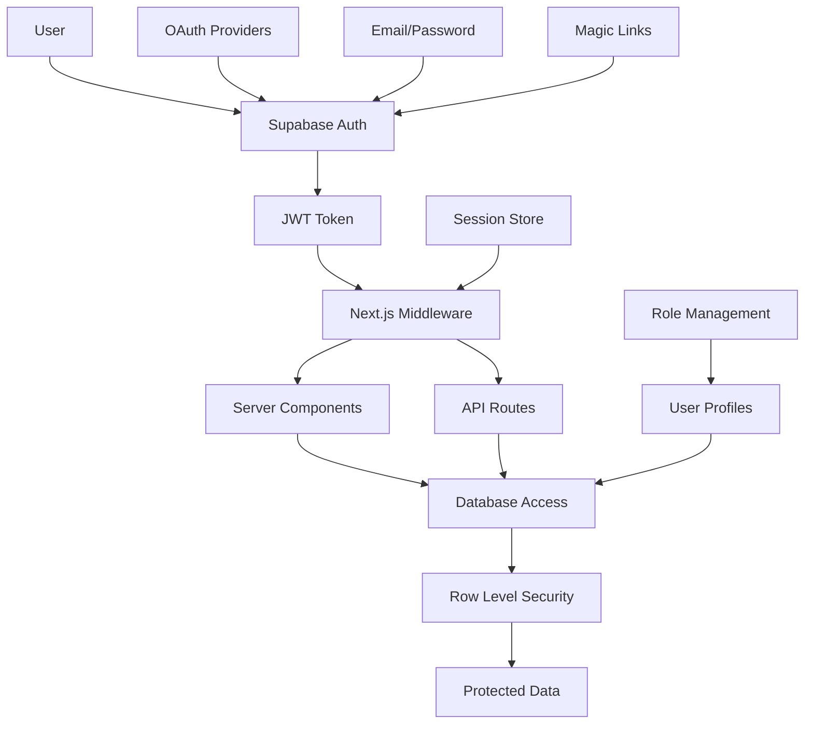

# Authentication Implementation Documentation

## Overview

SmartSlate Polaris v3 implements a comprehensive authentication and authorization system using Supabase Auth as the primary identity provider. The system includes secure session management, role-based access control, middleware protection, and advanced security features designed for enterprise-grade applications.

## Table of Contents

1. [Architecture Overview](#architecture-overview)
2. [Authentication Flow](#authentication-flow)
3. [Supabase Configuration](#supabase-configuration)
4. [Session Management](#session-management)
5. [Middleware Implementation](#middleware-implementation)
6. [Role-Based Access Control](#role-based-access-control)
7. [Frontend Integration](#frontend-integration)
8. [Security Features](#security-features)
9. [Error Handling](#error-handling)
10. [Testing & Validation](#testing--validation)
11. [Monitoring & Analytics](#monitoring--analytics)
12. [Troubleshooting](#troubleshooting)

## Architecture Overview

### System Architecture



### Authentication Components

1. **Supabase Auth**: Complete authentication service with JWT tokens
2. **Next.js Middleware**: Server-side session validation and route protection
3. **Database Layer**: Row Level Security (RLS) and user profile management
4. **Client Components**: Authentication UI and session management
5. **API Routes**: Secure backend endpoints with authentication checks

## Authentication Flow

### 1. User Registration/Login

#### Authentication Service Implementation

```typescript
// Location: frontend/lib/auth/authService.ts

export class AuthService {
  private supabase: SupabaseClient;

  constructor() {
    this.supabase = createBrowserClient();
  }

  async signUp(email: string, password: string, metadata?: UserMetadata): Promise<AuthResult> {
    try {
      const { data, error } = await this.supabase.auth.signUp({
        email,
        password,
        options: {
          data: metadata || {},
          emailRedirectTo: `${process.env.NEXT_PUBLIC_APP_URL}/auth/callback`
        }
      });

      if (error) {
        throw new AuthError(error.message, error.status);
      }

      // Log registration event
      logger.info('user_registered', 'New user registration', {
        email,
        userId: data.user?.id,
        hasMetadata: !!metadata
      });

      return {
        success: true,
        user: data.user,
        session: data.session,
        message: 'Registration successful. Please check your email to verify your account.'
      };

    } catch (error) {
      logger.error('registration_failed', 'User registration failed', {
        email,
        error: (error as Error).message
      });

      return {
        success: false,
        error: (error as Error).message
      };
    }
  }

  async signIn(email: string, password: string): Promise<AuthResult> {
    try {
      const { data, error } = await this.supabase.auth.signInWithPassword({
        email,
        password
      });

      if (error) {
        throw new AuthError(error.message, error.status);
      }

      // Log successful login
      logger.info('user_signed_in', 'User signed in successfully', {
        email,
        userId: data.user?.id
      });

      // Update last login timestamp
      await this.updateLastLogin(data.user?.id);

      return {
        success: true,
        user: data.user,
        session: data.session
      };

    } catch (error) {
      logger.error('sign_in_failed', 'User sign in failed', {
        email,
        error: (error as Error).message
      });

      return {
        success: false,
        error: (error as Error).message
      };
    }
  }

  async signInWithOAuth(provider: 'google' | 'github' | 'discord'): Promise<AuthResult> {
    try {
      const { data, error } = await this.supabase.auth.signInWithOAuth({
        provider,
        options: {
          redirectTo: `${process.env.NEXT_PUBLIC_APP_URL}/auth/callback`
        }
      });

      if (error) {
        throw new AuthError(error.message, error.status);
      }

      return {
        success: true,
        url: data.url,
        message: 'Redirecting to OAuth provider...'
      };

    } catch (error) {
      logger.error('oauth_sign_in_failed', 'OAuth sign in failed', {
        provider,
        error: (error as Error).message
      });

      return {
        success: false,
        error: (error as Error).message
      };
    }
  }

  async signOut(): Promise<AuthResult> {
    try {
      const { error } = await this.supabase.auth.signOut();

      if (error) {
        throw new AuthError(error.message, error.status);
      }

      logger.info('user_signed_out', 'User signed out successfully');

      return {
        success: true,
        message: 'Signed out successfully'
      };

    } catch (error) {
      logger.error('sign_out_failed', 'User sign out failed', {
        error: (error as Error).message
      });

      return {
        success: false,
        error: (error as Error).message
      };
    }
  }

  async resetPassword(email: string): Promise<AuthResult> {
    try {
      const { error } = await this.supabase.auth.resetPasswordForEmail(email, {
        redirectTo: `${process.env.NEXT_PUBLIC_APP_URL}/auth/reset-password`
      });

      if (error) {
        throw new AuthError(error.message, error.status);
      }

      logger.info('password_reset_requested', 'Password reset requested', {
        email
      });

      return {
        success: true,
        message: 'Password reset email sent. Please check your inbox.'
      };

    } catch (error) {
      logger.error('password_reset_failed', 'Password reset failed', {
        email,
        error: (error as Error).message
      });

      return {
        success: false,
        error: (error as Error).message
      };
    }
  }

  private async updateLastLogin(userId?: string): Promise<void> {
    if (!userId) return;

    try {
      const supabase = await createClient();
      await supabase
        .from('user_profiles')
        .update({
          last_login_at: new Date().toISOString(),
          updated_at: new Date().toISOString()
        })
        .eq('user_id', userId);
    } catch (error) {
      logger.warn('last_login_update_failed', 'Failed to update last login', {
        userId,
        error: (error as Error).message
      });
    }
  }
}
```

### 2. Email Verification

#### Email Verification Handler

```typescript
// Location: frontend/app/(auth)/auth/confirm/route.ts

export async function GET(request: NextRequest): Promise<NextResponse> {
  try {
    const searchParams = request.nextUrl.searchParams;
    const token_hash = searchParams.get('token_hash');
    const type = searchParams.get('type');

    if (!token_hash || !type) {
      return NextResponse.redirect(
        new URL('/auth/error?message=Invalid verification link', request.url)
      );
    }

    const supabase = await getSupabaseServerClient();

    // Verify email or magic link
    const { data, error } = await supabase.auth.verifyOtp({
      token_hash,
      type: type as 'email' | 'recovery' | 'signup'
    });

    if (error) {
      logger.error('email_verification_failed', 'Email verification failed', {
        error: error.message,
        type
      });

      return NextResponse.redirect(
        new URL(`/auth/error?message=${encodeURIComponent(error.message)}`, request.url)
      );
    }

    // Log successful verification
    logger.info('email_verified', 'Email verified successfully', {
      userId: data.user?.id,
      email: data.user?.email,
      type
    });

    // Update user profile verification status
    if (data.user && type === 'signup') {
      await updateUserVerificationStatus(data.user.id);
    }

    // Redirect to success page
    const redirectUrl = type === 'recovery'
      ? '/auth/reset-password?success=true'
      : '/auth/success?message=Email verified successfully';

    return NextResponse.redirect(
      new URL(redirectUrl, request.url)
    );

  } catch (error) {
    logger.error('verification_error', 'Unexpected error during verification', {
      error: (error as Error).message
    });

    return NextResponse.redirect(
      new URL('/auth/error?message=Verification failed', request.url)
    );
  }
}

async function updateUserVerificationStatus(userId: string): Promise<void> {
  try {
    const supabase = await getSupabaseServerClient();

    await supabase
      .from('user_profiles')
      .update({
        email_verified: true,
        email_verified_at: new Date().toISOString(),
        updated_at: new Date().toISOString()
      })
      .eq('user_id', userId);

  } catch (error) {
    logger.error('verification_status_update_failed', 'Failed to update verification status', {
      userId,
      error: (error as Error).message
    });
  }
}
```

### 3. Session Management

#### Session Provider Implementation

```typescript
// Location: frontend/components/auth/SessionProvider.tsx

interface SessionContextType {
  user: User | null;
  session: Session | null;
  isLoading: boolean;
  signOut: () => Promise<void>;
  refreshSession: () => Promise<void>;
}

const SessionContext = createContext<SessionContextType | undefined>(undefined);

export function SessionProvider({ children }: { children: React.ReactNode }) {
  const [user, setUser] = useState<User | null>(null);
  const [session, setSession] = useState<Session | null>(null);
  const [isLoading, setIsLoading] = useState(true);

  const supabase = createBrowserClient();

  useEffect(() => {
    // Get initial session
    const getInitialSession = async () => {
      try {
        const { data: { session } } = await supabase.auth.getSession();

        if (session) {
          setUser(session.user);
          setSession(session);

          // Track session start
          logger.info('session_started', 'User session started', {
            userId: session.user.id,
            provider: session.user.app_metadata.provider
          });
        }

        setIsLoading(false);
      } catch (error) {
        logger.error('session_initialization_failed', 'Failed to initialize session', {
          error: (error as Error).message
        });
        setIsLoading(false);
      }
    };

    getInitialSession();

    // Listen for auth changes
    const {
      data: { subscription }
    } = supabase.auth.onAuthStateChange(async (event, session) => {
      logger.info('auth_state_changed', 'Authentication state changed', {
        event,
        userId: session?.user?.id,
        hasSession: !!session
      });

      switch (event) {
        case 'SIGNED_IN':
          setUser(session.user);
          setSession(session);
          break;

        case 'SIGNED_OUT':
          setUser(null);
          setSession(null);
          // Clear any client-side data
          clearClientData();
          break;

        case 'TOKEN_REFRESHED':
          setSession(session);
          break;

        case 'USER_UPDATED':
          setUser(session.user);
          setSession(session);
          break;

        default:
          break;
      }

      setIsLoading(false);
    });

    return () => subscription.unsubscribe();
  }, [supabase]);

  const signOut = async () => {
    try {
      await supabase.auth.signOut();

      // Track session end
      logger.info('session_ended', 'User session ended', {
        userId: user?.id
      });

    } catch (error) {
      logger.error('sign_out_error', 'Error during sign out', {
        error: (error as Error).message
      });
    }
  };

  const refreshSession = async () => {
    try {
      const { data: { session } } = await supabase.auth.refreshSession();

      if (session) {
        setSession(session);
        setUser(session.user);
      }

    } catch (error) {
      logger.error('session_refresh_failed', 'Failed to refresh session', {
        error: (error as Error).message
      });
    }
  };

  const value: SessionContextType = {
    user,
    session,
    isLoading,
    signOut,
    refreshSession
  };

  return (
    <SessionContext.Provider value={value}>
      {children}
    </SessionContext.Provider>
  );
}

export function useSession(): SessionContextType {
  const context = useContext(SessionContext);
  if (context === undefined) {
    throw new Error('useSession must be used within a SessionProvider');
  }
  return context;
}

function clearClientData(): void {
  // Clear any user-specific data from localStorage or state
  localStorage.removeItem('blueprint_draft');
  localStorage.removeItem('user_preferences');
}
```

## Supabase Configuration

### 1. Database Schema for Authentication

#### User Profiles Table

```sql
-- Location: supabase/migrations/0002_user_profiles.sql

CREATE TABLE IF NOT EXISTS public.user_profiles (
  -- Primary Key
  user_id UUID PRIMARY KEY REFERENCES auth.users(id) ON DELETE CASCADE,

  -- Basic Information
  email TEXT NOT NULL,
  full_name TEXT,
  avatar_url TEXT,

  -- Subscription & Role
  subscription_tier TEXT NOT NULL DEFAULT 'explorer',
  user_role TEXT NOT NULL DEFAULT 'explorer',

  -- Usage Tracking
  blueprint_creation_count INTEGER DEFAULT 0,
  blueprint_creation_limit INTEGER DEFAULT 2,
  blueprint_saving_count INTEGER DEFAULT 0,
  blueprint_saving_limit INTEGER DEFAULT 2,

  -- Email Verification
  email_verified BOOLEAN DEFAULT false,
  email_verified_at TIMESTAMPTZ,

  -- Session Management
  last_login_at TIMESTAMPTZ,
  current_session_id TEXT,

  -- Metadata
  subscription_metadata JSONB DEFAULT '{}'::jsonb,
  preferences JSONB DEFAULT '{}'::jsonb,

  -- Timestamps
  created_at TIMESTAMPTZ NOT NULL DEFAULT NOW(),
  updated_at TIMESTAMPTZ NOT NULL DEFAULT NOW(),

  -- Constraints
  CONSTRAINT valid_subscription_tier CHECK (
    subscription_tier IN ('explorer', 'navigator', 'voyager', 'crew', 'fleet', 'armada', 'enterprise', 'developer')
  ),
  CONSTRAINT valid_user_role CHECK (
    user_role IN ('explorer', 'navigator', 'voyager', 'crew', 'fleet', 'armada', 'enterprise', 'developer')
  )
);

-- Indexes for performance
CREATE INDEX idx_user_profiles_email ON public.user_profiles(email);
CREATE INDEX idx_user_profiles_subscription_tier ON public.user_profiles(subscription_tier);
CREATE INDEX idx_user_profiles_user_role ON public.user_profiles(user_role);
CREATE INDEX idx_user_profiles_last_login ON public.user_profiles(last_login_at DESC);

-- Enable Row Level Security
ALTER TABLE public.user_profiles ENABLE ROW LEVEL SECURITY;

-- RLS Policies
CREATE POLICY "Users can view own profile"
  ON public.user_profiles
  FOR SELECT
  TO authenticated
  USING (auth.uid() = user_id);

CREATE POLICY "Users can update own profile"
  ON public.user_profiles
  FOR UPDATE
  TO authenticated
  USING (auth.uid() = user_id)
  WITH CHECK (auth.uid() = user_id);

CREATE POLICY "Service role has full access to user profiles"
  ON public.user_profiles
  FOR ALL
  TO service_role
  USING (true)
  WITH CHECK (true);
```

#### User Sessions Table

```sql
-- Location: supabase/migrations/create_user_sessions.sql

CREATE TABLE IF NOT EXISTS public.user_sessions (
  -- Primary Key
  session_id UUID PRIMARY KEY DEFAULT gen_random_uuid(),

  -- Foreign Key
  user_id UUID NOT NULL REFERENCES auth.users(id) ON DELETE CASCADE,

  -- Session Information
  session_token_hash TEXT NOT NULL,
  provider TEXT NOT NULL,
  ip_address INET,
  user_agent TEXT,

  -- Timestamps
  created_at TIMESTAMPTZ NOT NULL DEFAULT NOW(),
  last_accessed_at TIMESTAMPTZ NOT NULL DEFAULT NOW(),
  expires_at TIMESTAMPTZ NOT NULL,

  -- Status
  is_active BOOLEAN DEFAULT true,
  revoked_at TIMESTAMPTZ,
  revoke_reason TEXT,

  -- Metadata
  metadata JSONB DEFAULT '{}'::jsonb
);

-- Indexes
CREATE INDEX idx_user_sessions_user_id ON public.user_sessions(user_id);
CREATE INDEX idx_user_sessions_token_hash ON public.user_sessions(session_token_hash);
CREATE INDEX idx_user_sessions_expires_at ON public.user_sessions(expires_at);
CREATE INDEX idx_user_sessions_is_active ON public.user_sessions(is_active);

-- Enable RLS
ALTER TABLE public.user_sessions ENABLE ROW LEVEL SECURITY;

-- RLS Policies
CREATE POLICY "Users can view own sessions"
  ON public.user_sessions
  FOR SELECT
  TO authenticated
  USING (auth.uid() = user_id);

-- Function to automatically create user profile on signup
CREATE OR REPLACE FUNCTION public.handle_new_user()
RETURNS TRIGGER AS $$
BEGIN
  INSERT INTO public.user_profiles (
    user_id,
    email,
    full_name,
    subscription_tier,
    user_role,
    subscription_metadata,
    created_at
  ) VALUES (
    NEW.id,
    NEW.email,
    COALESCE(NEW.raw_user_meta_data->>'full_name', NEW.raw_user_meta_data->>'name'),
    'explorer',
    'explorer',
    jsonb_build_object(
      'plan_id', 'explorer',
      'billing_cycle', 'monthly',
      'started_at', NEW.created_at,
      'usage', jsonb_build_object(
        'blueprint_creation_count', 0,
        'blueprint_saving_count', 0,
        'last_reset', NOW()
      ),
      'limits', jsonb_build_object(
        'max_blueprints_per_month', 2,
        'max_saved_blueprints', 2
      )
    ),
    NOW()
  );

  RETURN NEW;
END;
$$ LANGUAGE plpgsql SECURITY DEFINER;

-- Trigger to automatically create user profile
CREATE TRIGGER on_auth_user_created
  AFTER INSERT ON auth.users
  FOR EACH ROW
  EXECUTE FUNCTION public.handle_new_user();
```

### 2. Supabase Client Configuration

#### Server-Side Client

```typescript
// Location: frontend/lib/supabase/server.ts

import { createServerClient, type CookieOptions } from '@supabase/ssr';
import { cookies } from 'next/headers';
import type { Database } from '@/types/supabase';

export async function getSupabaseServerClient() {
  const cookieStore = await cookies();

  return createServerClient<Database>(
    process.env.NEXT_PUBLIC_SUPABASE_URL!,
    process.env.NEXT_PUBLIC_SUPABASE_ANON_KEY!,
    {
      cookies: {
        get(name: string) {
          return cookieStore.get(name)?.value;
        },
        set(name: string, value: string, options: CookieOptions) {
          cookieStore.set({
            name,
            value,
            httpOnly: options.httpOnly,
            sameSite: options.sameSite,
            secure: options.secure,
            path: options.path,
            maxAge: options.maxAge,
            domain: options.domain,
            expires: options.expires,
          });
        },
        remove(name: string, options: CookieOptions) {
          cookieStore.set({
            name,
            value: '',
            httpOnly: options.httpOnly,
            sameSite: options.sameSite,
            secure: options.secure,
            path: options.path,
            maxAge: 0,
            domain: options.domain,
            expires: new Date(0),
          });
        },
      },
    }
  );
}

export async function getServerSession() {
  const supabase = await getSupabaseServerClient();

  const {
    data: { session },
    error,
  } = await supabase.auth.getSession();

  if (error) {
    return { session: null, error } as const;
  }

  return { session, error: null } as const;
}

// Legacy alias for backward compatibility
export const createClient = getSupabaseServerClient;
```

#### Client-Side Browser Client

```typescript
// Location: frontend/lib/supabase/client.ts

import { createBrowserClient } from '@supabase/ssr';
import type { Database } from '@/types/supabase';

export function createBrowserClient() {
  return createBrowserClient<Database>(
    process.env.NEXT_PUBLIC_SUPABASE_URL!,
    process.env.NEXT_PUBLIC_SUPABASE_ANON_KEY!
  );
}
```

## Session Management

### 1. Session Validation Middleware

#### Session Middleware Implementation

```typescript
// Location: frontend/lib/auth/sessionMiddleware.ts

export class SessionMiddleware {
  private supabase: SupabaseClient;

  constructor() {
    this.supabase = await getSupabaseServerClient();
  }

  async validateSession(request: NextRequest): Promise<SessionValidationResult> {
    try {
      // Get session from Supabase
      const { data: { session }, error } = await this.supabase.auth.getSession();

      if (error) {
        logger.error('session_validation_error', 'Failed to validate session', {
          error: error.message
        });

        return {
          valid: false,
          error: 'Session validation failed',
          user: null
        };
      }

      if (!session) {
        return {
          valid: false,
          error: 'No active session',
          user: null
        };
      }

      // Check if session is expired
      if (this.isSessionExpired(session)) {
        logger.warn('session_expired', 'Session expired', {
          userId: session.user.id,
          expiresAt: session.expires_at
        });

        return {
          valid: false,
          error: 'Session expired',
          user: null
        };
      }

      // Update last accessed time
      await this.updateSessionAccess(session.user.id);

      // Log session validation
      logger.info('session_validated', 'Session validated successfully', {
        userId: session.user.id,
        provider: session.user.app_metadata.provider,
        expiresAt: session.expires_at
      });

      return {
        valid: true,
        user: session.user,
        session
      };

    } catch (error) {
      logger.error('session_validation_unexpected', 'Unexpected error during session validation', {
        error: (error as Error).message
      });

      return {
        valid: false,
        error: 'Session validation error',
        user: null
      };
    }
  }

  private isSessionExpired(session: Session): boolean {
    if (!session.expires_at) return false;

    return new Date() >= new Date(session.expires_at);
  }

  private async updateSessionAccess(userId: string): Promise<void> {
    try {
      const supabase = await getSupabaseServerClient();

      await supabase
        .from('user_sessions')
        .update({
          last_accessed_at: new Date().toISOString(),
          updated_at: new Date().toISOString()
        })
        .eq('user_id', userId)
        .eq('is_active', true);

    } catch (error) {
      // Don't fail the request if session tracking fails
      logger.warn('session_access_update_failed', 'Failed to update session access', {
        userId,
        error: (error as Error).message
      });
    }
  }

  async createSessionRecord(user: User, session: Session, request: NextRequest): Promise<void> {
    try {
      const supabase = await getSupabaseServerClient();

      // Hash session token for security
      const sessionTokenHash = crypto
        .createHash('sha256')
        .update(session.access_token)
        .digest('hex');

      // Get user agent and IP
      const userAgent = request.headers.get('user-agent') || 'unknown';
      const clientIP = this.getClientIP(request);

      await supabase
        .from('user_sessions')
        .insert({
          user_id: user.id,
          session_token_hash,
          provider: user.app_metadata.provider,
          ip_address: clientIP,
          user_agent: userAgent,
          created_at: new Date().toISOString(),
          last_accessed_at: new Date().toISOString(),
          expires_at: session.expires_at ? new Date(session.expires_at).toISOString() : null,
          metadata: {
            device: this.detectDevice(userAgent),
            browser: this.detectBrowser(userAgent)
          }
        });

    } catch (error) {
      logger.error('session_creation_failed', 'Failed to create session record', {
        userId: user.id,
        error: (error as Error).message
      });
    }
  }

  private getClientIP(request: NextRequest): string {
    const forwarded = request.headers.get('x-forwarded-for');
    const real = request.headers.get('x-real-ip');
    const ip = forwarded?.split(',')[0] || real || 'unknown';
    return ip;
  }

  private detectDevice(userAgent: string): string {
    if (/Mobile|Android|iPhone|iPad/.test(userAgent)) {
      return 'mobile';
    } else if (/Tablet|iPad/.test(userAgent)) {
      return 'tablet';
    } else {
      return 'desktop';
    }
  }

  private detectBrowser(userAgent: string): string {
    if (/Chrome/.test(userAgent)) return 'chrome';
    if (/Firefox/.test(userAgent)) return 'firefox';
    if (/Safari/.test(userAgent)) return 'safari';
    if (/Edge/.test(userAgent)) return 'edge';
    return 'unknown';
  }
}
```

### 2. Session Refresh Logic

#### Automatic Token Refresh

```typescript
// Location: frontend/lib/auth/sessionRefresh.ts

export class SessionRefreshManager {
  private refreshInterval: NodeJS.Timeout | null = null;
  private readonly REFRESH_INTERVAL = 4 * 60 * 1000; // 4 minutes

  constructor(private supabase: SupabaseClient) {}

  startAutoRefresh(): void {
    // Clear any existing interval
    this.stopAutoRefresh();

    // Set up new refresh interval
    this.refreshInterval = setInterval(async () => {
      await this.refreshSession();
    }, this.REFRESH_INTERVAL);
  }

  stopAutoRefresh(): void {
    if (this.refreshInterval) {
      clearInterval(this.refreshInterval);
      this.refreshInterval = null;
    }
  }

  private async refreshSession(): Promise<void> {
    try {
      const { data: { session }, error } = await this.supabase.auth.refreshSession();

      if (error) {
        logger.error('session_refresh_failed', 'Failed to refresh session', {
          error: error.message
        });
        return;
      }

      if (session) {
        logger.info('session_refreshed', 'Session refreshed successfully', {
          userId: session.user.id,
          newExpiresAt: session.expires_at
        });

        // Update session in client state
        this.notifySessionRefresh(session);
      }

    } catch (error) {
      logger.error('session_refresh_unexpected', 'Unexpected error during session refresh', {
        error: (error as Error).message
      });
    }
  }

  private notifySessionRefresh(session: Session): void {
    // Dispatch custom event for components to listen to
    window.dispatchEvent(new CustomEvent('sessionRefreshed', {
      detail: { session }
    }));
  }

  async manualRefresh(): Promise<SessionRefreshResult> {
    try {
      const { data: { session }, error } = await this.supabase.auth.refreshSession();

      if (error) {
        return {
          success: false,
          error: error.message
        };
      }

      return {
        success: true,
        session
      };

    } catch (error) {
      return {
        success: false,
        error: (error as Error).message
      };
    }
  }
}
```

## Middleware Implementation

### 1. Authentication Middleware

#### Comprehensive Authentication Middleware

```typescript
// Location: frontend/lib/auth/middleware.ts

export interface AuthResult {
  success: boolean;
  user?: User;
  session?: Session;
  error?: string;
}

export interface RoleResult {
  success: boolean;
  user?: User;
  role?: string;
  tier?: string;
  error?: string;
}

/**
 * Require authenticated user
 * Validates that a user is authenticated and returns their user data
 */
export async function requireAuth(request: NextRequest): Promise<AuthResult> {
  try {
    const supabase = await createClient();
    const {
      data: { user },
      error,
    } = await supabase.auth.getUser();

    if (error) {
      return {
        success: false,
        error: 'Authentication failed: ' + error.message,
      };
    }

    if (!user) {
      return {
        success: false,
        error: 'Authentication required: No user found',
      };
    }

    // Validate user email is verified
    if (!user.email_confirmed_at) {
      return {
        success: false,
        error: 'Email verification required. Please check your inbox.',
      };
    }

    return {
      success: true,
      user,
    };
  } catch (error) {
    return {
      success: false,
      error: 'Authentication error: ' + (error as Error).message,
    };
  }
}

/**
 * Require specific user role
 * Validates that the authenticated user has one of the required roles
 */
export async function requireRole(
  request: NextRequest,
  requiredRoles: string[]
): Promise<RoleResult> {
  try {
    // First authenticate the user
    const authResult = await requireAuth(request);
    if (!authResult.success) {
      return {
        success: false,
        error: authResult.error,
      };
    }

    const user = authResult.user!;

    // Get user profile to check role
    const supabase = await createClient();
    const { data: profile, error: profileError } = await supabase
      .from('user_profiles')
      .select('user_role, subscription_tier, email_verified')
      .eq('user_id', user.id)
      .single();

    if (profileError) {
      return {
        success: false,
        error: 'Failed to fetch user profile: ' + profileError.message,
      };
    }

    if (!profile) {
      return {
        success: false,
        error: 'User profile not found',
      };
    }

    // Check email verification
    if (!profile.email_verified) {
      return {
        success: false,
        error: 'Email verification required. Please check your inbox.',
      };
    }

    const userRole = profile.user_role;

    // Check if user has required role
    if (!requiredRoles.includes(userRole)) {
      logger.warn('insufficient_permissions', 'User attempted access without required role', {
        userId: user.id,
        userRole,
        requiredRoles,
        ip: getUserIP(request),
        userAgent: getUserAgent(request)
      });

      return {
        success: false,
        error: `Insufficient permissions. Required roles: ${requiredRoles.join(', ')}, Current role: ${userRole}`,
      };
    }

    return {
      success: true,
      user,
      role: userRole,
      tier: profile.subscription_tier
    };

  } catch (error) {
    return {
      success: false,
      error: 'Role validation error: ' + (error as Error).message,
    };
  }
}

/**
 * Require specific subscription tier
 * Validates that the authenticated user has the required subscription tier or higher
 */
export async function requireTier(request: NextRequest, requiredTier: string): Promise<RoleResult> {
  try {
    // First authenticate the user
    const authResult = await requireAuth(request);
    if (!authResult.success) {
      return {
        success: false,
        error: authResult.error,
      };
    }

    const user = authResult.user!;

    // Get user profile to check subscription tier
    const supabase = await createClient();
    const { data: profile, error: profileError } = await supabase
      .from('user_profiles')
      .select('user_role, subscription_tier, email_verified')
      .eq('user_id', user.id)
      .single();

    if (profileError) {
      return {
        success: false,
        error: 'Failed to fetch user profile: ' + profileError.message,
      };
    }

    if (!profile) {
      return {
        success: false,
        error: 'User profile not found',
      };
    }

    // Check email verification
    if (!profile.email_verified) {
      return {
        success: false,
        error: 'Email verification required. Please check your inbox.',
      };
    }

    const userTier = profile.subscription_tier;

    // Define tier hierarchy (lower index = lower tier)
    const tierHierarchy = [
      'explorer',
      'navigator',
      'voyager',
      'crew',
      'fleet',
      'armada',
      'enterprise',
    ];

    const requiredTierIndex = tierHierarchy.indexOf(requiredTier);
    const userTierIndex = tierHierarchy.indexOf(userTier);

    if (requiredTierIndex === -1 || userTierIndex === -1) {
      return {
        success: false,
        error: `Invalid tier specified. Required: ${requiredTier}, User: ${userTier}`,
      };
    }

    if (userTierIndex < requiredTierIndex) {
      logger.warn('insufficient_tier', 'User attempted access without required subscription tier', {
        userId: user.id,
        userTier,
        requiredTier,
        ip: getUserIP(request),
        userAgent: getUserAgent(request)
      });

      return {
        success: false,
        error: `Insufficient subscription tier. Required: ${requiredTier} or higher, Current: ${userTier}`,
      };
    }

    return {
      success: true,
      user,
      role: profile.user_role,
      tier: userTier
    };

  } catch (error) {
    return {
      success: false,
      error: 'Tier validation error: ' + (error as Error).message,
    };
  }
}

/**
 * Optional authentication - returns user if authenticated, null otherwise
 * Used for routes that work with or without authentication
 */
export async function optionalAuth(
  request: NextRequest
): Promise<{ user: User | null; error?: string }> {
  try {
    const supabase = await createClient();
    const {
      data: { user },
      error,
    } = await supabase.auth.getUser();

    if (error) {
      return {
        user: null,
        error: 'Authentication error: ' + error.message,
      };
    }

    return {
      user: user || null,
    };
  } catch (error) {
    return {
      user: null,
      error: 'Authentication error: ' + (error as Error).message,
    };
  }
}

// ============================================================================
// Helper Functions
// ============================================================================

/**
 * Get user IP address from request
 */
export function getUserIP(request: NextRequest): string {
  const forwarded = request.headers.get('x-forwarded-for');
  const real = request.headers.get('x-real-ip');
  const ip = forwarded?.split(',')[0] || real || 'unknown';
  return ip;
}

/**
 * Get user agent from request
 */
export function getUserAgent(request: NextRequest): string {
  return request.headers.get('user-agent') || 'unknown';
}

/**
 * Create auth context for logging and monitoring
 */
export async function createAuthContext(request: NextRequest): Promise<{
  user?: User;
  userId?: string;
  ip: string;
  userAgent: string;
  timestamp: string;
}> {
  const authResult = await optionalAuth(request);
  const timestamp = new Date().toISOString();

  return {
    user: authResult.user || undefined,
    userId: authResult.user?.id,
    ip: getUserIP(request),
    userAgent: getUserAgent(request),
    timestamp,
  };
}

/**
 * Create rate limit key for authenticated user
 */
export function createUserRateLimitKey(
  request: NextRequest,
  prefix: string,
  identifier?: string
): string {
  const ip = getUserIP(request);
  const userId = identifier || 'anonymous';
  return `${prefix}:${userId}:${ip}`;
}

/**
 * Check if request is from a trusted source
 */
export function isTrustedRequest(request: NextRequest): boolean {
  const trustedIPs = process.env.TRUSTED_IPS?.split(',') || [];
  const clientIP = getUserIP(request);

  return trustedIPs.includes(clientIP) || isInternalRequest(request);
}

function isInternalRequest(request: NextRequest): boolean {
  const referer = request.headers.get('referer');
  const origin = request.headers.get('origin');
  const appUrl = process.env.NEXT_PUBLIC_APP_URL;

  return (
    (referer && referer.startsWith(appUrl!)) ||
    (origin && origin === appUrl)
  );
}
```

### 2. Route Protection Middleware

#### Protected Route Wrapper

```typescript
// Location: frontend/lib/auth/protectedRoute.ts

export function withAuth<T extends any[]>(
  handler: (request: NextRequest, ...args: T) => Promise<NextResponse>,
  options: AuthOptions = {}
) {
  return async (request: NextRequest, ...args: T): Promise<NextResponse> => {
    const startTime = Date.now();

    try {
      // Create auth context
      const authContext = await createAuthContext(request);

      // Check if authentication is required
      if (options.optional !== true) {
        const authResult = await requireAuth(request);

        if (!authResult.success) {
          logger.warn('unauthorized_access', 'Unauthorized access attempt', {
            ...authContext,
            error: authResult.error,
            path: request.nextUrl.pathname
          });

          return NextResponse.json(
            { error: authResult.error || 'Unauthorized' },
            { status: 401 }
          );
        }
      }

      // Check role requirements
      if (options.requiredRoles) {
        const roleResult = await requireRole(request, options.requiredRoles);

        if (!roleResult.success) {
          logger.warn('insufficient_role_access', 'Access denied due to insufficient role', {
            ...authContext,
            requiredRoles: options.requiredRoles,
            error: roleResult.error
          });

          return NextResponse.json(
            { error: roleResult.error || 'Insufficient permissions' },
            { status: 403 }
          );
        }
      }

      // Check tier requirements
      if (options.requiredTier) {
        const tierResult = await requireTier(request, options.requiredTier);

        if (!tierResult.success) {
          logger.warn('insufficient_tier_access', 'Access denied due to insufficient subscription tier', {
            ...authContext,
            requiredTier: options.requiredTier,
            error: tierResult.error
          });

          return NextResponse.json(
            {
              error: tierResult.error || 'Insufficient subscription tier',
              upgradeUrl: '/pricing'
            },
            { status: 403 }
          );
        }
      }

      // Execute the protected handler
      const result = await handler(request, ...args);

      // Log successful access
      logger.info('protected_access', 'Protected route accessed successfully', {
        ...authContext,
        path: request.nextUrl.pathname,
        duration: Date.now() - startTime
      });

      return result;

    } catch (error) {
      const duration = Date.now() - startTime;

      logger.error('protected_route_error', 'Error in protected route', {
        path: request.nextUrl.pathname,
        error: (error as Error).message,
        duration
      });

      return NextResponse.json(
        { error: 'Internal server error' },
        { status: 500 }
      );
    }
  };
}

// Usage examples:
export const GET = withAuth(async (request: NextRequest) => {
  // Protected route logic
  return NextResponse.json({ message: 'Protected data' });
});

export const POST = withAuth(
  async (request: NextRequest) => {
    // Protected route logic
    return NextResponse.json({ message: 'Protected action completed' });
  },
  {
    requiredRoles: ['admin', 'developer'],
    requiredTier: 'navigator'
  }
);
```

## Role-Based Access Control

### 1. Role Management System

#### Role Definitions and Permissions

```typescript
// Location: frontend/lib/auth/roles.ts

export type UserRole = 'explorer' | 'navigator' | 'voyager' | 'crew' | 'fleet' | 'armada' | 'enterprise' | 'developer';
export type SubscriptionTier = UserRole; // For now, roles and tiers are the same

export interface RolePermissions {
  canCreateBlueprints: boolean;
  canSaveBlueprints: boolean;
  canExportBlueprints: boolean;
  canAccessAnalytics: boolean;
  canManageTeam: boolean;
  canAccessAdminPanel: boolean;
  canManageSubscriptions: boolean;
  canAccessAPI: boolean;
  maxBlueprintsPerMonth: number;
  maxSavedBlueprints: number;
  maxExportsPerMonth: number;
  maxTeamMembers?: number;
}

export const ROLE_PERMISSIONS: Record<UserRole, RolePermissions> = {
  explorer: {
    canCreateBlueprints: true,
    canSaveBlueprints: true,
    canExportBlueprints: true,
    canAccessAnalytics: false,
    canManageTeam: false,
    canAccessAdminPanel: false,
    canManageSubscriptions: false,
    canAccessAPI: false,
    maxBlueprintsPerMonth: 2,
    maxSavedBlueprints: 2,
    maxExportsPerMonth: 2
  },

  navigator: {
    canCreateBlueprints: true,
    canSaveBlueprints: true,
    canExportBlueprints: true,
    canAccessAnalytics: true,
    canManageTeam: false,
    canAccessAdminPanel: false,
    canManageSubscriptions: false,
    canAccessAPI: false,
    maxBlueprintsPerMonth: 25,
    maxSavedBlueprints: 50,
    maxExportsPerMonth: 25
  },

  voyager: {
    canCreateBlueprints: true,
    canSaveBlueprints: true,
    canExportBlueprints: true,
    canAccessAnalytics: true,
    canManageTeam: false,
    canAccessAdminPanel: false,
    canManageSubscriptions: false,
    canAccessAPI: false,
    maxBlueprintsPerMonth: 50,
    maxSavedBlueprints: 100,
    maxExportsPerMonth: 50
  },

  crew: {
    canCreateBlueprints: true,
    canSaveBlueprints: true,
    canExportBlueprints: true,
    canAccessAnalytics: true,
    canManageTeam: true,
    canAccessAdminPanel: false,
    canManageSubscriptions: false,
    canAccessAPI: false,
    maxBlueprintsPerMonth: 10,
    maxSavedBlueprints: 25,
    maxExportsPerMonth: 10,
    maxTeamMembers: 5
  },

  fleet: {
    canCreateBlueprints: true,
    canSaveBlueprints: true,
    canExportBlueprints: true,
    canAccessAnalytics: true,
    canManageTeam: true,
    canAccessAdminPanel: false,
    canManageSubscriptions: false,
    canAccessAPI: true,
    maxBlueprintsPerMonth: 30,
    maxSavedBlueprints: 75,
    maxExportsPerMonth: 30,
    maxTeamMembers: 20
  },

  armada: {
    canCreateBlueprints: true,
    canSaveBlueprints: true,
    canExportBlueprints: true,
    canAccessAnalytics: true,
    canManageTeam: true,
    canAccessAdminPanel: false,
    canManageSubscriptions: false,
    canAccessAPI: true,
    maxBlueprintsPerMonth: 60,
    maxSavedBlueprints: 150,
    maxExportsPerMonth: 60,
    maxTeamMembers: -1 // unlimited
  },

  enterprise: {
    canCreateBlueprints: true,
    canSaveBlueprints: true,
    canExportBlueprints: true,
    canAccessAnalytics: true,
    canManageTeam: true,
    canAccessAdminPanel: true,
    canManageSubscriptions: true,
    canAccessAPI: true,
    maxBlueprintsPerMonth: -1, // unlimited
    maxSavedBlueprints: -1,
    maxExportsPerMonth: -1,
    maxTeamMembers: -1
  },

  developer: {
    canCreateBlueprints: true,
    canSaveBlueprints: true,
    canExportBlueprints: true,
    canAccessAnalytics: true,
    canManageTeam: true,
    canAccessAdminPanel: true,
    canManageSubscriptions: true,
    canAccessAPI: true,
    maxBlueprintsPerMonth: -1, // unlimited
    maxSavedBlueprints: -1,
    maxExportsPerMonth: -1,
    maxTeamMembers: -1
  }
};

export class RoleManager {
  static getPermissions(role: UserRole): RolePermissions {
    return ROLE_PERMISSIONS[role] || ROLE_PERMISSIONS.explorer;
  }

  static hasPermission(role: UserRole, permission: keyof RolePermissions): boolean {
    const permissions = this.getPermissions(role);
    return permissions[permission] === true;
  }

  static canAccessFeature(role: UserRole, feature: string): boolean {
    const permissions = this.getPermissions(role);

    switch (feature) {
      case 'create-blueprint':
        return permissions.canCreateBlueprints;
      case 'save-blueprint':
        return permissions.canSaveBlueprints;
      case 'export-blueprint':
        return permissions.canExportBlueprints;
      case 'analytics':
        return permissions.canAccessAnalytics;
      case 'team-management':
        return permissions.canManageTeam;
      case 'admin-panel':
        return permissions.canAccessAdminPanel;
      case 'subscription-management':
        return permissions.canManageSubscriptions;
      case 'api-access':
        return permissions.canAccessAPI;
      default:
        return false;
    }
  }

  static checkUsageLimit(
    role: UserRole,
    feature: 'blueprints' | 'saved-blueprints' | 'exports',
    currentUsage: number
  ): { allowed: boolean; remaining: number; limit: number } {
    const permissions = this.getPermissions(role);

    let limit: number;
    switch (feature) {
      case 'blueprints':
        limit = permissions.maxBlueprintsPerMonth;
        break;
      case 'saved-blueprints':
        limit = permissions.maxSavedBlueprints;
        break;
      case 'exports':
        limit = permissions.maxExportsPerMonth;
        break;
      default:
        limit = 0;
    }

    const remaining = limit === -1 ? -1 : Math.max(0, limit - currentUsage);
    const allowed = limit === -1 || currentUsage < limit;

    return { allowed, remaining, limit };
  }

  static getRoleHierarchy(): UserRole[] {
    return [
      'explorer',
      'navigator',
      'voyager',
      'crew',
      'fleet',
      'armada',
      'enterprise',
      'developer'
    ];
  }

  static isRoleHigherOrEqual(userRole: UserRole, requiredRole: UserRole): boolean {
    const hierarchy = this.getRoleHierarchy();
    const userIndex = hierarchy.indexOf(userRole);
    const requiredIndex = hierarchy.indexOf(requiredRole);

    return userIndex >= requiredIndex;
  }

  static getUpgradeUrl(currentRole: UserRole): string {
    const hierarchy = this.getRoleHierarchy();
    const currentIndex = hierarchy.indexOf(currentRole);
    const nextRole = hierarchy[Math.min(currentIndex + 1, hierarchy.length - 1)];

    return `/pricing?highlight=${nextRole}`;
  }
}
```

### 2. Permission Hooks

#### Client-Side Permission Hooks

```typescript
// Location: frontend/lib/hooks/usePermissions.ts

export function usePermissions() {
  const { user } = useSession();
  const [userRole, setUserRole] = useState<UserRole>('explorer');
  const [permissions, setPermissions] = useState<RolePermissions>(ROLE_PERMISSIONS.explorer);
  const [isLoading, setIsLoading] = useState(true);

  useEffect(() => {
    if (user) {
      loadUserRole();
    } else {
      setUserRole('explorer');
      setPermissions(ROLE_PERMISSIONS.explorer);
      setIsLoading(false);
    }
  }, [user]);

  const loadUserRole = async () => {
    try {
      const response = await fetch('/api/user/role');
      const data = await response.json();

      if (data.success) {
        setUserRole(data.role);
        setPermissions(RoleManager.getPermissions(data.role));
      }
    } catch (error) {
      logger.error('role_load_failed', 'Failed to load user role', {
        error: (error as Error).message
      });
    } finally {
      setIsLoading(false);
    }
  };

  const hasPermission = useCallback((permission: keyof RolePermissions) => {
    return permissions[permission] === true;
  }, [permissions]);

  const canAccessFeature = useCallback((feature: string) => {
    return RoleManager.canAccessFeature(userRole, feature);
  }, [userRole]);

  const checkUsageLimit = useCallback((
    feature: 'blueprints' | 'saved-blueprints' | 'exports',
    currentUsage: number
  ) => {
    return RoleManager.checkUsageLimit(userRole, feature, currentUsage);
  }, [userRole]);

  const needsUpgrade = useCallback((feature: string) => {
    const canAccess = canAccessFeature(feature);
    return !canAccess && userRole !== 'enterprise' && userRole !== 'developer';
  }, [canAccessFeature, userRole]);

  return {
    userRole,
    permissions,
    isLoading,
    hasPermission,
    canAccessFeature,
    checkUsageLimit,
    needsUpgrade,
    upgradeUrl: RoleManager.getUpgradeUrl(userRole)
  };
}

export function useRequireAuth() {
  const { user, isLoading } = useSession();
  const router = useRouter();

  useEffect(() => {
    if (!isLoading && !user) {
      router.push('/auth/signin');
    }
  }, [user, isLoading, router]);

  return {
    user,
    isLoading,
    isAuthenticated: !!user
  };
}

export function useRequireRole(requiredRoles: UserRole[]) {
  const { user, isLoading } = useSession();
  const { userRole } = usePermissions();
  const router = useRouter();

  useEffect(() => {
    if (!isLoading) {
      if (!user) {
        router.push('/auth/signin');
      } else if (!requiredRoles.includes(userRole)) {
        router.push('/unauthorized');
      }
    }
  }, [user, userRole, requiredRoles, isLoading, router]);

  return {
    user,
    userRole,
    isLoading,
    isAuthorized: user && requiredRoles.includes(userRole)
  };
}
```

## Frontend Integration

### 1. Authentication Components

#### Sign In Component

```typescript
// Location: frontend/components/auth/SignInForm.tsx

export function SignInForm() {
  const [formData, setFormData] = useState({
    email: '',
    password: ''
  });
  const [isLoading, setIsLoading] = useState(false);
  const [error, setError] = useState<string | null>(null);
  const [showPassword, setShowPassword] = useState(false);
  const router = useRouter();
  const { refreshSession } = useSession();

  const handleSubmit = async (e: React.FormEvent) => {
    e.preventDefault();
    setIsLoading(true);
    setError(null);

    try {
      const authService = new AuthService();
      const result = await authService.signIn(formData.email, formData.password);

      if (result.success) {
        await refreshSession();
        router.push('/dashboard');
        showNotification('Welcome back!', 'success');
      } else {
        setError(result.error || 'Sign in failed');
      }
    } catch (error) {
      setError('An unexpected error occurred');
      logger.error('sign_in_form_error', 'Error in sign in form', {
        error: (error as Error).message,
        email: formData.email
      });
    } finally {
      setIsLoading(false);
    }
  };

  const handleOAuthSignIn = async (provider: 'google' | 'github' | 'discord') => {
    try {
      const authService = new AuthService();
      const result = await authService.signInWithOAuth(provider);

      if (result.success) {
        // OAuth provider will handle redirect
        showNotification('Redirecting to OAuth provider...', 'info');
      } else {
        setError(result.error || 'OAuth sign in failed');
      }
    } catch (error) {
      setError('OAuth sign in failed');
      logger.error('oauth_sign_in_error', 'Error in OAuth sign in', {
        provider,
        error: (error as Error).message
      });
    }
  };

  return (
    <div className="sign-in-form">
      <div className="form-header">
        <h2>Sign In</h2>
        <p>Welcome back to SmartSlate Polaris</p>
      </div>

      {error && (
        <div className="error-message">
          <AlertCircle size={20} />
          {error}
        </div>
      )}

      <form onSubmit={handleSubmit} className="form-content">
        <div className="form-group">
          <label htmlFor="email">Email</label>
          <input
            id="email"
            type="email"
            value={formData.email}
            onChange={(e) => setFormData(prev => ({ ...prev, email: e.target.value }))}
            required
            disabled={isLoading}
            placeholder="Enter your email"
          />
        </div>

        <div className="form-group">
          <label htmlFor="password">Password</label>
          <div className="password-input">
            <input
              id="password"
              type={showPassword ? 'text' : 'password'}
              value={formData.password}
              onChange={(e) => setFormData(prev => ({ ...prev, password: e.target.value }))}
              required
              disabled={isLoading}
              placeholder="Enter your password"
            />
            <button
              type="button"
              onClick={() => setShowPassword(!showPassword)}
              className="password-toggle"
            >
              {showPassword ? <EyeOff size={20} /> : <Eye size={20} />}
            </button>
          </div>
        </div>

        <div className="form-actions">
          <button
            type="submit"
            disabled={isLoading}
            className="submit-button"
          >
            {isLoading ? 'Signing in...' : 'Sign In'}
          </button>
        </div>
      </form>

      <div className="oauth-section">
        <div className="divider">
          <span>Or continue with</span>
        </div>

        <div className="oauth-buttons">
          <button
            type="button"
            onClick={() => handleOAuthSignIn('google')}
            className="oauth-button google"
            disabled={isLoading}
          >
            <Chrome size={20} />
            Google
          </button>

          <button
            type="button"
            onClick={() => handleOAuthSignIn('github')}
            className="oauth-button github"
            disabled={isLoading}
          >
            <Github size={20} />
            GitHub
          </button>
        </div>
      </div>

      <div className="form-footer">
        <p>
          Don't have an account?{' '}
          <Link href="/auth/signup">Sign up</Link>
        </p>
        <p>
          <Link href="/auth/forgot-password">Forgot your password?</Link>
        </p>
      </div>
    </div>
  );
}
```

#### Sign Up Component

```typescript
// Location: frontend/components/auth/SignUpForm.tsx

export function SignUpForm() {
  const [formData, setFormData] = useState({
    email: '',
    password: '',
    confirmPassword: '',
    fullName: ''
  });
  const [isLoading, setIsLoading] = useState(false);
  const [errors, setErrors] = useState<Record<string, string>>({});
  const [showPassword, setShowPassword] = useState(false);
  const router = useRouter();

  const validateForm = (): boolean => {
    const newErrors: Record<string, string> = {};

    // Email validation
    if (!formData.email) {
      newErrors.email = 'Email is required';
    } else if (!/\S+@\S+\.\S+/.test(formData.email)) {
      newErrors.email = 'Please enter a valid email address';
    }

    // Password validation
    if (!formData.password) {
      newErrors.password = 'Password is required';
    } else if (formData.password.length < 8) {
      newErrors.password = 'Password must be at least 8 characters';
    } else if (!/(?=.*[a-z])(?=.*[A-Z])(?=.*\d)/.test(formData.password)) {
      newErrors.password = 'Password must contain uppercase, lowercase, and numbers';
    }

    // Confirm password
    if (formData.password !== formData.confirmPassword) {
      newErrors.confirmPassword = 'Passwords do not match';
    }

    // Full name
    if (!formData.fullName.trim()) {
      newErrors.fullName = 'Full name is required';
    }

    setErrors(newErrors);
    return Object.keys(newErrors).length === 0;
  };

  const handleSubmit = async (e: React.FormEvent) => {
    e.preventDefault();

    if (!validateForm()) {
      return;
    }

    setIsLoading(true);

    try {
      const authService = new AuthService();
      const result = await authService.signUp(formData.email, formData.password, {
        full_name: formData.fullName.trim()
      });

      if (result.success) {
        showNotification('Account created! Please check your email to verify.', 'success');
        router.push('/auth/confirm-email');
      } else {
        setErrors({ general: result.error || 'Sign up failed' });
      }
    } catch (error) {
      setErrors({ general: 'An unexpected error occurred' });
      logger.error('sign_up_form_error', 'Error in sign up form', {
        error: (error as Error).message,
        email: formData.email
      });
    } finally {
      setIsLoading(false);
    }
  };

  return (
    <div className="sign-up-form">
      <div className="form-header">
        <h2>Create Account</h2>
        <p>Join SmartSlate Polaris and start your learning journey</p>
      </div>

      {errors.general && (
        <div className="error-message">
          <AlertCircle size={20} />
          {errors.general}
        </div>
      )}

      <form onSubmit={handleSubmit} className="form-content">
        <div className="form-group">
          <label htmlFor="fullName">Full Name</label>
          <input
            id="fullName"
            type="text"
            value={formData.fullName}
            onChange={(e) => setFormData(prev => ({ ...prev, fullName: e.target.value }))}
            required
            disabled={isLoading}
            placeholder="Enter your full name"
          />
          {errors.fullName && (
            <span className="error-text">{errors.fullName}</span>
          )}
        </div>

        <div className="form-group">
          <label htmlFor="email">Email</label>
          <input
            id="email"
            type="email"
            value={formData.email}
            onChange={(e) => setFormData(prev => ({ ...prev, email: e.target.value }))}
            required
            disabled={isLoading}
            placeholder="Enter your email"
          />
          {errors.email && (
            <span className="error-text">{errors.email}</span>
          )}
        </div>

        <div className="form-group">
          <label htmlFor="password">Password</label>
          <div className="password-input">
            <input
              id="password"
              type={showPassword ? 'text' : 'password'}
              value={formData.password}
              onChange={(e) => setFormData(prev => ({ ...prev, password: e.target.value }))}
              required
              disabled={isLoading}
              placeholder="Create a password"
            />
            <button
              type="button"
              onClick={() => setShowPassword(!showPassword)}
              className="password-toggle"
            >
              {showPassword ? <EyeOff size={20} /> : <Eye size={20} />}
            </button>
          </div>
          {errors.password && (
            <span className="error-text">{errors.password}</span>
          )}
          <div className="password-requirements">
            <p>Password must contain:</p>
            <ul>
              <li>At least 8 characters</li>
              <li>Uppercase and lowercase letters</li>
              <li>Numbers</li>
            </ul>
          </div>
        </div>

        <div className="form-group">
          <label htmlFor="confirmPassword">Confirm Password</label>
          <input
            id="confirmPassword"
            type="password"
            value={formData.confirmPassword}
            onChange={(e) => setFormData(prev => ({ ...prev, confirmPassword: e.target.value }))}
            required
            disabled={isLoading}
            placeholder="Confirm your password"
          />
          {errors.confirmPassword && (
            <span className="error-text">{errors.confirmPassword}</span>
          )}
        </div>

        <div className="form-actions">
          <button
            type="submit"
            disabled={isLoading}
            className="submit-button"
          >
            {isLoading ? 'Creating Account...' : 'Create Account'}
          </button>
        </div>
      </form>

      <div className="form-footer">
        <p>
          Already have an account?{' '}
          <Link href="/auth/signin">Sign in</Link>
        </p>
        <p className="terms-text">
          By creating an account, you agree to our{' '}
          <Link href="/terms">Terms of Service</Link> and{' '}
          <Link href="/privacy">Privacy Policy</Link>
        </p>
      </div>
    </div>
  );
}
```

### 2. Protected Route Component

#### Route Protection Wrapper

```typescript
// Location: frontend/components/auth/ProtectedRoute.tsx

interface ProtectedRouteProps {
  children: React.ReactNode;
  requiredRoles?: UserRole[];
  requiredTier?: UserRole;
  fallback?: React.ReactNode;
  redirectTo?: string;
}

export function ProtectedRoute({
  children,
  requiredRoles,
  requiredTier,
  fallback,
  redirectTo = '/auth/signin'
}: ProtectedRouteProps) {
  const { user, isLoading } = useSession();
  const { userRole, isLoading: roleLoading } = usePermissions();
  const router = useRouter();

  // Show loading spinner while checking authentication
  if (isLoading || roleLoading) {
    return <AuthLoadingSpinner />;
  }

  // Redirect to sign in if not authenticated
  if (!user) {
    if (fallback) {
      return fallback;
    }

    useEffect(() => {
      router.push(redirectTo);
    }, [router, redirectTo]);

    return <AuthLoadingSpinner />;
  }

  // Check role requirements
  if (requiredRoles && !requiredRoles.includes(userRole)) {
    return (
      <div className="access-denied">
        <div className="access-denied-content">
          <Lock size={64} />
          <h2>Access Denied</h2>
          <p>You don't have permission to access this page.</p>
          <p>
            Required roles: {requiredRoles.join(', ')}<br />
            Your role: {userRole}
          </p>
          <button onClick={() => router.push('/dashboard')}>
            Go to Dashboard
          </button>
        </div>
      </div>
    );
  }

  // Check tier requirements
  if (requiredTier && !RoleManager.isRoleHigherOrEqual(userRole, requiredTier)) {
    return (
      <div className="tier-required">
        <div className="tier-required-content">
          <Crown size={64} />
          <h2>Upgrade Required</h2>
          <p>This feature requires a {requiredTier} subscription or higher.</p>
          <p>Your current plan: {userRole}</p>
          <Link href={RoleManager.getUpgradeUrl(userRole)}>
            <button>Upgrade Now</button>
          </Link>
        </div>
      </div>
    );
  }

  return <>{children}</>;
}

export function AuthLoadingSpinner() {
  return (
    <div className="auth-loading">
      <div className="loading-spinner">
        <Loader2 size={32} className="animate-spin" />
      </div>
      <p>Checking authentication...</p>
    </div>
  );
}
```

## Security Features

### 1. Password Security

#### Password Validation

```typescript
// Location: frontend/lib/auth/passwordValidation.ts

export interface PasswordValidationResult {
  isValid: boolean;
  score: number; // 0-100
  issues: string[];
  suggestions: string[];
}

export class PasswordValidator {
  private static readonly MIN_LENGTH = 8;
  private static readonly COMMON_PASSWORDS = [
    'password', '123456', '123456789', 'qwerty', 'abc123',
    'password123', 'admin', 'letmein', 'welcome'
  ];

  static validatePassword(password: string): PasswordValidationResult {
    const issues: string[] = [];
    const suggestions: string[] = [];
    let score = 0;

    // Length check
    if (password.length < this.MIN_LENGTH) {
      issues.push(`Password must be at least ${this.MIN_LENGTH} characters long`);
      suggestions.push('Use a longer password for better security');
    } else {
      score += 20;
    }

    // Character variety
    if (!/[a-z]/.test(password)) {
      issues.push('Include lowercase letters');
      suggestions.push('Add lowercase letters for better security');
    } else {
      score += 15;
    }

    if (!/[A-Z]/.test(password)) {
      issues.push('Include uppercase letters');
      suggestions.push('Add uppercase letters for better security');
    } else {
      score += 15;
    }

    if (!/\d/.test(password)) {
      issues.push('Include numbers');
      suggestions.push('Add numbers for better security');
    } else {
      score += 15;
    }

    if (!/[!@#$%^&*(),.?":{}|<>]/.test(password)) {
      issues.push('Include special characters');
      suggestions.push('Add special characters for better security');
    } else {
      score += 15;
    }

    // Common password check
    if (this.isCommonPassword(password.toLowerCase())) {
      issues.push('Password is too common');
      suggestions.push('Choose a more unique password');
      score = Math.max(0, score - 30);
    }

    // Pattern checks
    if (this.hasRepeatingCharacters(password)) {
      issues.push('Avoid repeating characters');
      suggestions.push('Use more varied characters');
      score = Math.max(0, score - 10);
    }

    if (this.hasSequentialCharacters(password)) {
      issues.push('Avoid sequential characters');
      suggestions.push('Avoid sequences like "123" or "abc"');
      score = Math.max(0, score - 10);
    }

    return {
      isValid: issues.length === 0,
      score: Math.min(100, Math.max(0, score)),
      issues,
      suggestions
    };
  }

  private static isCommonPassword(password: string): boolean {
    return this.COMMON_PASSWORDS.includes(password);
  }

  private static hasRepeatingCharacters(password: string): boolean {
    return /(.)\1{2,}/.test(password);
  }

  private static hasSequentialCharacters(password: string): boolean {
    // Check for sequential numbers
    for (let i = 0; i < password.length - 2; i++) {
      const char1 = password.charCodeAt(i);
      const char2 = password.charCodeAt(i + 1);
      const char3 = password.charCodeAt(i + 2);

      if (char2 === char1 + 1 && char3 === char1 + 2) {
        return true;
      }
      if (char2 === char1 - 1 && char3 === char1 - 2) {
        return true;
      }
    }

    return false;
  }

  static generateStrongPassword(length: number = 12): string {
    const lowercase = 'abcdefghijklmnopqrstuvwxyz';
    const uppercase = 'ABCDEFGHIJKLMNOPQRSTUVWXYZ';
    const numbers = '0123456789';
    const symbols = '!@#$%^&*()_+-=[]{}|;:,.<>?';

    const allChars = lowercase + uppercase + numbers + symbols;
    let password = '';

    // Ensure at least one character from each category
    password += lowercase[Math.floor(Math.random() * lowercase.length)];
    password += uppercase[Math.floor(Math.random() * uppercase.length)];
    password += numbers[Math.floor(Math.random() * numbers.length)];
    password += symbols[Math.floor(Math.random() * symbols.length)];

    // Fill the rest
    for (let i = 4; i < length; i++) {
      password += allChars[Math.floor(Math.random() * allChars.length)];
    }

    // Shuffle the password
    return password.split('').sort(() => Math.random() - 0.5).join('');
  }
}
```

### 2. Account Security

#### Account Security Monitoring

```typescript
// Location: frontend/lib/auth/securityMonitoring.ts

export class SecurityMonitor {
  private static readonly MAX_LOGIN_ATTEMPTS = 5;
  private static readonly LOCKOUT_DURATION = 15 * 60 * 1000; // 15 minutes

  static async recordLoginAttempt(
    email: string,
    success: boolean,
    ip: string,
    userAgent: string
  ): Promise<void> {
    try {
      const supabase = await createClient();

      // Record login attempt
      await supabase
        .from('login_attempts')
        .insert({
          email,
          success,
          ip_address: ip,
          user_agent: userAgent,
          attempted_at: new Date().toISOString()
        });

      // Check for suspicious activity
      if (!success) {
        await this.checkSuspiciousActivity(email, ip);
      }

    } catch (error) {
      logger.error('login_attempt_recording_failed', 'Failed to record login attempt', {
        email,
        success,
        ip,
        error: (error as Error).message
      });
    }
  }

  private static async checkSuspiciousActivity(email: string, ip: string): Promise<void> {
    try {
      const supabase = await createClient();

      // Check recent failed attempts
      const { data: recentAttempts } = await supabase
        .from('login_attempts')
        .select('*')
        .eq('email', email)
        .eq('success', false)
        .gte('attempted_at', new Date(Date.now() - 60 * 60 * 1000).toISOString()) // Last hour
        .order('attempted_at', { ascending: false });

      if (!recentAttempts || recentAttempts.length < this.MAX_LOGIN_ATTEMPTS) {
        return;
      }

      // Lock account if too many failed attempts
      await this.lockAccount(email, ip);

      logger.warn('account_locked', 'Account locked due to suspicious activity', {
        email,
        ip,
        attemptCount: recentAttempts.length
      });

    } catch (error) {
      logger.error('suspicious_activity_check_failed', 'Failed to check suspicious activity', {
        email,
        ip,
        error: (error as Error).message
      });
    }
  }

  private static async lockAccount(email: string, ip: string): Promise<void> {
    try {
      const supabase = await createClient();

      await supabase
        .from('account_locks')
        .insert({
          email,
          ip_address: ip,
          locked_at: new Date().toISOString(),
          expires_at: new Date(Date.now() + this.LOCKOUT_DURATION).toISOString(),
          reason: 'Too many failed login attempts'
        });

      // Send security notification
      await this.sendSecurityNotification(email, 'account_locked', {
        reason: 'Too many failed login attempts',
        ip,
        lockedAt: new Date().toISOString(),
        expiresAt: new Date(Date.now() + this.LOCKOUT_DURATION).toISOString()
      });

    } catch (error) {
      logger.error('account_lock_failed', 'Failed to lock account', {
        email,
        ip,
        error: (error as Error).message
      });
    }
  }

  static async isAccountLocked(email: string): Promise<{ locked: boolean; expiresAt?: Date }> {
    try {
      const supabase = await createClient();

      const { data: lock } = await supabase
        .from('account_locks')
        .select('*')
        .eq('email', email)
        .gt('expires_at', new Date().toISOString())
        .single();

      if (lock) {
        return {
          locked: true,
          expiresAt: new Date(lock.expires_at)
        };
      }

      return { locked: false };

    } catch (error) {
      logger.error('account_lock_check_failed', 'Failed to check account lock status', {
        email,
        error: (error as Error).message
      });

      return { locked: false };
    }
  }

  private static async sendSecurityNotification(
    email: string,
    type: string,
    data: any
  ): Promise<void> {
    try {
      // Send security email notification
      const emailService = new EmailService();
      await emailService.sendSecurityAlert(email, type, data);

    } catch (error) {
      logger.error('security_notification_failed', 'Failed to send security notification', {
        email,
        type,
        error: (error as Error).message
      });
    }
  }

  static async detectSuspiciousLocation(
    userId: string,
    currentIP: string,
    userAgent: string
  ): Promise<void> {
    try {
      const supabase = await createClient();

      // Get recent login locations
      const { data: recentLogins } = await supabase
        .from('login_attempts')
        .select('ip_address, user_agent, attempted_at')
        .eq('user_id', userId)
        .eq('success', true)
        .order('attempted_at', { ascending: false })
        .limit(10);

      if (!recentLogins || recentLogins.length === 0) {
        return;
      }

      const mostRecentLogin = recentLogins[0];

      // Check if login is from new location
      if (mostRecentLogin.ip_address !== currentIP) {
        // Check if IP is from different country/region
        const locationChanged = await this.isDifferentLocation(
          mostRecentLogin.ip_address,
          currentIP
        );

        if (locationChanged) {
          await this.sendSecurityNotification(
            '', // Will get email from user profile
            'new_location_login',
            {
              newIP: currentIP,
              previousIP: mostRecentLogin.ip_address,
              userAgent,
              timestamp: new Date().toISOString()
            }
          );

          logger.warn('suspicious_location_login', 'Login from new location detected', {
            userId,
            newIP: currentIP,
            previousIP: mostRecentLogin.ip_address
          });
        }
      }

    } catch (error) {
      logger.error('suspicious_location_detection_failed', 'Failed to detect suspicious location', {
        userId,
        currentIP,
        error: (error as Error).message
      });
    }
  }

  private static async isDifferentLocation(ip1: string, ip2: string): Promise<boolean> {
    try {
      // Use a geolocation service to check if IPs are from different regions
      // This is a simplified implementation
      return ip1 !== ip2;
    } catch (error) {
      return false;
    }
  }
}
```

## Error Handling

### 1. Authentication Error Types

#### Custom Error Classes

```typescript
// Location: frontend/lib/auth/errors.ts

export class AuthError extends Error {
  constructor(
    message: string,
    public statusCode: number = 400,
    public code?: string,
    public retryable: boolean = false
  ) {
    super(message);
    this.name = 'AuthError';
  }
}

export class SessionExpiredError extends AuthError {
  constructor(message: string = 'Session has expired') {
    super(message, 401, 'SESSION_EXPIRED', true);
    this.name = 'SessionExpiredError';
  }
}

export class InsufficientPermissionsError extends AuthError {
  constructor(message: string, public requiredRole?: string) {
    super(message, 403, 'INSUFFICIENT_PERMISSIONS', false);
    this.name = 'InsufficientPermissionsError';
  }
}

export class AccountLockedError extends AuthError {
  constructor(message: string, public lockedUntil?: Date) {
    super(message, 423, 'ACCOUNT_LOCKED', false);
    this.name = 'AccountLockedError';
  }
}

export class EmailNotVerifiedError extends AuthError {
  constructor(message: string = 'Email verification required') {
    super(message, 403, 'EMAIL_NOT_VERIFIED', false);
    this.name = 'EmailNotVerifiedError';
  }
}

export function handleAuthError(error: any): AuthError {
  if (error instanceof AuthError) {
    return error;
  }

  // Handle Supabase auth errors
  if (error?.message?.includes('Invalid login credentials')) {
    return new AuthError('Invalid email or password', 400, 'INVALID_CREDENTIALS', false);
  }

  if (error?.message?.includes('Email not confirmed')) {
    return new EmailNotVerifiedError();
  }

  if (error?.message?.includes('Invalid token')) {
    return new SessionExpiredError();
  }

  if (error?.message?.includes('Too many requests')) {
    return new AuthError('Too many requests. Please try again later.', 429, 'RATE_LIMIT_EXCEEDED', true);
  }

  // Generic error
  return new AuthError(
    error?.message || 'An authentication error occurred',
    error?.status || 500,
    error?.code,
    true
  );
}
```

### 2. Error Handling Middleware

#### Global Error Handler

```typescript
// Location: frontend/lib/auth/errorHandler.ts

export class AuthErrorHandler {
  static handle(error: any, context: string = 'authentication'): void {
    const authError = handleAuthError(error);

    logger.error('auth_error', `${context} error occurred`, {
      error: authError.message,
      code: authError.code,
      statusCode: authError.statusCode,
      retryable: authError.retryable,
      context
    });

    // Show user-friendly error message
    if (authError.retryable) {
      showNotification(
        'Something went wrong. Please try again.',
        'error'
      );
    } else {
      showNotification(
        authError.message,
        'error'
      );
    }

    // Handle specific error types
    if (authError instanceof SessionExpiredError) {
      // Redirect to login page
      window.location.href = '/auth/signin?reason=session_expired';
    }

    if (authError instanceof AccountLockedError) {
      // Show account locked message
      showNotification(
        `Account locked. Try again after ${authError.lockedUntil?.toLocaleString()}`,
        'error'
      );
    }

    if (authError instanceof EmailNotVerifiedError) {
      // Redirect to email verification page
      window.location.href = '/auth/verify-email';
    }
  }

  static async handleAsync<T>(
    operation: () => Promise<T>,
    context: string = 'authentication'
  ): Promise<{ success: boolean; data?: T; error?: string }> {
    try {
      const data = await operation();
      return { success: true, data };
    } catch (error) {
      this.handle(error, context);
      return { success: false, error: (error as Error).message };
    }
  }
}
```

## Testing & Validation

### 1. Authentication Testing

#### Authentication Service Tests

```typescript
// Location: frontend/__tests__/auth/authService.test.ts

describe('AuthService', () => {
  let authService: AuthService;
  let mockSupabase: any;

  beforeEach(() => {
    mockSupabase = {
      auth: {
        signUp: vi.fn(),
        signInWithPassword: vi.fn(),
        signInWithOAuth: vi.fn(),
        signOut: vi.fn(),
        resetPasswordForEmail: vi.fn(),
        getUser: vi.fn(),
        getSession: vi.fn()
      }
    };

    authService = new AuthService();
    vi.spyOn(console, 'error').mockImplementation(() => {});
  });

  describe('signUp', () => {
    it('should successfully register a new user', async () => {
      const mockUser = { id: 'user123', email: 'test@example.com' };
      const mockSession = { access_token: 'token123' };

      mockSupabase.auth.signUp.mockResolvedValue({
        data: { user: mockUser, session: mockSession },
        error: null
      });

      const result = await authService.signUp('test@example.com', 'password123', {
        full_name: 'Test User'
      });

      expect(result.success).toBe(true);
      expect(result.user).toEqual(mockUser);
      expect(result.session).toEqual(mockSession);
      expect(mockSupabase.auth.signUp).toHaveBeenCalledWith({
        email: 'test@example.com',
        password: 'password123',
        options: {
          data: { full_name: 'Test User' },
          emailRedirectTo: expect.any(String)
        }
      });
    });

    it('should handle registration errors', async () => {
      const errorMessage = 'Email already registered';
      mockSupabase.auth.signUp.mockResolvedValue({
        data: null,
        error: { message: errorMessage }
      });

      const result = await authService.signUp('test@example.com', 'password123');

      expect(result.success).toBe(false);
      expect(result.error).toBe(errorMessage);
    });
  });

  describe('signIn', () => {
    it('should successfully sign in a user', async () => {
      const mockUser = { id: 'user123', email: 'test@example.com' };
      const mockSession = { access_token: 'token123' };

      mockSupabase.auth.signInWithPassword.mockResolvedValue({
        data: { user: mockUser, session: mockSession },
        error: null
      });

      const result = await authService.signIn('test@example.com', 'password123');

      expect(result.success).toBe(true);
      expect(result.user).toEqual(mockUser);
      expect(result.session).toEqual(mockSession);
    });

    it('should handle invalid credentials', async () => {
      const errorMessage = 'Invalid login credentials';
      mockSupabase.auth.signInWithPassword.mockResolvedValue({
        data: null,
        error: { message: errorMessage, status: 400 }
      });

      const result = await authService.signIn('test@example.com', 'wrongpassword');

      expect(result.success).toBe(false);
      expect(result.error).toBe(errorMessage);
    });
  });
});
```

### 2. Middleware Testing

#### Authentication Middleware Tests

```typescript
// Location: frontend/__tests__/auth/middleware.test.ts

describe('Authentication Middleware', () => {
  let mockRequest: any;
  let mockSupabase: any;

  beforeEach(() => {
    mockRequest = {
      headers: new Map([
        ['user-agent', 'test-user-agent'],
        ['x-forwarded-for', '192.168.1.1']
      ])
    };

    mockSupabase = {
      auth: {
        getUser: vi.fn()
      }
    };
  });

  describe('requireAuth', () => {
    it('should return user for valid authentication', async () => {
      const mockUser = { id: 'user123', email: 'test@example.com' };
      mockSupabase.auth.getUser.mockResolvedValue({
        data: { user: mockUser },
        error: null
      });

      vi.doMock('@/lib/supabase/server', () => ({
        createClient: () => mockSupabase
      }));

      const result = await requireAuth(mockRequest);

      expect(result.success).toBe(true);
      expect(result.user).toEqual(mockUser);
    });

    it('should return error for unauthenticated request', async () => {
      mockSupabase.auth.getUser.mockResolvedValue({
        data: { user: null },
        error: null
      });

      vi.doMock('@/lib/supabase/server', () => ({
        createClient: () => mockSupabase
      }));

      const result = await requireAuth(mockRequest);

      expect(result.success).toBe(false);
      expect(result.error).toContain('No user found');
    });

    it('should handle unverified email', async () => {
      const mockUser = { id: 'user123', email: 'test@example.com', email_confirmed_at: null };
      mockSupabase.auth.getUser.mockResolvedValue({
        data: { user: mockUser },
        error: null
      });

      vi.doMock('@/lib/supabase/server', () => ({
        createClient: () => mockSupabase
      }));

      const result = await requireAuth(mockRequest);

      expect(result.success).toBe(false);
      expect(result.error).toContain('Email verification required');
    });
  });

  describe('requireRole', () => {
    it('should allow access for users with required role', async () => {
      const mockUser = { id: 'user123', email: 'test@example.com' };
      const mockProfile = { user_role: 'admin', subscription_tier: 'enterprise' };

      mockSupabase.auth.getUser.mockResolvedValue({
        data: { user: mockUser },
        error: null
      });

      const mockSupabaseWithProfile = {
        ...mockSupabase,
        from: vi.fn().mockReturnThis(),
        select: vi.fn().mockReturnThis(),
        eq: vi.fn().mockReturnThis(),
        single: vi.fn().mockResolvedValue({
          data: mockProfile,
          error: null
        })
      };

      vi.doMock('@/lib/supabase/server', () => ({
        createClient: () => mockSupabaseWithProfile
      }));

      const result = await requireRole(mockRequest, ['admin', 'developer']);

      expect(result.success).toBe(true);
      expect(result.user).toEqual(mockUser);
      expect(result.role).toBe('admin');
    });

    it('should deny access for users without required role', async () => {
      const mockUser = { id: 'user123', email: 'test@example.com' };
      const mockProfile = { user_role: 'user', subscription_tier: 'explorer' };

      mockSupabase.auth.getUser.mockResolvedValue({
        data: { user: mockUser },
        error: null
      });

      const mockSupabaseWithProfile = {
        ...mockSupabase,
        from: vi.fn().mockReturnThis(),
        select: vi.fn().mockReturnThis(),
        eq: vi.fn().mockReturnThis(),
        single: vi.fn().mockResolvedValue({
          data: mockProfile,
          error: null
        })
      };

      vi.doMock('@/lib/supabase/server', () => ({
        createClient: () => mockSupabaseWithProfile
      }));

      const result = await requireRole(mockRequest, ['admin', 'developer']);

      expect(result.success).toBe(false);
      expect(result.error).toContain('Insufficient permissions');
    });
  });
});
```

## Monitoring & Analytics

### 1. Authentication Analytics

#### Auth Event Tracking

```typescript
// Location: frontend/lib/auth/analytics.ts

export class AuthAnalytics {
  static async trackAuthEvent(
    event: string,
    userId: string | null,
    data: any = {}
  ): Promise<void> {
    try {
      const analyticsData = {
        event,
        userId,
        timestamp: new Date().toISOString(),
        data,
        userAgent: typeof window !== 'undefined' ? window.navigator.userAgent : 'server',
        platform: 'web'
      };

      // Send to analytics service
      await this.sendToAnalytics(analyticsData);

      // Log for debugging
      logger.info('auth_analytics_event', 'Authentication analytics event', analyticsData);

    } catch (error) {
      logger.error('auth_analytics_failed', 'Failed to track auth analytics', {
        event,
        userId,
        error: (error as Error).message
      });
    }
  }

  static async trackRegistration(user: User, metadata?: any): Promise<void> {
    await this.trackAuthEvent('user_registered', user.id, {
      email: user.email,
      provider: user.app_metadata.provider,
      metadata
    });
  }

  static async trackLogin(user: User, context?: any): Promise<void> {
    await this.trackAuthEvent('user_logged_in', user.id, {
      email: user.email,
      provider: user.app_metadata.provider,
      context
    });
  }

  static async trackLogout(userId: string, context?: any): Promise<void> {
    await this.trackAuthEvent('user_logged_out', userId, {
      context
    });
  }

  static async trackPasswordReset(email: string): Promise<void> {
    await this.trackAuthEvent('password_reset_requested', null, {
      email
    });
  }

  static async trackEmailVerification(userId: string): Promise<void> {
    await this.trackAuthEvent('email_verified', userId);
  }

  static async trackSecurityEvent(
    event: string,
    userId: string | null,
    data: any
  ): Promise<void> {
    await this.trackAuthEvent(`security_${event}`, userId, data);
  }

  static async getAuthMetrics(
    startDate: Date,
    endDate: Date
  ): Promise<AuthMetrics> {
    try {
      const supabase = await createClient();

      // Get registration metrics
      const { data: registrations } = await supabase
        .from('user_profiles')
        .select('created_at, subscription_tier')
        .gte('created_at', startDate.toISOString())
        .lte('created_at', endDate.toISOString());

      // Get login attempts
      const { data: loginAttempts } = await supabase
        .from('login_attempts')
        .select('*')
        .gte('attempted_at', startDate.toISOString())
        .lte('attempted_at', endDate.toISOString());

      // Calculate metrics
      const totalRegistrations = registrations?.length || 0;
      const totalLogins = loginAttempts?.filter(a => a.success).length || 0;
      const failedLogins = loginAttempts?.filter(a => !a.success).length || 0;

      const tierBreakdown = registrations?.reduce((acc, user) => {
        acc[user.subscription_tier] = (acc[user.subscription_tier] || 0) + 1;
        return acc;
      }, {} as Record<string, number>) || {};

      const dailyLogins = this.groupByDate(loginAttempts?.filter(a => a.success) || []);

      return {
        totalRegistrations,
        totalLogins,
        failedLogins,
        loginSuccessRate: totalLogins + failedLogins > 0
          ? (totalLogins / (totalLogins + failedLogins)) * 100
          : 0,
        tierBreakdown,
        dailyLogins,
        averageRegistrationsPerDay: totalRegistrations / Math.ceil((endDate.getTime() - startDate.getTime()) / (1000 * 60 * 60 * 24))
      };

    } catch (error) {
      logger.error('auth_metrics_failed', 'Failed to get auth metrics', {
        startDate,
        endDate,
        error: (error as Error).message
      });

      return {
        totalRegistrations: 0,
        totalLogins: 0,
        failedLogins: 0,
        loginSuccessRate: 0,
        tierBreakdown: {},
        dailyLogins: {},
        averageRegistrationsPerDay: 0
      };
    }
  }

  private static groupByDate(events: any[]): Record<string, number> {
    return events.reduce((acc, event) => {
      const date = new Date(event.attempted_at).toISOString().split('T')[0];
      acc[date] = (acc[date] || 0) + 1;
      return acc;
    }, {});
  }

  private static async sendToAnalytics(data: any): Promise<void> {
    // Implementation depends on analytics service
    // This is a placeholder for the actual implementation
    console.log('Auth Analytics Event:', data);
  }
}
```

### 2. Security Monitoring

#### Threat Detection

```typescript
// Location: frontend/lib/auth/threatDetection.ts

export class ThreatDetector {
  private static readonly SUSPICIOUS_PATTERNS = [
    'rapid_login_attempts',
    'multiple_account_creation',
    'unusual_access_patterns',
    'credential_stuffing'
  ];

  static async detectThreats(
    userId: string,
    event: string,
    context: any
  ): Promise<ThreatDetectionResult> {
    const threats: string[] = [];
    const riskScore = await this.calculateRiskScore(userId, event, context);

    // Detect rapid login attempts
    if (await this.detectRapidLogins(userId)) {
      threats.push('rapid_login_attempts');
    }

    // Detect multiple account creation from same IP
    if (await this.detectMultipleAccounts(context.ip)) {
      threats.push('multiple_account_creation');
    }

    // Detect unusual access patterns
    if (await this.detectUnusualAccess(userId, context)) {
      threats.push('unusual_access_patterns');
    }

    // Detect potential credential stuffing
    if (await this.detectCredentialStuffing(context.email, context.ip)) {
      threats.push('credential_stuffing');
    }

    const result: ThreatDetectionResult = {
      threats,
      riskScore,
      isThreat: threats.length > 0 || riskScore > 70,
      recommendations: this.generateRecommendations(threats, riskScore)
    };

    if (result.isThreat) {
      await this.handleThreatDetection(userId, event, result);
    }

    return result;
  }

  private static async calculateRiskScore(
    userId: string,
    event: string,
    context: any
  ): Promise<number> {
    let score = 0;

    // Base score for different events
    const baseScores: Record<string, number> = {
      'login_failed': 20,
      'password_reset': 15,
      'account_locked': 50,
      'suspicious_location': 30,
      'multiple_failed_logins': 40
    };

    score += baseScores[event] || 0;

    // Add points for suspicious patterns
    if (context.isNewLocation) score += 15;
    if (context.isNewDevice) score += 10;
    if (context.isOffHours) score += 20;

    return Math.min(100, score);
  }

  private static async detectRapidLogins(userId: string): Promise<boolean> {
    try {
      const supabase = await createClient();

      const { data: recentLogins } = await supabase
        .from('login_attempts')
        .select('*')
        .eq('user_id', userId)
        .eq('success', false)
        .gte('attempted_at', new Date(Date.now() - 5 * 60 * 1000).toISOString()) // Last 5 minutes
        .order('attempted_at', { ascending: false });

      return (recentLogins?.length || 0) >= 5;

    } catch (error) {
      logger.error('rapid_login_detection_failed', 'Failed to detect rapid logins', {
        userId,
        error: (error as Error).message
      });
      return false;
    }
  }

  private static async detectMultipleAccounts(ip: string): Promise<boolean> {
    try {
      const supabase = await createClient();

      const { data: accounts } = await supabase
        .from('user_profiles')
        .select('*')
        .eq('ip_address', ip)
        .gte('created_at', new Date(Date.now() - 24 * 60 * 60 * 1000).toISOString()); // Last 24 hours

      return (accounts?.length || 0) >= 3;

    } catch (error) {
      logger.error('multiple_accounts_detection_failed', 'Failed to detect multiple accounts', {
        ip,
        error: (error as Error).message
      });
      return false;
    }
  }

  private static async detectUnusualAccess(
    userId: string,
    context: any
  ): Promise<boolean> {
    try {
      const supabase = await createClient();

      // Get user's typical access patterns
      const { data: accessPatterns } = await supabase
        .from('user_access_patterns')
        .select('*')
        .eq('user_id', userId)
        .order('created_at', { ascending: false })
        .limit(100);

      if (!accessPatterns || accessPatterns.length < 10) {
        return false; // Not enough data to detect patterns
      }

      // Check if current access is unusual
      const typicalHours = accessPatterns.map(p => new Date(p.created_at).getHours());
      const typicalDays = new Set(typicalHours.map(h => Math.floor(h / 6))); // 6-hour blocks
      const currentHour = new Date().getHours();
      const currentBlock = Math.floor(currentHour / 6);

      return !typicalDays.has(currentBlock);

    } catch (error) {
      logger.error('unusual_access_detection_failed', 'Failed to detect unusual access', {
        userId,
        error: (error as Error).message
      });
      return false;
    }
  }

  private static async detectCredentialStuffing(
    email: string,
    ip: string
  ): Promise<boolean> {
    try {
      const supabase = await createClient();

      // Check how many different accounts have tried to login with this email
      const { data: attempts } = await supabase
        .from('login_attempts')
        .select('user_id, ip_address')
        .eq('email', email)
        .gte('attempted_at', new Date(Date.now() - 60 * 60 * 1000).toISOString()); // Last hour

      if (!attempts || attempts.length < 5) {
        return false;
      }

      const uniqueUsers = new Set(attempts.map(a => a.user_id));
      const uniqueIPs = new Set(attempts.map(a => a.ip_address));

      // If many different users/IPs are trying the same email, it might be credential stuffing
      return uniqueUsers.size >= 3 || uniqueIPs.size >= 3;

    } catch (error) {
      logger.error('credential_stuffing_detection_failed', 'Failed to detect credential stuffing', {
        email,
        ip,
        error: (error as Error).message
      });
      return false;
    }
  }

  private static generateRecommendations(
    threats: string[],
    riskScore: number
  ): string[] {
    const recommendations: string[] = [];

    if (threats.includes('rapid_login_attempts')) {
      recommendations.push('Consider implementing rate limiting');
      recommendations.push('Enable account lockout after failed attempts');
    }

    if (threats.includes('multiple_account_creation')) {
      recommendations.push('Implement IP-based rate limiting');
      recommendations.push('Require email verification');
    }

    if (threats.includes('unusual_access_patterns')) {
      recommendations.push('Implement additional verification for unusual locations');
      recommendations.push('Notify users of new login locations');
    }

    if (threats.includes('credential_stuffing')) {
      recommendations.push('Implement CAPTCHA');
      recommendations.push('Block suspicious IP addresses');
    }

    if (riskScore > 70) {
      recommendations.push('Manual security review recommended');
      recommendations.push('Consider temporary account suspension');
    }

    return recommendations;
  }

  private static async handleThreatDetection(
    userId: string,
    event: string,
    result: ThreatDetectionResult
  ): Promise<void> {
    // Log threat detection
    logger.warn('threat_detected', 'Security threat detected', {
      userId,
      event,
      threats: result.threats,
      riskScore: result.riskScore
    });

    // Send security alert
    await this.sendSecurityAlert(userId, result);

    // Take automatic action if needed
    if (result.riskScore > 80) {
      await this.takeAutomaticAction(userId, result);
    }
  }

  private static async sendSecurityAlert(
    userId: string,
    result: ThreatDetectionResult
  ): Promise<void> {
    try {
      // Send alert to security team
      const alertService = new SecurityAlertService();
      await alertService.sendAlert({
        type: 'threat_detected',
        userId,
        threats: result.threats,
        riskScore: result.riskScore,
        recommendations: result.recommendations,
        timestamp: new Date().toISOString()
      });

    } catch (error) {
      logger.error('security_alert_failed', 'Failed to send security alert', {
        userId,
        error: (error as Error).message
      });
    }
  }

  private static async takeAutomaticAction(
    userId: string,
    result: ThreatDetectionResult
  ): Promise<void> {
    try {
      const supabase = await createClient();

      // Lock account if high risk
      if (result.riskScore > 90) {
        await supabase
          .from('user_profiles')
          .update({
            security_locked: true,
            security_locked_until: new Date(Date.now() + 60 * 60 * 1000).toISOString(), // 1 hour
            updated_at: new Date().toISOString()
          })
          .eq('user_id', userId);

        // Force logout user
        await supabase.auth.admin.signOut(userId);
      }

    } catch (error) {
      logger.error('automatic_action_failed', 'Failed to take automatic security action', {
        userId,
        error: (error as Error).message
      });
    }
  }
}

interface ThreatDetectionResult {
  threats: string[];
  riskScore: number;
  isThreat: boolean;
  recommendations: string[];
}
```

## Troubleshooting

### Common Authentication Issues

#### 1. Session Validation Problems

**Symptoms**:
- Users being logged out randomly
- Session expiration issues
- Invalid token errors

**Debugging Steps**:
```typescript
// Check session validation
const sessionResult = await getServerSession();
console.log('Session result:', sessionResult);

// Check token expiration
if (sessionResult.session?.expires_at) {
  const expiresAt = new Date(sessionResult.session.expires_at);
  const now = new Date();
  const timeUntilExpiry = expiresAt.getTime() - now.getTime();
  console.log('Time until expiry:', timeUntilExpiry);
}

// Validate Supabase configuration
const validation = validateSupabaseConfig();
console.log('Supabase config validation:', validation);
```

**Solutions**:
- Check JWT token expiration settings in Supabase dashboard
- Verify environment variables are correctly configured
- Ensure cookies are being set with correct security settings
- Check for timezone differences between server and client

#### 2. Email Verification Issues

**Symptoms**:
- Users not receiving verification emails
- Email verification links not working
- Users stuck in unverified state

**Debugging Code**:
```typescript
// Check email logs
const { data: emailLogs } = await supabase
  .from('_supabase_auth_audit_log')
  .select('*')
  .eq('event_type', 'email.sent')
  .order('created_at', { ascending: false })
  .limit(10);

console.log('Recent email logs:', emailLogs);

// Test email service configuration
const emailService = new EmailService();
const testResult = await emailService.testConfiguration();
console.log('Email service test:', testResult);
```

**Solutions**:
- Verify email service configuration in Supabase dashboard
- Check email templates and content
- Ensure email provider settings are correct
- Add email troubleshooting endpoints for testing

#### 3. Role/Permission Issues

**Symptoms**:
- Users unable to access features they should have access to
- Role-based access not working correctly
- Permission checks failing

**Debugging Code**:
```typescript
// Check user role
const { data: profile } = await supabase
  .from('user_profiles')
  .select('user_role, subscription_tier')
  .eq('user_id', userId)
  .single();

console.log('User profile:', profile);

// Test role permissions
const permissions = RoleManager.getPermissions(profile.user_role);
console.log('User permissions:', permissions);

// Test specific permission
const canAccess = RoleManager.canAccessFeature(profile.user_role, 'create-blueprint');
console.log('Can access feature:', canAccess);
```

This comprehensive authentication implementation documentation covers all aspects of the authentication system, from basic setup to advanced security features, monitoring, and troubleshooting. The system is designed to be secure, scalable, and user-friendly while providing enterprise-grade security features.