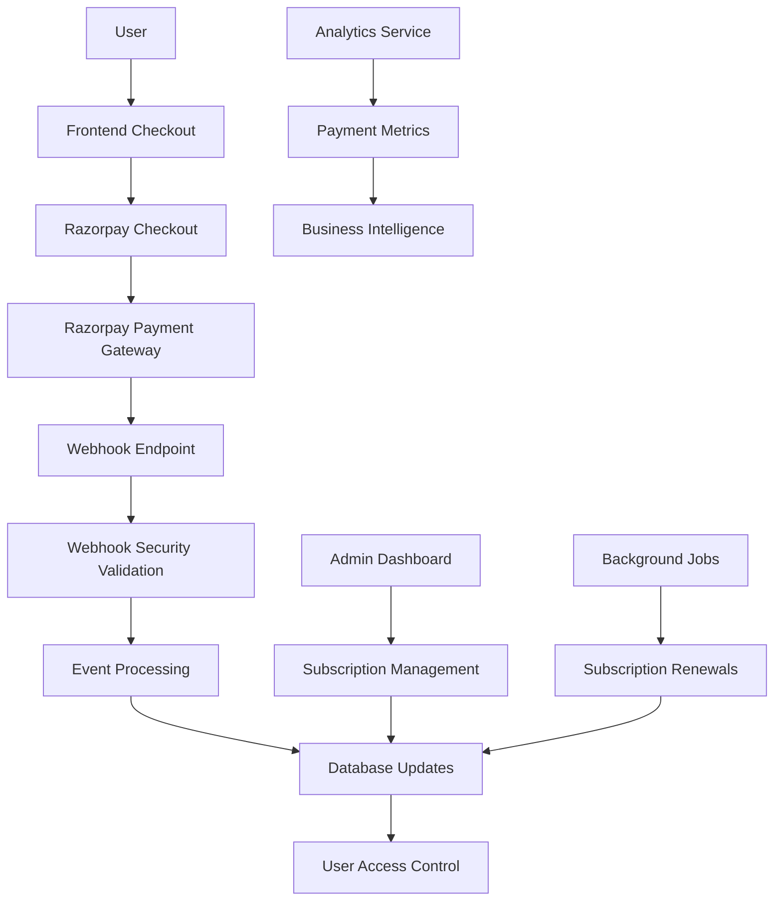

# Razorpay Integration Documentation

## Overview

SmartSlate Polaris v3 integrates Razorpay as its primary payment gateway for subscription management. This comprehensive integration handles subscription creation, payment processing, webhook management, and tier-based access control with enterprise-grade security and reliability.

## Table of Contents

1. [Architecture Overview](#architecture-overview)
2. [Environment Configuration](#environment-configuration)
3. [Database Schema](#database-schema)
4. [Subscription Tiers](#subscription-tiers)
5. [Payment Flow](#payment-flow)
6. [Webhook Processing](#webhook-processing)
7. [API Endpoints](#api-endpoints)
8. [Frontend Integration](#frontend-integration)
9. [Error Handling](#error-handling)
10. [Security Implementation](#security-implementation)
11. [Testing & Debugging](#testing--debugging)
12. [Monitoring & Analytics](#monitoring--analytics)
13. [Troubleshooting](#troubleshooting)

## Architecture Overview

### System Architecture



### Integration Components

1. **Frontend Components**: Checkout UI, payment forms, subscription management
2. **API Endpoints**: Subscription creation, webhook processing, payment verification
3. **Database Layer**: Subscription tracking, payment history, user access control
4. **Security Layer**: Webhook signature verification, fraud detection
5. **Monitoring Layer**: Payment analytics, error tracking, revenue reporting

## Environment Configuration

### Required Environment Variables

```bash
# Razorpay Configuration
NEXT_PUBLIC_RAZORPAY_KEY_ID=rzp_test_xxxxxxxxxxxxxxxxxxxxxxx  # Public key for frontend
RAZORPAY_KEY_SECRET=razorpay_secret_xxxxxxxxxxxxxxxxxxxxxxx  # Secret key for backend
RAZORPAY_WEBHOOK_SECRET=webhook_secret_xxxxxxxxxxxxxxxxxxxxxxx  # Webhook signature verification

# Application URLs
NEXT_PUBLIC_APP_URL=https://your-domain.com
NEXT_PUBLIC_RAZORPAY_SUCCESS_URL=https://your-domain.com/subscription/success
NEXT_PUBLIC_RAZORPAY_FAILURE_URL=https://your-domain.com/subscription/failure

# Webhook Endpoint
NEXT_PUBLIC_WEBHOOK_ENDPOINT=https://your-domain.com/api/webhooks/razorpay
```

### Configuration Validation

```typescript
// Location: frontend/lib/razorpay/config.ts
export function validateRazorpayConfig(): ValidationResult {
  const required = [
    'NEXT_PUBLIC_RAZORPAY_KEY_ID',
    'RAZORPAY_KEY_SECRET',
    'RAZORPAY_WEBHOOK_SECRET'
  ];

  const missing = required.filter(key => !process.env[key]);

  if (missing.length > 0) {
    return {
      valid: false,
      error: `Missing required Razorpay configuration: ${missing.join(', ')}`
    };
  }

  // Validate key format
  const keyId = process.env.NEXT_PUBLIC_RAZORPAY_KEY_ID!;
  if (!keyId.startsWith('rzp_')) {
    return {
      valid: false,
      error: 'Invalid Razorpay Key ID format'
    };
  }

  return { valid: true };
}

export const razorpayConfig = {
  keyId: process.env.NEXT_PUBLIC_RAZORPAY_KEY_ID!,
  secret: process.env.RAZORPAY_KEY_SECRET!,
  webhookSecret: process.env.RAZORPAY_WEBHOOK_SECRET!,
  successUrl: process.env.NEXT_PUBLIC_RAZORPAY_SUCCESS_URL!,
  failureUrl: process.env.NEXT_PUBLIC_RAZORPAY_FAILURE_URL!,
  webhookEndpoint: process.env.NEXT_PUBLIC_WEBHOOK_ENDPOINT!
};
```

## Database Schema

### Subscription Table

```sql
-- Location: supabase/migrations/20251029060000_create_razorpay_subscriptions_table.sql

CREATE TABLE IF NOT EXISTS public.subscriptions (
  -- Primary Key
  subscription_id UUID PRIMARY KEY DEFAULT gen_random_uuid(),

  -- Foreign Keys
  user_id UUID NOT NULL REFERENCES auth.users(id) ON DELETE CASCADE,

  -- Razorpay IDs
  razorpay_subscription_id VARCHAR(255) NOT NULL UNIQUE,
  razorpay_plan_id VARCHAR(255) NOT NULL,
  razorpay_customer_id VARCHAR(255),

  -- Subscription Status
  status VARCHAR(50) NOT NULL DEFAULT 'created',
  CONSTRAINT valid_subscription_status CHECK (
    status IN (
      'created', 'authenticated', 'active', 'halted',
      'cancelled', 'completed', 'expired', 'paused'
    )
  ),

  -- Plan Details
  plan_name VARCHAR(100) NOT NULL,
  plan_amount INTEGER NOT NULL, -- Amount in paise (₹1 = 100 paise)
  plan_currency VARCHAR(3) NOT NULL DEFAULT 'INR',
  plan_period VARCHAR(20) NOT NULL, -- 'monthly' or 'yearly'
  plan_interval INTEGER NOT NULL DEFAULT 1,

  -- Subscription Tier
  subscription_tier VARCHAR(50) NOT NULL,
  CONSTRAINT valid_subscription_tier CHECK (
    subscription_tier IN (
      'free', 'explorer', 'navigator', 'voyager',
      'crew', 'fleet', 'armada'
    )
  ),

  -- Billing Dates (ISO 8601 timestamps)
  start_date TIMESTAMPTZ,
  end_date TIMESTAMPTZ,
  current_start TIMESTAMPTZ,
  current_end TIMESTAMPTZ,
  next_billing_date TIMESTAMPTZ,
  charge_at TIMESTAMPTZ,

  -- Billing Cycle Tracking
  total_count INTEGER NOT NULL DEFAULT 12,
  paid_count INTEGER NOT NULL DEFAULT 0,
  remaining_count INTEGER NOT NULL DEFAULT 12,

  -- Payment Method (stored as JSONB for flexibility)
  payment_method JSONB,

  -- Metadata
  metadata JSONB DEFAULT '{}'::jsonb,
  short_url TEXT,

  -- Timestamps
  created_at TIMESTAMPTZ NOT NULL DEFAULT NOW(),
  updated_at TIMESTAMPTZ NOT NULL DEFAULT NOW(),
  deleted_at TIMESTAMPTZ -- Soft delete
);

-- Indexes for performance
CREATE INDEX idx_subscriptions_user_id ON public.subscriptions(user_id);
CREATE INDEX idx_subscriptions_razorpay_subscription_id ON public.subscriptions(razorpay_subscription_id);
CREATE INDEX idx_subscriptions_status ON public.subscriptions(status);
CREATE INDEX idx_subscriptions_subscription_tier ON public.subscriptions(subscription_tier);
CREATE INDEX idx_subscriptions_next_billing_date ON public.subscriptions(next_billing_date);
CREATE INDEX idx_subscriptions_deleted_at ON public.subscriptions(deleted_at);

-- Composite index for active subscriptions per user
CREATE INDEX idx_subscriptions_user_active ON public.subscriptions(user_id, status)
  WHERE status IN ('active', 'authenticated');
```

### Payment Events Table

```sql
-- Location: supabase/migrations/20251029080000_create_razorpay_webhook_events_table.sql

CREATE TABLE IF NOT EXISTS public.razorpay_webhook_events (
  -- Primary Key
  event_id UUID PRIMARY KEY DEFAULT gen_random_uuid(),

  -- Event Details
  razorpay_event_id VARCHAR(255) NOT NULL UNIQUE,
  event_type VARCHAR(100) NOT NULL,
  event_time TIMESTAMPTZ NOT NULL,

  -- Event Data
  event_payload JSONB NOT NULL,
  processed_at TIMESTAMPTZ,
  processing_status VARCHAR(50) NOT NULL DEFAULT 'pending',
  processing_error TEXT,

  -- Metadata
  created_at TIMESTAMPTZ NOT NULL DEFAULT NOW(),
  updated_at TIMESTAMPTZ NOT NULL DEFAULT NOW(),

  -- Indexes
  CONSTRAINT valid_processing_status CHECK (
    processing_status IN ('pending', 'processed', 'failed', 'retrying')
  )
);

CREATE INDEX idx_razorpay_webhook_events_event_id ON public.razorpay_webhook_events(razorpay_event_id);
CREATE INDEX idx_razorpay_webhook_events_type ON public.razorpay_webhook_events(event_type);
CREATE INDEX idx_razorpay_webhook_events_status ON public.razorpay_webhook_events(processing_status);
CREATE INDEX idx_razorpay_webhook_events_created ON public.razorpay_webhook_events(created_at DESC);
```

### Payment History Table

```sql
-- Location: supabase/migrations/20251029070000_create_razorpay_payments_table.sql

CREATE TABLE IF NOT EXISTS public.payments (
  -- Primary Key
  payment_id UUID PRIMARY KEY DEFAULT gen_random_uuid(),

  -- Foreign Keys
  user_id UUID NOT NULL REFERENCES auth.users(id) ON DELETE CASCADE,
  subscription_id UUID REFERENCES public.subscriptions(subscription_id) ON DELETE SET NULL,

  -- Razorpay Details
  razorpay_payment_id VARCHAR(255) NOT NULL UNIQUE,
  razorpay_order_id VARCHAR(255),
  razorpay_invoice_id VARCHAR(255),

  -- Payment Details
  amount INTEGER NOT NULL, -- Amount in paise
  currency VARCHAR(3) NOT NULL DEFAULT 'INR',
  status VARCHAR(50) NOT NULL,
  method VARCHAR(50), -- 'card', 'upi', 'netbanking', etc.

  -- Timestamps
  created_at TIMESTAMPTZ NOT NULL DEFAULT NOW(),
  captured_at TIMESTAMPTZ,
  updated_at TIMESTAMPTZ NOT NULL DEFAULT NOW(),

  -- Metadata
  payment_method JSONB,
  notes JSONB DEFAULT '{}'::jsonb,
  failure_reason TEXT
);

CREATE INDEX idx_payments_user_id ON public.payments(user_id);
CREATE INDEX idx_payments_subscription_id ON public.payments(subscription_id);
CREATE INDEX idx_payments_razorpay_payment_id ON public.payments(razorpay_payment_id);
CREATE INDEX idx_payments_status ON public.payments(status);
CREATE INDEX idx_payments_created ON public.payments(created_at DESC);
```

## Subscription Tiers

### Tier Configuration

```typescript
// Location: frontend/lib/razorpay/tiers.ts

export interface SubscriptionTier {
  id: string;
  name: string;
  displayName: string;
  price: {
    monthly: number; // in paise
    yearly?: number; // in paise
  };
  features: string[];
  limits: {
    blueprintsPerMonth: number;
    savedBlueprints: number;
    exports: number;
    collaborators?: number;
  };
  razorpayPlanId: {
    monthly: string;
    yearly?: string;
  };
}

export const subscriptionTiers: Record<string, SubscriptionTier> = {
  explorer: {
    id: 'explorer',
    name: 'Explorer',
    displayName: 'Free Tier Member',
    price: {
      monthly: 0
    },
    features: [
      '2 AI-generated blueprints per month',
      'Basic learning path generation',
      'Email support',
      'Community access'
    ],
    limits: {
      blueprintsPerMonth: 2,
      savedBlueprints: 2,
      exports: 2
    },
    razorpayPlanId: {
      monthly: 'plan_explorer_free'
    }
  },

  navigator: {
    id: 'navigator',
    name: 'Navigator',
    displayName: 'Navigator Member',
    price: {
      monthly: 2900, // ₹29/month
      yearly: 29000 // ₹290/year (2 months free)
    },
    features: [
      '25 AI-generated blueprints per month',
      'Advanced learning analytics',
      'Priority email support',
      'Custom learning paths',
      'Progress tracking',
      'Export to multiple formats'
    ],
    limits: {
      blueprintsPerMonth: 25,
      savedBlueprints: 50,
      exports: 25
    },
    razorpayPlanId: {
      monthly: 'plan_navigator_monthly',
      yearly: 'plan_navigator_yearly'
    }
  },

  voyager: {
    id: 'voyager',
    name: 'Voyager',
    displayName: 'Voyager Member',
    price: {
      monthly: 5900, // ₹59/month
      yearly: 59000 // ₹590/year (2 months free)
    },
    features: [
      '50 AI-generated blueprints per month',
      'Advanced AI recommendations',
      'Live chat support',
      'Team collaboration tools',
      'Custom integrations',
      'Advanced analytics dashboard'
    ],
    limits: {
      blueprintsPerMonth: 50,
      savedBlueprints: 100,
      exports: 50
    },
    razorpayPlanId: {
      monthly: 'plan_voyager_monthly',
      yearly: 'plan_voyager_yearly'
    }
  },

  crew: {
    id: 'crew',
    name: 'Crew',
    displayName: 'Crew Member',
    price: {
      monthly: 9900, // ₹99/month
      yearly: 99000 // ₹990/year (2 months free)
    },
    features: [
      'Team collaboration features',
      'Shared workspaces',
      'Admin dashboard',
      'Bulk blueprint generation',
      'API access',
      'Priority support'
    ],
    limits: {
      blueprintsPerMonth: 10,
      savedBlueprints: 25,
      exports: 10,
      collaborators: 5
    },
    razorpayPlanId: {
      monthly: 'plan_crew_monthly',
      yearly: 'plan_crew_yearly'
    }
  },

  fleet: {
    id: 'fleet',
    name: 'Fleet',
    displayName: 'Fleet Member',
    price: {
      monthly: 19900, // ₹199/month
      yearly: 199000 // ₹1990/year (2 months free)
    },
    features: [
      'Advanced team management',
      'Custom branding',
      'White-label options',
      'Dedicated account manager',
      'Custom integrations',
      'Advanced analytics'
    ],
    limits: {
      blueprintsPerMonth: 30,
      savedBlueprints: 75,
      exports: 30,
      collaborators: 20
    },
    razorpayPlanId: {
      monthly: 'plan_fleet_monthly',
      yearly: 'plan_fleet_yearly'
    }
  },

  armada: {
    id: 'armada',
    name: 'Armada',
    displayName: 'Armada Member',
    price: {
      monthly: 49900, // ₹499/month
      yearly: 499000 // ₹4990/year (2 months free)
    },
    features: [
      'Enterprise features',
      'Unlimited team members',
      'Custom AI training',
      'SLA guarantee',
      'On-premise deployment option',
      'Custom contract terms'
    ],
    limits: {
      blueprintsPerMonth: 60,
      savedBlueprints: 150,
      exports: 60,
      collaborators: -1 // unlimited
    },
    razorpayPlanId: {
      monthly: 'plan_armada_monthly',
      yearly: 'plan_armada_yearly'
    }
  }
};
```

## Payment Flow

### 1. Subscription Creation Flow

#### Frontend Subscription Creation

```typescript
// Location: frontend/components/subscription/SubscriptionCheckout.tsx

export function SubscriptionCheckout({ tier, billingCycle }: SubscriptionCheckoutProps) {
  const [isProcessing, setIsProcessing] = useState(false);
  const [error, setError] = useState<string | null>(null);

  const handleSubscribe = async () => {
    setIsProcessing(true);
    setError(null);

    try {
      // Step 1: Create subscription on backend
      const subscriptionResponse = await fetch('/api/subscriptions/create-subscription', {
        method: 'POST',
        headers: { 'Content-Type': 'application/json' },
        body: JSON.stringify({
          planId: tier.id,
          billingCycle,
          successUrl: `${window.location.origin}/subscription/success`,
          failureUrl: `${window.location.origin}/subscription/failure`
        })
      });

      const subscriptionData = await subscriptionResponse.json();

      if (!subscriptionData.success) {
        throw new Error(subscriptionData.error || 'Failed to create subscription');
      }

      // Step 2: Initialize Razorpay checkout
      const razorpay = new (window as any).Razorpay({
        key_id: process.env.NEXT_PUBLIC_RAZORPAY_KEY_ID,
        amount: subscriptionData.amount,
        currency: subscriptionData.currency,
        name: 'SmartSlate Polaris',
        description: `${tier.name} - ${billingCycle}`,
        subscription_id: subscriptionData.razorpaySubscriptionId,
        callback_url: subscriptionData.callbackUrl,
        prefill: {
          email: user.email,
          name: user.name
        },
        theme: {
          color: '#3b82f6'
        },
        modal: {
          ondismiss: () => {
            setIsProcessing(false);
            // Handle cancelled payment
          }
        }
      });

      // Step 3: Open checkout
      razorpay.open();

      // Step 4: Handle payment completion (redirect handled by callback URLs)

    } catch (error) {
      setError((error as Error).message);
      setIsProcessing(false);
    }
  };

  return (
    <div className="subscription-checkout">
      <div className="plan-summary">
        <h3>{tier.displayName}</h3>
        <div className="price">
          ₹{(tier.price[billingCycle] / 100).toFixed(0)}/{billingCycle}
        </div>
      </div>

      <button
        onClick={handleSubscribe}
        disabled={isProcessing}
        className="subscribe-button"
      >
        {isProcessing ? 'Processing...' : 'Subscribe Now'}
      </button>

      {error && (
        <div className="error-message">
          {error}
        </div>
      )}
    </div>
  );
}
```

#### Backend Subscription Creation

```typescript
// Location: frontend/app/api/subscriptions/create-subscription/route.ts

export async function POST(req: NextRequest): Promise<NextResponse> {
  try {
    // Authenticate user
    const authResult = await requireAuth(req);
    if (!authResult.success) {
      return NextResponse.json({ error: authResult.error }, { status: 401 });
    }

    const userId = authResult.user!.id;
    const { planId, billingCycle, successUrl, failureUrl } = await req.json();

    // Validate plan
    const tier = subscriptionTiers[planId];
    if (!tier) {
      return NextResponse.json({ error: 'Invalid plan selected' }, { status: 400 });
    }

    // Check for existing active subscription
    const supabase = await getSupabaseServerClient();
    const { data: existingSubscription } = await supabase
      .from('subscriptions')
      .select('*')
      .eq('user_id', userId)
      .eq('status', 'active')
      .single();

    if (existingSubscription) {
      return NextResponse.json({
        error: 'You already have an active subscription',
        existingSubscription
      }, { status: 409 });
    }

    // Create Razorpay subscription
    const razorpay = new Razorpay({
      key_id: process.env.RAZORPAY_KEY_SECRET,
      key_secret: process.env.RAZORPAY_KEY_SECRET
    });

    const subscriptionData = {
      plan_id: tier.razorpayPlanId[billingCycle],
      customer_notify: true,
      quantity: 1,
      total_count: billingCycle === 'yearly' ? 1 : 12,
      notes: {
        userId: userId,
        planId: planId,
        billingCycle: billingCycle
      }
    };

    const razorpaySubscription = await razorpay.subscriptions.create(subscriptionData);

    // Save subscription to database
    const { data: subscription, error } = await supabase
      .from('subscriptions')
      .insert({
        user_id: userId,
        razorpay_subscription_id: razorpaySubscription.id,
        razorpay_plan_id: tier.razorpayPlanId[billingCycle],
        status: razorpaySubscription.status,
        plan_name: tier.name,
        plan_amount: tier.price[billingCycle],
        plan_currency: 'INR',
        plan_period: billingCycle,
        plan_interval: 1,
        subscription_tier: planId,
        start_date: new Date(razorpaySubscription.start_at * 1000).toISOString(),
        current_start: new Date(razorpaySubscription.current_start * 1000).toISOString(),
        next_billing_date: new Date(razorpaySubscription.charge_at * 1000).toISOString(),
        total_count: razorpaySubscription.total_count,
        paid_count: razorpaySubscription.paid_count,
        remaining_count: razorpaySubscription.remaining_count,
        short_url: razorpaySubscription.short_url,
        metadata: {
          billingCycle,
          userId,
          planId
        }
      })
      .select()
      .single();

    if (error) {
      logger.error('subscription_creation_failed', 'Failed to save subscription', {
        userId,
        planId,
        error: error.message
      });

      return NextResponse.json({
        error: 'Failed to create subscription'
      }, { status: 500 });
    }

    // Create webhook callback URL
    const callbackUrl = `${process.env.NEXT_PUBLIC_APP_URL}/api/webhooks/razorpay`;

    return NextResponse.json({
      success: true,
      subscriptionId: subscription.subscription_id,
      razorpaySubscriptionId: razorpaySubscription.id,
      amount: tier.price[billingCycle],
      currency: 'INR',
      callbackUrl,
      shortUrl: razorpaySubscription.short_url
    });

  } catch (error) {
    logger.error('subscription_creation_error', 'Unexpected error during subscription creation', {
      error: (error as Error).message
    });

    return NextResponse.json({
      error: 'Internal server error'
    }, { status: 500 });
  }
}
```

### 2. Payment Completion Flow

#### Success URL Handler

```typescript
// Location: frontend/app/(auth)/subscription/success/page.tsx

export default function SubscriptionSuccessPage() {
  const [subscription, setSubscription] = useState(null);
  const [isLoading, setIsLoading] = useState(true);

  useEffect(() => {
    const verifySubscription = async () => {
      try {
        // Get subscription ID from URL parameters
        const urlParams = new URLSearchParams(window.location.search);
        const subscriptionId = urlParams.get('subscription_id');

        if (!subscriptionId) {
          throw new Error('Missing subscription ID');
        }

        // Verify subscription status
        const response = await fetch('/api/subscriptions/verify-payment', {
          method: 'POST',
          headers: { 'Content-Type': 'application/json' },
          body: JSON.stringify({ subscriptionId })
        });

        const data = await response.json();

        if (data.success) {
          setSubscription(data.subscription);

          // Update user profile with new tier
          await updateUserProfile(data.subscription);

          // Redirect to dashboard after 3 seconds
          setTimeout(() => {
            window.location.href = '/dashboard';
          }, 3000);
        } else {
          throw new Error(data.error);
        }
      } catch (error) {
        // Handle error
        window.location.href = '/subscription/failure';
      } finally {
        setIsLoading(false);
      }
    };

    verifySubscription();
  }, []);

  if (isLoading) {
    return <SubscriptionSuccessSkeleton />;
  }

  return (
    <div className="subscription-success">
      <div className="success-icon">
        <CheckCircle size={64} />
      </div>

      <h1>Subscription Successful!</h1>

      <p>
        Thank you for subscribing to SmartSlate Polaris.
        You now have access to {subscription?.tier_name} features.
      </p>

      <div className="next-steps">
        <h2>What's Next?</h2>
        <ul>
          <li>Start creating your first AI-powered learning blueprint</li>
          <li>Explore advanced features available to you</li>
          <li>Access your personalized dashboard</li>
        </ul>
      </div>

      <div className="redirect-notice">
        <p>You will be redirected to your dashboard in a few seconds...</p>
        <Link href="/dashboard">
          <button>Go to Dashboard Now</button>
        </Link>
      </div>
    </div>
  );
}
```

#### Payment Verification

```typescript
// Location: frontend/app/api/subscriptions/verify-payment/route.ts

export async function POST(req: NextRequest): Promise<NextResponse> {
  try {
    const authResult = await requireAuth(req);
    if (!authResult.success) {
      return NextResponse.json({ error: authResult.error }, { status: 401 });
    }

    const { subscriptionId } = await req.json();

    const supabase = await getSupabaseServerClient();

    // Get subscription from database
    const { data: subscription, error } = await supabase
      .from('subscriptions')
      .select('*')
      .eq('subscription_id', subscriptionId)
      .eq('user_id', authResult.user!.id)
      .single();

    if (error || !subscription) {
      return NextResponse.json({
        error: 'Subscription not found'
      }, { status: 404 });
    }

    // Verify with Razorpay
    const razorpay = new Razorpay({
      key_id: process.env.RAZORPAY_KEY_SECRET,
      key_secret: process.env.RAZORPAY_KEY_SECRET
    });

    const razorpaySubscription = await razorpay.subscriptions.fetch(
      subscription.razorpay_subscription_id
    );

    // Update subscription status if needed
    if (razorpaySubscription.status !== subscription.status) {
      await supabase
        .from('subscriptions')
        .update({
          status: razorpaySubscription.status,
          updated_at: new Date().toISOString()
        })
        .eq('subscription_id', subscriptionId);
    }

    return NextResponse.json({
      success: true,
      subscription: {
        ...subscription,
        status: razorpaySubscription.status
      }
    });

  } catch (error) {
    logger.error('payment_verification_failed', 'Failed to verify payment', {
      error: (error as Error).message
    });

    return NextResponse.json({
      error: 'Failed to verify payment'
    }, { status: 500 });
  }
}
```

## Webhook Processing

### 1. Webhook Security Validation

#### Signature Verification

```typescript
// Location: frontend/lib/razorpay/webhookSecurity.ts

export function validateWebhookSecurity(
  headers: Headers,
  body: string
): SecurityValidationResult {
  try {
    const signature = headers.get('X-Razorpay-Signature');

    if (!signature) {
      return {
        valid: false,
        error: 'Missing X-Razorpay-Signature header'
      };
    }

    const webhookSecret = process.env.RAZORPAY_WEBHOOK_SECRET;
    if (!webhookSecret) {
      return {
        valid: false,
        error: 'Webhook secret not configured'
      };
    }

    // Parse signature
    const receivedSignature = signature.split(' ')[1]; // Remove 'sha256=' prefix
    const expectedSignature = crypto
      .createHmac('sha256', webhookSecret)
      .update(body)
      .digest('hex');

    if (receivedSignature !== expectedSignature) {
      logger.error('webhook_signature_invalid', 'Webhook signature validation failed', {
        receivedSignature: receivedSignature.substring(0, 10) + '...',
        expectedSignature: expectedSignature.substring(0, 10) + '...'
      });

      return {
        valid: false,
        error: 'Invalid webhook signature'
      };
    }

    // Extract event details for logging
    const eventDetails = extractEventDetails(body);

    return {
      valid: true,
      details: eventDetails
    };

  } catch (error) {
    return {
      valid: false,
      error: 'Signature validation error: ' + (error as Error).message
    };
  }
}

function extractEventDetails(body: string): EventDetails {
  try {
    const event = JSON.parse(body);
    return {
      eventId: event.id || 'unknown',
      eventType: event.event || 'unknown',
      accountId: event.account || 'unknown'
    };
  } catch {
    return {
      eventId: 'unknown',
      eventType: 'unknown',
      accountId: 'unknown'
    };
  }
}

export function extractRazorpaySignature(headers: Headers): string | null {
  return headers.get('X-Razorpay-Signature');
}
```

### 2. Main Webhook Handler

#### Webhook Endpoint Implementation

```typescript
// Location: frontend/app/api/webhooks/razorpay/route.ts

export async function POST(request: Request): Promise<Response> {
  const startTime = Date.now();
  const requestId = generateRequestId();

  try {
    // Get request body and headers
    const body = await request.text();
    const signature = extractRazorpaySignature(request.headers);

    // Validate webhook security
    const securityValidation = validateWebhookSecurity(request.headers, body);

    if (!securityValidation.valid) {
      logger.error('webhook_security_failed', 'Webhook security validation failed', {
        requestId,
        error: securityValidation.error
      });

      return createWebhookResponse(false, securityValidation.error!, 401);
    }

    // Parse webhook event
    const event = parseWebhookEvent(body);
    if (!event.valid || !event.event) {
      return createWebhookResponse(false, 'Invalid webhook payload', 400);
    }

    // Check idempotency
    const idempotencyCheck = await checkEventProcessed(event.event.eventId);
    if (idempotencyCheck.exists) {
      return createWebhookResponse(true, 'Duplicate event acknowledged', 200);
    }

    // Record webhook event
    await recordWebhookEvent(event.event);

    // Route to appropriate handler
    const handlerResult = await routeWebhookEvent(event);

    if (handlerResult.success) {
      // Mark event as processed
      await markEventProcessed(event.event.eventId, handlerResult);

      logger.info('webhook_processed', 'Webhook processed successfully', {
        requestId,
        eventId: event.event.eventId,
        eventType: event.event.eventType,
        duration: Date.now() - startTime
      });

      return createWebhookResponse(true, 'Webhook processed successfully', 200);
    } else {
      // Mark event as failed
      await markEventFailed(event.event.eventId, handlerResult.error);

      logger.error('webhook_processing_failed', 'Webhook processing failed', {
        requestId,
        eventId: event.event.eventId,
        error: handlerResult.error
      });

      return createWebhookResponse(false, handlerResult.error, 500);
    }

  } catch (error) {
    logger.error('webhook_unexpected_error', 'Unexpected webhook error', {
      requestId,
      error: (error as Error).message
    });

    return createWebhookResponse(false, 'Internal server error', 500);
  }
}
```

### 3. Event Handlers

#### Subscription Event Handlers

```typescript
// Location: frontend/lib/razorpay/handlers/subscriptionHandlers.ts

export const subscriptionHandlers = {
  'subscription.authorized': async (event: RazorpayEvent): Promise<HandlerResult> => {
    const subscription = event.payload.entity;

    try {
      const supabase = await createClient();

      // Update subscription status
      await supabase
        .from('subscriptions')
        .update({
          status: 'authenticated',
          start_date: new Date(subscription.start_at * 1000).toISOString(),
          current_start: new Date(subscription.current_start * 1000).toISOString(),
          updated_at: new Date().toISOString()
        })
        .eq('razorpay_subscription_id', subscription.id);

      // Update user profile
      await updateUserSubscriptionStatus(subscription);

      return {
        success: true,
        processed: true,
        details: {
          subscriptionId: subscription.id,
          action: 'subscription_authorized'
        }
      };

    } catch (error) {
      return {
        success: false,
        error: (error as Error).message,
        retryable: true
      };
    }
  },

  'subscription.activated': async (event: RazorpayEvent): Promise<HandlerResult> => {
    const subscription = event.payload.entity;

    try {
      const supabase = await createClient();

      // Update subscription status to active
      await supabase
        .from('subscriptions')
        .update({
          status: 'active',
          activated_at: new Date().toISOString(),
          updated_at: new Date().toISOString()
        })
        .eq('razorpay_subscription_id', subscription.id);

      // Grant user access to features
      await grantUserAccess(subscription);

      // Send confirmation email
      await sendSubscriptionConfirmation(subscription);

      return {
        success: true,
        processed: true,
        details: {
          subscriptionId: subscription.id,
          action: 'subscription_activated'
        }
      };

    } catch (error) {
      return {
        success: false,
        error: (error as Error).message,
        retryable: true
      };
    }
  },

  'subscription.completed': async (event: RazorpayEvent): Promise<HandlerResult> => {
    const subscription = event.payload.entity;

    try {
      const supabase = await createClient();

      // Mark subscription as completed
      await supabase
        .from('subscriptions')
        .update({
          status: 'completed',
          end_date: new Date(subscription.end_at * 1000).toISOString(),
          updated_at: new Date().toISOString()
        })
        .eq('razorpay_subscription_id', subscription.id);

      // Downgrade user to free tier
      await downgradeUserToFreeTier(subscription.customer_id);

      // Send completion notification
      await sendSubscriptionCompletionNotification(subscription);

      return {
        success: true,
        processed: true,
        details: {
          subscriptionId: subscription.id,
          action: 'subscription_completed'
        }
      };

    } catch (error) {
      return {
        success: false,
        error: (error as Error).message,
        retryable: true
      };
    }
  },

  'subscription.cancelled': async (event: RazorpayEvent): Promise<HandlerResult> => {
    const subscription = event.payload.entity;

    try {
      const supabase = await createClient();

      // Mark subscription as cancelled
      await supabase
        .from('subscriptions')
        .update({
          status: 'cancelled',
          cancelled_at: new Date(subscription.ended_at * 1000).toISOString(),
          updated_at: new Date().toISOString()
        })
        .eq('razorpay_subscription_id', subscription.id);

      // Handle grace period if applicable
      await handleSubscriptionGracePeriod(subscription);

      return {
        success: true,
        processed: true,
        details: {
          subscriptionId: subscription.id,
          action: 'subscription_cancelled'
        }
      };

    } catch (error) {
      return {
        success: false,
        error: (error as Error).message,
        retryable: true
      };
    }
  }
};
```

#### Payment Event Handlers

```typescript
// Location: frontend/lib/razorpay/handlers/paymentHandlers.ts

export const paymentHandlers = {
  'payment.captured': async (event: RazorpayEvent): Promise<HandlerResult> => {
    const payment = event.payload.entity;

    try {
      const supabase = await createClient();

      // Record payment
      await supabase
        .from('payments')
        .upsert({
          user_id: payment.notes?.userId,
          razorpay_payment_id: payment.id,
          razorpay_order_id: payment.order_id,
          amount: payment.amount,
          currency: payment.currency,
          status: 'captured',
          method: payment.method,
          captured_at: new Date().toISOString(),
          payment_method: payment.method_details,
          notes: payment.notes
        });

      // Update subscription payment count
      if (payment.subscription_id) {
        await supabase
          .from('subscriptions')
          .update({
            paid_count: supabase.raw(`paid_count + 1`),
            remaining_count: supabase.raw(`remaining_count - 1`),
            next_billing_date: new Date(payment.created_at * 1000).toISOString(),
            updated_at: new Date().toISOString()
          })
          .eq('razorpay_subscription_id', payment.subscription_id);
      }

      // Send payment confirmation
      await sendPaymentConfirmation(payment);

      return {
        success: true,
        processed: true,
        details: {
          paymentId: payment.id,
          subscriptionId: payment.subscription_id,
          action: 'payment_captured'
        }
      };

    } catch (error) {
      return {
        success: false,
        error: (error as Error).message,
        retryable: true
      };
    }
  },

  'payment.failed': async (event: RazorpayEvent): Promise<HandlerResult> => {
    const payment = event.payload.entity;

    try {
      const supabase = await createClient();

      // Record failed payment
      await supabase
        .from('payments')
        .insert({
          user_id: payment.notes?.userId,
          razorpay_payment_id: payment.id,
          razorpay_order_id: payment.order_id,
          amount: payment.amount,
          currency: payment.currency,
          status: 'failed',
          method: payment.method,
          failure_reason: payment.error_description,
          notes: payment.notes
        });

      // Handle subscription retry logic
      if (payment.subscription_id) {
        await handlePaymentRetry(payment.subscription_id);
      }

      // Send payment failure notification
      await sendPaymentFailureNotification(payment);

      return {
        success: true,
        processed: true,
        details: {
          paymentId: payment.id,
          subscriptionId: payment.subscription_id,
          action: 'payment_failed'
        }
      };

    } catch (error) {
      return {
        success: false,
        error: (error as Error).message,
        retryable: true
      };
    }
  }
};
```

### 4. User Profile Updates

#### Subscription Status Synchronization

```typescript
// Location: frontend/lib/razorpay/userProfileSync.ts

export async function updateUserSubscriptionStatus(
  subscription: RazorpaySubscription
): Promise<void> {
  const supabase = await createClient();

  // Get user profile
  const { data: profile } = await supabase
    .from('user_profiles')
    .select('*')
    .eq('user_id', subscription.notes.userId)
    .single();

  if (!profile) {
    throw new Error('User profile not found');
  }

  // Get tier configuration
  const tier = subscriptionTiers[subscription.notes.planId];
  if (!tier) {
    throw new Error('Invalid tier configuration');
  }

  // Update user profile with new subscription
  await supabase
    .from('user_profiles')
    .update({
      subscription_tier: tier.id,
      user_role: tier.id,
      blueprint_creation_limit: tier.limits.blueprintsPerMonth,
      blueprint_saving_limit: tier.limits.savedBlueprints,
      subscription_metadata: {
        ...profile.subscription_metadata,
        currentSubscription: {
          subscriptionId: subscription.id,
          planId: tier.id,
          status: subscription.status,
          billingCycle: subscription.notes.billingCycle,
          activatedAt: new Date().toISOString(),
          nextBillingDate: new Date(subscription.charge_at * 1000).toISOString()
        }
      },
      updated_at: new Date().toISOString()
    })
    .eq('user_id', subscription.notes.userId);
}

export async function downgradeUserToFreeTier(userId: string): Promise<void> {
  const supabase = await createClient();

  const freeTier = subscriptionTiers.explorer;

  await supabase
    .from('user_profiles')
    .update({
      subscription_tier: 'explorer',
      user_role: 'explorer',
      blueprint_creation_limit: freeTier.limits.blueprintsPerMonth,
      blueprint_saving_limit: freeTier.limits.savedBlueprints,
      subscription_metadata: {
        currentSubscription: null,
        lastSubscription: {
          endedAt: new Date().toISOString()
        }
      },
      updated_at: new Date().toISOString()
    })
    .eq('user_id', userId);
}

export async function grantUserAccess(subscription: RazorpaySubscription): Promise<void> {
  const userId = subscription.notes.userId;
  const planId = subscription.notes.planId;

  // Update user permissions and access control
  const supabase = await createClient();

  await supabase
    .from('user_profiles')
    .update({
      subscription_metadata: {
        ...supabase.raw('subscription_metadata'),
        access: {
          hasPremiumAccess: true,
          features: getTierFeatures(planId),
          grantedAt: new Date().toISOString()
        }
      }
    })
    .eq('user_id', userId);

  // Log access grant
  logger.info('user_access_granted', 'Premium access granted to user', {
    userId,
    planId,
    subscriptionId: subscription.id
  });
}

function getTierFeatures(planId: string): string[] {
  const tier = subscriptionTiers[planId];
  return tier ? tier.features : [];
}
```

## API Endpoints

### 1. Subscription Management

#### Cancel Subscription

```typescript
// Location: frontend/app/api/subscriptions/cancel/route.ts

export async function POST(req: NextRequest): Promise<NextResponse> {
  try {
    const authResult = await requireAuth(req);
    if (!authResult.success) {
      return NextResponse.json({ error: authResult.error }, { status: 401 });
    }

    const { subscriptionId, cancelAtEndOfPeriod = true } = await req.json();

    const supabase = await getSupabaseServerClient();

    // Get subscription details
    const { data: subscription, error } = await supabase
      .from('subscriptions')
      .select('*')
      .eq('subscription_id', subscriptionId)
      .eq('user_id', authResult.user!.id)
      .single();

    if (error || !subscription) {
      return NextResponse.json({
        error: 'Subscription not found'
      }, { status: 404 });
    }

    // Cancel with Razorpay
    const razorpay = new Razorpay({
      key_id: process.env.RAZORPAY_KEY_SECRET,
      key_secret: process.env.RAZORPAY_KEY_SECRET
    });

    const cancellationResult = await razorpay.subscriptions.cancel(
      subscription.razorpay_subscription_id,
      { cancel_at_cycle_end: cancelAtEndOfPeriod }
    );

    // Update database
    await supabase
      .from('subscriptions')
      .update({
        status: cancellationResult.status,
        cancelled_at: cancelAtEndOfPeriod ? null : new Date().toISOString(),
        updated_at: new Date().toISOString()
      })
      .eq('subscription_id', subscriptionId);

    // Send cancellation confirmation
    await sendCancellationConfirmation(subscription, cancelAtEndOfPeriod);

    return NextResponse.json({
      success: true,
      message: cancelAtEndOfPeriod
        ? 'Subscription will be cancelled at the end of the billing period'
        : 'Subscription cancelled immediately'
    });

  } catch (error) {
    logger.error('subscription_cancellation_failed', 'Failed to cancel subscription', {
      error: (error as Error).message
    });

    return NextResponse.json({
      error: 'Failed to cancel subscription'
    }, { status: 500 });
  }
}
```

#### Pause Subscription

```typescript
// Location: frontend/app/api/subscriptions/pause/route.ts

export async function POST(req: NextRequest): Promise<NextResponse> {
  try {
    const authResult = await requireAuth(req);
    if (!authResult.success) {
      return NextResponse.json({ error: authResult.error }, { status: 401 });
    }

    const { subscriptionId, pauseDuration } = await req.json();

    // Validate pause duration (1-3 months)
    if (pauseDuration < 1 || pauseDuration > 3) {
      return NextResponse.json({
        error: 'Pause duration must be between 1 and 3 months'
      }, { status: 400 });
    }

    const supabase = await getSupabaseServerClient();

    // Get subscription
    const { data: subscription } = await supabase
      .from('subscriptions')
      .select('*')
      .eq('subscription_id', subscriptionId)
      .eq('user_id', authResult.user!.id)
      .single();

    if (!subscription) {
      return NextResponse.json({
        error: 'Subscription not found'
      }, { status: 404 });
    }

    // Pause with Razorpay
    const razorpay = new Razorpay({
      key_id: process.env.RAZORPAY_KEY_SECRET,
      key_secret: process.env.RAZORPAY_KEY_SECRET
    });

    const pauseResult = await razorpay.subscriptions.pause(
      subscription.razorpay_subscription_id,
      {
        pause_at: new Date(Date.now() + 24 * 60 * 60 * 1000).toISOString(), // Start pause tomorrow
        resume_at: new Date(Date.now() + pauseDuration * 30 * 24 * 60 * 60 * 1000).toISOString()
      }
    );

    // Update database
    await supabase
      .from('subscriptions')
      .update({
        status: 'paused',
        paused_at: new Date().toISOString(),
        resume_at: new Date(Date.now() + pauseDuration * 30 * 24 * 60 * 60 * 1000).toISOString(),
        updated_at: new Date().toISOString()
      })
      .eq('subscription_id', subscriptionId);

    // Send pause confirmation
    await sendPauseConfirmation(subscription, pauseDuration);

    return NextResponse.json({
      success: true,
      message: `Subscription paused for ${pauseDuration} month(s)`,
      resumeAt: pauseResult.resume_at
    });

  } catch (error) {
    logger.error('subscription_pause_failed', 'Failed to pause subscription', {
      error: (error as Error).message
    });

    return NextResponse.json({
      error: 'Failed to pause subscription'
    }, { status: 500 });
  }
}
```

### 2. Usage and Billing

#### Get Usage Information

```typescript
// Location: frontend/app/api/user/usage/route.ts

export async function GET(req: NextRequest): Promise<NextResponse> {
  try {
    const authResult = await requireAuth(req);
    if (!authResult.success) {
      return NextResponse.json({ error: authResult.error }, { status: 401 });
    }

    const supabase = await getSupabaseServerClient();

    // Get user profile
    const { data: profile } = await supabase
      .from('user_profiles')
      .select('*')
      .eq('user_id', authResult.user!.id)
      .single();

    // Get active subscription
    const { data: subscription } = await supabase
      .from('subscriptions')
      .select('*')
      .eq('user_id', authResult.user!.id)
      .in('status', ['active', 'authenticated'])
      .order('created_at', { ascending: false })
      .limit(1)
      .single();

    // Get current usage
    const currentUsage = profile.subscription_metadata?.usage || {};

    // Get tier limits
    const tier = subscription ?
      subscriptionTiers[subscription.subscription_tier] :
      subscriptionTiers.explorer;

    const limits = tier ? tier.limits : subscriptionTiers.explorer.limits;

    return NextResponse.json({
      success: true,
      usage: {
        blueprintsCreated: currentUsage.blueprint_creation_count || 0,
        blueprintsSaved: currentUsage.saved_blueprints || 0,
        exportsPdf: currentUsage.exports_pdf || 0,
        exportsWord: currentUsage.exports_word || 0
      },
      limits: {
        blueprintsCreated: limits.blueprintsPerMonth,
        blueprintsSaved: limits.savedBlueprints,
        exports: limits.exports
      },
      subscription: subscription ? {
        id: subscription.subscription_id,
        tier: subscription.subscription_tier,
        status: subscription.status,
        planName: subscription.plan_name,
        nextBilling: subscription.next_billing_date,
        cancelledAt: subscription.cancelled_at
      } : null,
      canCreate: (currentUsage.blueprint_creation_count || 0) < limits.blueprintsPerMonth,
      canSave: (currentUsage.saved_blueprints || 0) < limits.savedBlueprints,
      canExport: (currentUsage.exports_pdf || 0) + (currentUsage.exports_word || 0) < limits.exports
    });

  } catch (error) {
    logger.error('usage_fetch_failed', 'Failed to fetch usage information', {
      error: (error as Error).message
    });

    return NextResponse.json({
      error: 'Failed to fetch usage information'
    }, { status: 500 });
  }
}
```

## Frontend Integration

### 1. Subscription Management Component

```typescript
// Location: frontend/components/subscription/SubscriptionManager.tsx

export function SubscriptionManager() {
  const [subscriptions, setSubscriptions] = useState<Subscription[]>([]);
  const [isLoading, setIsLoading] = useState(true);
  const [activeTab, setActiveTab] = useState('current');

  useEffect(() => {
    loadSubscriptions();
  }, []);

  const loadSubscriptions = async () => {
    try {
      const response = await fetch('/api/subscriptions/list');
      const data = await response.json();

      if (data.success) {
        setSubscriptions(data.subscriptions);
      }
    } catch (error) {
      console.error('Failed to load subscriptions:', error);
    } finally {
      setIsLoading(false);
    }
  };

  const handleCancelSubscription = async (subscriptionId: string) => {
    if (!confirm('Are you sure you want to cancel this subscription?')) {
      return;
    }

    try {
      const response = await fetch('/api/subscriptions/cancel', {
        method: 'POST',
        headers: { 'Content-Type': 'application/json' },
        body: JSON.stringify({
          subscriptionId,
          cancelAtEndOfPeriod: true
        })
      });

      const data = await response.json();

      if (data.success) {
        await loadSubscriptions();
        showNotification('Subscription cancelled successfully', 'success');
      } else {
        showNotification(data.error, 'error');
      }
    } catch (error) {
      showNotification('Failed to cancel subscription', 'error');
    }
  };

  const handlePauseSubscription = async (subscriptionId: string) => {
    try {
      const response = await fetch('/api/subscriptions/pause', {
        method: 'POST',
        headers: { 'Content-Type': 'application/json' },
        body: JSON.stringify({
          subscriptionId,
          pauseDuration: 1 // 1 month pause
        })
      });

      const data = await response.json();

      if (data.success) {
        await loadSubscriptions();
        showNotification('Subscription paused successfully', 'success');
      } else {
        showNotification(data.error, 'error');
      }
    } catch (error) {
      showNotification('Failed to pause subscription', 'error');
    }
  };

  if (isLoading) {
    return <SubscriptionManagerSkeleton />;
  }

  const activeSubscription = subscriptions.find(s =>
    ['active', 'authenticated', 'paused'].includes(s.status)
  );

  return (
    <div className="subscription-manager">
      <div className="manager-header">
        <h1>Subscription Management</h1>
      </div>

      <div className="manager-tabs">
        <button
          onClick={() => setActiveTab('current')}
          className={activeTab === 'current' ? 'active' : ''}
        >
          Current Subscription
        </button>
        <button
          onClick={() => setActiveTab('history')}
          className={activeTab === 'history' ? 'active' : ''}
        >
          Payment History
        </button>
        <button
          onClick={() => setActiveTab('invoices')}
          className={activeTab === 'invoices' ? 'active' : ''}
        >
          Invoices
        </button>
      </div>

      <div className="manager-content">
        {activeTab === 'current' && (
          <CurrentSubscriptionView
            subscription={activeSubscription}
            onCancel={handleCancelSubscription}
            onPause={handlePauseSubscription}
          />
        )}

        {activeTab === 'history' && (
          <PaymentHistoryView subscriptions={subscriptions} />
        )}

        {activeTab === 'invoices' && (
          <InvoicesView subscriptions={subscriptions} />
        )}
      </div>
    </div>
  );
}
```

### 2. Usage Monitoring Component

```typescript
// Location: frontend/components/subscription/UsageMonitor.tsx

export function UsageMonitor() {
  const [usageData, setUsageData] = useState<UsageData | null>(null);
  const [isLoading, setIsLoading] = useState(true);

  useEffect(() => {
    loadUsageData();
  }, []);

  const loadUsageData = async () => {
    try {
      const response = await fetch('/api/user/usage');
      const data = await response.json();

      if (data.success) {
        setUsageData(data);
      }
    } catch (error) {
      console.error('Failed to load usage data:', error);
    } finally {
      setIsLoading(false);
    }
  };

  if (isLoading) {
    return <UsageMonitorSkeleton />;
  }

  if (!usageData) {
    return <div>Failed to load usage data</div>;
  }

  const { usage, limits, subscription } = usageData;

  return (
    <div className="usage-monitor">
      <div className="usage-header">
        <h2>Usage Overview</h2>
        {subscription && (
          <div className="subscription-badge">
            {subscription.planName} - {subscription.status}
          </div>
        )}
      </div>

      <div className="usage-metrics">
        <div className="metric-card">
          <h3>Blueprints Created</h3>
          <div className="metric-value">
            {usage.blueprintsCreated} / {limits.blueprintsCreated}
          </div>
          <div className="metric-progress">
            <div
              className="progress-bar"
              style={{
                width: `${(usage.blueprintsCreated / limits.blueprintsCreated) * 100}%`
              }}
            />
          </div>
          <div className="metric-status">
            {usageData.canCreate ? 'Available' : 'Limit Reached'}
          </div>
        </div>

        <div className="metric-card">
          <h3>Blueprints Saved</h3>
          <div className="metric-value">
            {usage.blueprintsSaved} / {limits.blueprintsSaved}
          </div>
          <div className="metric-progress">
            <div
              className="progress-bar"
              style={{
                width: `${(usage.blueprintsSaved / limits.blueprintsSaved) * 100}%`
              }}
            />
          </div>
          <div className="metric-status">
            {usageData.canSave ? 'Available' : 'Limit Reached'}
          </div>
        </div>

        <div className="metric-card">
          <h3>Exports</h3>
          <div className="metric-value">
            {usage.exportsPdf + usage.exportsWord} / {limits.exports}
          </div>
          <div className="metric-progress">
            <div
              className="progress-bar"
              style={{
                width: `${((usage.exportsPdf + usage.exportsWord) / limits.exports) * 100}%`
              }}
            />
          </div>
          <div className="metric-status">
            {usageData.canExport ? 'Available' : 'Limit Reached'}
          </div>
        </div>
      </div>

      {subscription && (
        <div className="subscription-details">
          <h3>Subscription Details</h3>
          <div className="details-grid">
            <div className="detail-item">
              <label>Plan:</label>
              <span>{subscription.planName}</span>
            </div>
            <div className="detail-item">
              <label>Status:</label>
              <span className={`status ${subscription.status}`}>
                {subscription.status}
              </span>
            </div>
            <div className="detail-item">
              <label>Next Billing:</label>
              <span>
                {subscription.nextBilling
                  ? new Date(subscription.nextBilling).toLocaleDateString()
                  : 'N/A'
                }
              </span>
            </div>
            {subscription.cancelledAt && (
              <div className="detail-item">
                <label>Cancelled:</label>
                <span>{new Date(subscription.cancelledAt).toLocaleDateString()}</span>
              </div>
            )}
          </div>
        </div>
      )}

      {!usageData.canCreate && (
        <div className="upgrade-prompt">
          <p>You've reached your usage limit for this month.</p>
          <Link href="/pricing">
            <button className="upgrade-button">
              Upgrade Your Plan
            </button>
          </Link>
        </div>
      )}
    </div>
  );
}
```

## Error Handling

### 1. Payment Error Handling

```typescript
// Location: frontend/lib/razorpay/errorHandling.ts

export class PaymentError extends Error {
  constructor(
    message: string,
    public code: string,
    public retryable: boolean = false,
    public userMessage?: string
  ) {
    super(message);
    this.name = 'PaymentError';
  }
}

export function handleRazorpayError(error: any): PaymentError {
  const errorCode = error.error?.code || 'UNKNOWN_ERROR';
  const errorMessage = error.error?.description || error.message || 'Unknown payment error';

  switch (errorCode) {
    case 'BAD_REQUEST_ERROR':
      return new PaymentError(
        errorMessage,
        'BAD_REQUEST',
        false,
        'Invalid payment request. Please try again.'
      );

    case 'VALIDATION_ERROR':
      return new PaymentError(
        errorMessage,
        'VALIDATION_ERROR',
        false,
        'Payment details are invalid. Please check your information.'
      );

    case 'GATEWAY_ERROR':
      return new PaymentError(
        errorMessage,
        'GATEWAY_ERROR',
        true,
        'Payment gateway is temporarily unavailable. Please try again in a few minutes.'
      );

    case 'SERVER_ERROR':
      return new PaymentError(
        errorMessage,
        'SERVER_ERROR',
        true,
        'Our servers are experiencing issues. Please try again later.'
      );

    case 'INVALID_REQUEST':
      return new PaymentError(
        errorMessage,
        'INVALID_REQUEST',
        false,
        'The payment request is invalid. Please contact support.'
      );

    default:
      return new PaymentError(
        errorMessage,
        errorCode,
        true,
        'Payment failed. Please try again or contact support if the problem persists.'
      );
  }
}

export function getPaymentErrorMessage(error: PaymentError): string {
  return error.userMessage || error.message;
}
```

### 2. Retry Logic

```typescript
// Location: frontend/lib/razorpay/retryLogic.ts

export class PaymentRetryManager {
  private maxRetries = 3;
  private retryDelays = [1000, 3000, 5000]; // 1s, 3s, 5s

  async executeWithRetry<T>(
    operation: () => Promise<T>,
    operationName: string,
    options: RetryOptions = {}
  ): Promise<T> {
    const { maxRetries = this.maxRetries, retryDelays = this.retryDelays } = options;
    let lastError: Error;

    for (let attempt = 0; attempt <= maxRetries; attempt++) {
      try {
        const result = await operation();

        if (attempt > 0) {
          logger.info('payment_retry_success', 'Payment operation succeeded after retry', {
            operationName,
            attempt: attempt + 1,
            maxRetries: maxRetries + 1
          });
        }

        return result;
      } catch (error) {
        lastError = error as Error;

        const paymentError = error instanceof PaymentError
          ? error
          : new PaymentError((error as Error).message, 'UNKNOWN_ERROR', true);

        if (!paymentError.retryable || attempt >= maxRetries) {
          break;
        }

        const delay = retryDelays[Math.min(attempt, retryDelays.length - 1)];

        logger.warn('payment_retry_attempt', 'Payment operation failed, retrying', {
          operationName,
          attempt: attempt + 1,
          maxRetries: maxRetries + 1,
          error: paymentError.message,
          retryDelay: delay
        });

        await this.sleep(delay);
      }
    }

    logger.error('payment_retry_failed', 'All payment retry attempts exhausted', {
      operationName,
      totalAttempts: maxRetries + 1,
      finalError: lastError.message
    });

    throw lastError;
  }

  private sleep(ms: number): Promise<void> {
    return new Promise(resolve => setTimeout(resolve, ms));
  }
}
```

## Security Implementation

### 1. Webhook Security

```typescript
// Location: frontend/lib/razorpay/webhookSecurity.ts

export function validateWebhookRequest(request: Request): SecurityValidationResult {
  try {
    // Check required headers
    const requiredHeaders = ['X-Razorpay-Signature'];
    const missingHeaders = requiredHeaders.filter(header => !request.headers.get(header));

    if (missingHeaders.length > 0) {
      return {
        valid: false,
        error: `Missing required headers: ${missingHeaders.join(', ')}`
      };
    }

    // Check content type
    const contentType = request.headers.get('content-type');
    if (!contentType?.includes('application/json')) {
      return {
        valid: false,
        error: 'Invalid content type. Expected application/json'
      };
    }

    // Rate limiting check
    const clientIP = request.headers.get('x-forwarded-for') ||
                     request.headers.get('x-real-ip') ||
                     'unknown';

    if (isRateLimited(clientIP)) {
      return {
        valid: false,
        error: 'Rate limit exceeded',
        code: 'RATE_LIMIT_EXCEEDED'
      };
    }

    return { valid: true };
  } catch (error) {
    return {
      valid: false,
      error: 'Security validation error: ' + (error as Error).message
    };
  }
}

function isRateLimited(clientIP: string): boolean {
  // Implement rate limiting logic
  // This is a placeholder - implement with Redis or in-memory cache
  return false;
}
```

### 2. Data Encryption

```typescript
// Location: frontend/lib/razorpay/encryption.ts

export function encryptPaymentData(data: any): string {
  // Encrypt sensitive payment data before storing
  const key = process.env.PAYMENT_ENCRYPTION_KEY;
  if (!key) {
    throw new Error('Payment encryption key not configured');
  }

  const algorithm = 'aes-256-gcm';
  const iv = crypto.randomBytes(16);

  const cipher = crypto.createCipher(algorithm, key);
  cipher.setAAD(Buffer.from('payment-data'));

  let encrypted = cipher.update(JSON.stringify(data), 'utf8', 'hex');
  encrypted += cipher.final('hex');

  const authTag = cipher.getAuthTag();

  return iv.toString('hex') + ':' + authTag.toString('hex') + ':' + encrypted;
}

export function decryptPaymentData(encryptedData: string): any {
  const key = process.env.PAYMENT_ENCRYPTION_KEY;
  if (!key) {
    throw new Error('Payment encryption key not configured');
  }

  const algorithm = 'aes-256-gcm';
  const parts = encryptedData.split(':');

  if (parts.length !== 3) {
    throw new Error('Invalid encrypted data format');
  }

  const iv = Buffer.from(parts[0], 'hex');
  const authTag = Buffer.from(parts[1], 'hex');
  const encrypted = parts[2];

  const decipher = crypto.createDecipher(algorithm, key);
  decipher.setAAD(Buffer.from('payment-data'));
  decipher.setAuthTag(authTag);

  let decrypted = decipher.update(encrypted, 'hex', 'utf8');
  decrypted += decipher.final('utf8');

  return JSON.parse(decrypted);
}
```

## Testing & Debugging

### 1. Webhook Testing

```typescript
// Location: frontend/__tests__/razorpay/webhooks.test.ts

describe('Razorpay Webhook Processing', () => {
  const testWebhookEvents = [
    {
      event: 'subscription.authorized',
      payload: {
        entity: {
          id: 'sub_test123',
          status: 'authenticated',
          customer_id: 'cust_test123',
          plan_id: 'plan_test123',
          start_at: Math.floor(Date.now() / 1000),
          current_start: Math.floor(Date.now() / 1000),
          charge_at: Math.floor(Date.now() / 1000) + 30 * 24 * 60 * 60,
          total_count: 12,
          paid_count: 0,
          remaining_count: 12,
          notes: {
            userId: 'test-user-123',
            planId: 'navigator',
            billingCycle: 'monthly'
          }
        }
      }
    }
  ];

  test('should process subscription.authorized event', async () => {
    const event = testWebhookEvents[0];

    const mockSupabase = {
      from: vi.fn().mockReturnThis(),
      update: vi.fn().mockReturnThis(),
      eq: vi.fn().mockResolvedValue({ data: {}, error: null })
    };

    // Mock the webhook processing
    const result = await processWebhookEvent(event);

    expect(result.success).toBe(true);
    expect(result.details.action).toBe('subscription_authorized');
    expect(mockSupabase.update).toHaveBeenCalledWith({
      status: 'authenticated',
      start_at: expect.any(String),
      current_start: expect.any(String),
      updated_at: expect.any(String)
    });
  });

  test('should handle duplicate webhook events', async () => {
    const event = testWebhookEvents[0];

    // First processing
    await processWebhookEvent(event);

    // Second processing (should be acknowledged as duplicate)
    const result = await processWebhookEvent(event);

    expect(result.success).toBe(true);
    expect(result.status).toBe('duplicate');
  });
});
```

### 2. Payment Flow Testing

```typescript
// Location: frontend/__tests__/razorpay/payment.test.ts

describe('Payment Flow Integration', () => {
  test('should create subscription successfully', async () => {
    const subscriptionData = {
      planId: 'navigator',
      billingCycle: 'monthly',
      successUrl: 'https://example.com/success',
      failureUrl: 'https://example.com/failure'
    };

    const mockRazorpay = {
      subscriptions: {
        create: vi.fn().mockResolvedValue({
          id: 'sub_test123',
          status: 'created',
          short_url: 'https://rzp.io/test-link'
        })
      }
    };

    const result = await createSubscription(subscriptionData);

    expect(result.success).toBe(true);
    expect(result.razorpaySubscriptionId).toBe('sub_test123');
    expect(mockRazorpay.subscriptions.create).toHaveBeenCalledWith({
      plan_id: expect.any(String),
      customer_notify: true,
      quantity: 1,
      total_count: 12,
      notes: expect.any(Object)
    });
  });

  test('should handle payment failure gracefully', async () => {
    const mockRazorpay = {
      subscriptions: {
        create: vi.fn().mockRejectedValue(new Error('Payment gateway error'))
      }
    };

    const subscriptionData = {
      planId: 'navigator',
      billingCycle: 'monthly'
    };

    await expect(createSubscription(subscriptionData)).rejects.toThrow('Payment gateway error');
  });
});
```

### 3. Debug Tools

```typescript
// Location: frontend/lib/razorpay/debugTools.ts

export class RazorpayDebugger {
  static async validateConfiguration(): Promise<ConfigValidationResult> {
    const results = {
      environmentVariables: this.checkEnvironmentVariables(),
      razorpayConnection: await this.checkRazorpayConnection(),
      databaseConnection: await this.checkDatabaseConnection(),
      webhookConfiguration: await this.checkWebhookConfiguration()
    };

    return {
      valid: Object.values(results).every(r => r.valid),
      results
    };
  }

  private static checkEnvironmentVariables(): ValidationResult {
    const required = [
      'NEXT_PUBLIC_RAZORPAY_KEY_ID',
      'RAZORPAY_KEY_SECRET',
      'RAZORPAY_WEBHOOK_SECRET'
    ];

    const missing = required.filter(key => !process.env[key]);

    return {
      valid: missing.length === 0,
      message: missing.length === 0
        ? 'All environment variables configured'
        : `Missing: ${missing.join(', ')}`
    };
  }

  private static async checkRazorpayConnection(): Promise<ValidationResult> {
    try {
      const razorpay = new Razorpay({
        key_id: process.env.RAZORPAY_KEY_SECRET,
        key_secret: process.env.RAZORPAY_KEY_SECRET
      });

      // Test API call
      await razorpay.plans.all({ count: 1 });

      return { valid: true, message: 'Razorpay connection successful' };
    } catch (error) {
      return {
        valid: false,
        message: `Razorpay connection failed: ${(error as Error).message}`
      };
    }
  }

  private static async checkDatabaseConnection(): Promise<ValidationResult> {
    try {
      const supabase = await createClient();
      const { data, error } = await supabase
        .from('subscriptions')
        .select('count')
        .limit(1);

      if (error) {
        throw error;
      }

      return { valid: true, message: 'Database connection successful' };
    } catch (error) {
      return {
        valid: false,
        message: `Database connection failed: ${(error as Error).message}`
      };
    }
  }

  private static async checkWebhookConfiguration(): Promise<ValidationResult> {
    try {
      const webhookUrl = process.env.NEXT_PUBLIC_WEBHOOK_ENDPOINT;

      if (!webhookUrl) {
        return {
          valid: false,
          message: 'Webhook endpoint not configured'
        };
      }

      // Test webhook endpoint availability
      const response = await fetch(webhookUrl, {
        method: 'GET',
        headers: { 'Content-Type': 'application/json' }
      });

      if (response.ok) {
        return { valid: true, message: 'Webhook endpoint accessible' };
      } else {
        return {
          valid: false,
          message: `Webhook endpoint returned ${response.status}`
        };
      }
    } catch (error) {
      return {
        valid: false,
        message: `Webhook configuration check failed: ${(error as Error).message}`
      };
    }
  }

  static async simulateWebhookEvent(eventType: string, payload: any): Promise<void> {
    const webhookUrl = process.env.NEXT_PUBLIC_WEBHOOK_ENDPOINT;

    if (!webhookUrl) {
      throw new Error('Webhook endpoint not configured');
    }

    const event = {
      id: `evt_test_${Date.now()}`,
      event: eventType,
      account: 'acc_test123',
      created_at: Math.floor(Date.now() / 1000),
      payload
    };

    const signature = crypto
      .createHmac('sha256', process.env.RAZORPAY_WEBHOOK_SECRET!)
      .update(JSON.stringify(event))
      .digest('hex');

    await fetch(webhookUrl, {
      method: 'POST',
      headers: {
        'Content-Type': 'application/json',
        'X-Razorpay-Signature': `sha256=${signature}`
      },
      body: JSON.stringify(event)
    });
  }
}
```

## Monitoring & Analytics

### 1. Payment Analytics

```typescript
// Location: frontend/lib/razorpay/analytics.ts

export class PaymentAnalytics {
  static async trackPaymentEvent(
    event: string,
    data: any,
    userId?: string
  ): Promise<void> {
    try {
      const analyticsData = {
        event,
        timestamp: new Date().toISOString(),
        userId,
        data,
        platform: 'razorpay',
        version: '1.0.0'
      };

      // Send to analytics service
      await this.sendToAnalytics(analyticsData);

      // Log for debugging
      logger.info('payment_analytics_event', 'Payment analytics event', analyticsData);

    } catch (error) {
      logger.error('analytics_tracking_failed', 'Failed to track analytics event', {
        event,
        error: (error as Error).message
      });
    }
  }

  static async trackSubscriptionCreated(
    subscription: any,
    userId: string
  ): Promise<void> {
    await this.trackPaymentEvent('subscription_created', {
      subscriptionId: subscription.id,
      planId: subscription.plan_id,
      amount: subscription.amount,
      billingCycle: subscription.notes?.billingCycle
    }, userId);
  }

  static async trackPaymentCompleted(
    payment: any,
    userId: string
  ): Promise<void> {
    await this.trackPaymentEvent('payment_completed', {
      paymentId: payment.id,
      amount: payment.amount,
      method: payment.method,
      subscriptionId: payment.subscription_id
    }, userId);
  }

  static async trackPaymentFailed(
    payment: any,
    error: any,
    userId: string
  ): Promise<void> {
    await this.trackPaymentEvent('payment_failed', {
      paymentId: payment.id,
      amount: payment.amount,
      errorCode: error.code,
      errorMessage: error.description
    }, userId);
  }

  static async getRevenueMetrics(
    startDate: Date,
    endDate: Date
  ): Promise<RevenueMetrics> {
    const supabase = await createClient();

    const { data } = await supabase
      .from('payments')
      .select('amount, currency, created_at')
      .gte('created_at', startDate.toISOString())
      .lte('created_at', endDate.toISOString())
      .eq('status', 'captured');

    const metrics = {
      totalRevenue: data?.reduce((sum, payment) => sum + payment.amount, 0) || 0,
      transactionCount: data?.length || 0,
      averageTransactionValue: data?.length ?
        data.reduce((sum, payment) => sum + payment.amount, 0) / data.length : 0,
      currency: 'INR'
    };

    return metrics;
  }

  static async getSubscriptionMetrics(): Promise<SubscriptionMetrics> {
    const supabase = await createClient();

    // Get current active subscriptions by tier
    const { data: activeSubscriptions } = await supabase
      .from('subscriptions')
      .select('subscription_tier, plan_amount')
      .eq('status', 'active');

    const tierBreakdown = activeSubscriptions?.reduce((acc, sub) => {
      acc[sub.subscription_tier] = (acc[sub.subscription_tier] || 0) + 1;
      return acc;
    }, {} as Record<string, number>) || {};

    const monthlyRecurringRevenue = activeSubscriptions?.reduce(
      (sum, sub) => sum + sub.plan_amount,
      0
    ) || 0;

    return {
      activeSubscriptions: activeSubscriptions?.length || 0,
      tierBreakdown,
      monthlyRecurringRevenue,
      averageRevenuePerUser: activeSubscriptions?.length ?
        monthlyRecurringRevenue / activeSubscriptions.length : 0
    };
  }

  private static async sendToAnalytics(data: any): Promise<void> {
    // Implementation depends on analytics service (e.g., Segment, Mixpanel)
    // This is a placeholder for the actual implementation
    console.log('Analytics Event:', data);
  }
}
```

## Troubleshooting

### Common Issues and Solutions

#### 1. Webhook Not Receiving Events

**Symptoms**:
- Payment successful but subscription not activated
- No webhook events in database

**Debugging Steps**:
```typescript
// Use the debugger to check webhook configuration
const validation = await RazorpayDebugger.validateConfiguration();
console.log('Validation Results:', validation);

// Test webhook manually
await RazorpayDebugger.simulateWebhookEvent('payment.captured', {
  id: 'pay_test123',
  amount: 2900,
  currency: 'INR',
  status: 'captured',
  subscription_id: 'sub_test123'
});
```

**Solutions**:
- Verify webhook URL is publicly accessible
- Check webhook secret configuration
- Ensure firewall allows Razorpay IP addresses
- Verify webhook endpoint returns correct response codes

#### 2. Subscription Creation Fails

**Symptoms**:
- Error during checkout process
- Unable to create subscription

**Debugging Code**:
```typescript
// Check Razorpay configuration
const config = validateRazorpayConfig();
if (!config.valid) {
  console.error('Configuration Error:', config.error);
}

// Test Razorpay API connection
try {
  const razorpay = new Razorpay({
    key_id: process.env.RAZORPAY_KEY_SECRET,
    key_secret: process.env.RAZORPAY_KEY_SECRET
  });

  const plans = await razorpay.plans.all({ count: 1 });
  console.log('Razorpay API working:', plans);
} catch (error) {
  console.error('Razorpay API Error:', error);
}
```

**Solutions**:
- Verify Razorpay API keys are correct
- Check API key permissions
- Ensure plan IDs exist in Razorpay dashboard
- Verify account is activated for live payments

#### 3. Payment Processing Delays

**Symptoms**:
- Payment completed but status not updated
- Delays in subscription activation

**Debugging**:
```typescript
// Check webhook event processing
const { data: events } = await supabase
  .from('razorpay_webhook_events')
  .select('*')
  .order('created_at', { ascending: false })
  .limit(10);

console.log('Recent webhook events:', events);

// Check subscription status directly from Razorpay
const razorpay = new Razorpay({ /* config */ });
const subscription = await razorpay.subscriptions.fetch(subscriptionId);
console.log('Razorpay subscription status:', subscription.status);
```

**Solutions**:
- Check webhook processing logs
- Verify database connection
- Check for processing errors in webhook events
- Implement retry logic for failed webhooks

This comprehensive Razorpay integration documentation covers all aspects of the payment system implementation, from basic configuration to advanced features like subscription management, webhook processing, and analytics. The integration is designed to be secure, reliable, and scalable for production use.