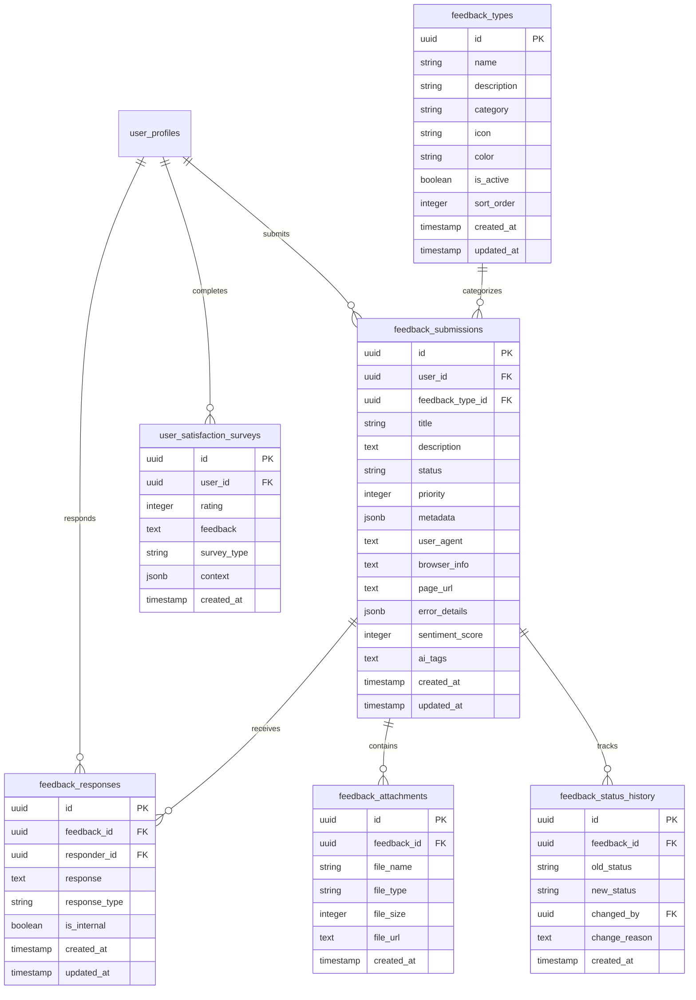
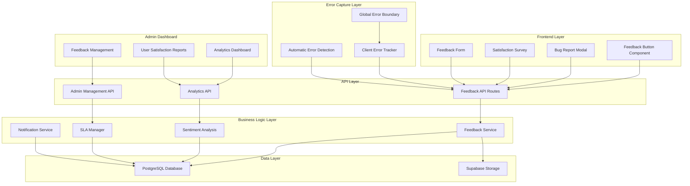
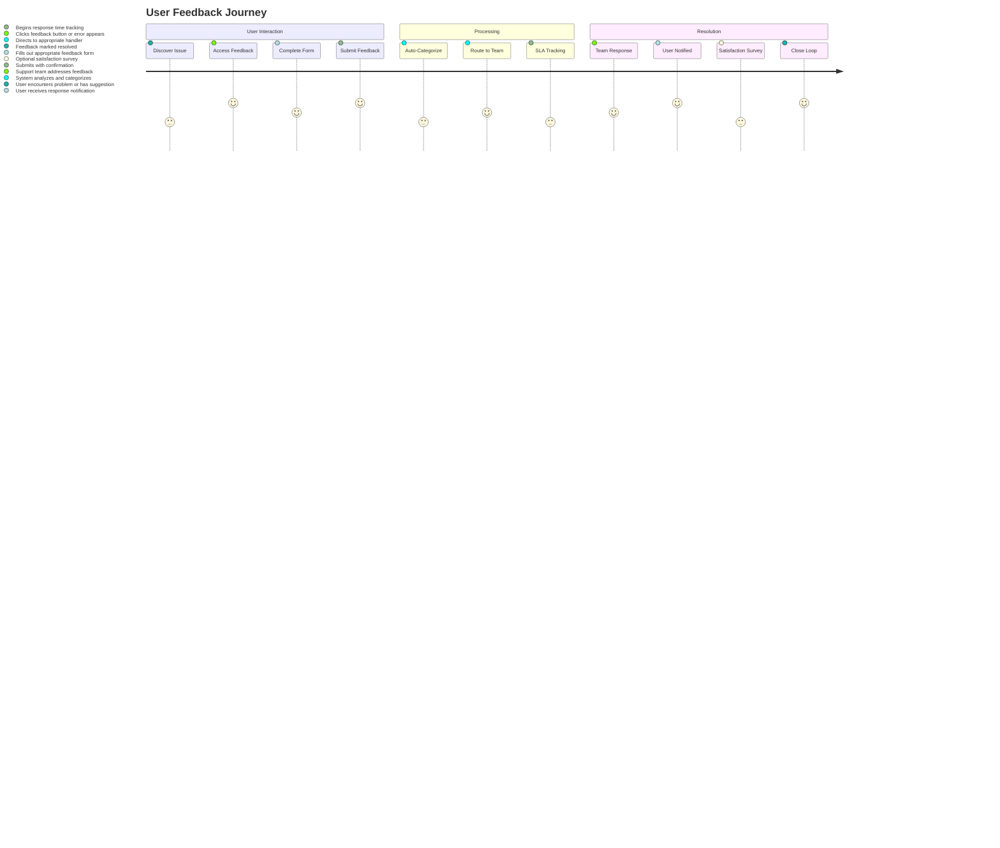

# User Feedback & Issue Tracking System Architecture

## 🎯 **System Overview**

This comprehensive User Feedback & Issue Tracking System provides enterprise-grade feedback management for SmartSlate Polaris v3, integrating seamlessly with the existing admin dashboard and user management system.

### **Core Capabilities**

- **Multi-channel Feedback Collection**: User forms, automated error capture, satisfaction surveys
- **Intelligent Categorization**: AI-powered sentiment analysis and automatic tagging
- **Workflow Management**: Status tracking, SLA monitoring, escalation rules
- **Analytics & Insights**: Real-time dashboards, trend analysis, reporting
- **Admin Integration**: Seamless integration with existing admin dashboard

## 📊 **Database Schema Design**

### **Entity Relationship Diagram**



### **Table Definitions**

#### **feedback_types**
Predefined feedback categories with customizable properties:
- Bug Report, Feature Request, General Feedback, UI/UX Issue, Performance Issue
- Customizable icons, colors, and sorting
- Active/inactive status management

#### **feedback_submissions**
Core feedback data with rich context:
- User association and type categorization
- Status workflow (open → in_progress → resolved → closed)
- Priority levels (1-5) for triage
- Rich metadata for context and automation
- Browser/environment information for debugging
- AI-powered sentiment analysis and tagging

#### **feedback_responses**
Threaded conversation system:
- Support team responses
- User replies and follow-ups
- Internal notes and collaboration
- Response type categorization

#### **feedback_attachments**
File management for screenshots and documents:
- Screenshot capture from error reporting
- Document uploads for detailed reports
- File type and size validation
- Integration with Supabase Storage

#### **user_satisfaction_surveys**
Customer satisfaction measurement:
- CSAT (Customer Satisfaction) scores
- NPS (Net Promoter Score) tracking
- Contextual survey triggers
- Correlation with specific features/actions

#### **feedback_status_history**
Complete audit trail:
- Status change tracking
- Attribution to responsible users
- Change reasoning and timestamps
- Compliance and audit requirements

## 🏗️ **System Architecture**

### **High-Level Architecture**



### **Component Architecture**

```
frontend/
├── components/
│   ├── feedback/
│   │   ├── FeedbackButton.tsx          # Floating action button
│   │   ├── FeedbackModal.tsx           # Main feedback form
│   │   ├── BugReportForm.tsx           # Bug-specific form
│   │   ├── SatisfactionSurvey.tsx      # User satisfaction survey
│   │   ├── ErrorBoundary.tsx           # Enhanced error boundary
│   │   ├── FeedbackProvider.tsx        # Context provider
│   │   ├── FeedbackCard.tsx            # Feedback display card
│   │   ├── FeedbackList.tsx            # Feedback listing component
│   │   └── FeedbackFilters.tsx         # Search and filters
│   └── admin/
│       └── feedback/
│           ├── FeedbackManager.tsx       # Admin management interface
│           ├── FeedbackAnalytics.tsx     # Analytics dashboard
│           ├── SatisfactionReports.tsx   # Satisfaction reports
│           ├── ResponseTemplates.tsx     # Quick response templates
│           └── SLADashboard.tsx         # SLA tracking
├── app/
│   ├── api/
│   │   ├── feedback/
│   │   │   ├── submit/route.ts         # Feedback submission
│   │   │   ├── [id]/route.ts          # Individual feedback
│   │   │   ├── analytics/route.ts      # Analytics data
│   │   │   └── admin/route.ts         # Admin operations
│   │   └── surveys/
│   │       └── satisfaction/route.ts    # Survey submission
│   ├── admin/
│   │   └── feedback/
│   │       ├── page.tsx                # Feedback management
│   │       ├── analytics/
│   │       │   └── page.tsx          # Analytics dashboard
│   │       ├── satisfaction/
│   │       │   └── page.tsx          # Satisfaction reports
│   │       └── [id]/
│   │           └── page.tsx            # Individual feedback view
│   └── (auth)/
│       └── feedback/
│           └── page.tsx               # User feedback history
└── lib/
    ├── feedback/
    │   ├── feedbackService.ts          # Core business logic
    │   ├── sentimentAnalysis.ts       # AI categorization
    │   ├── slaManager.ts             # SLA tracking
    │   ├── errorCapture.ts           # Error handling
    │   ├── notificationService.ts     # Notifications
    │   ├── responseTemplates.ts      # Template management
    │   └── analyticsService.ts       # Analytics calculations
    └── types/
        └── feedback.ts               # TypeScript definitions
```

## 🚀 **Key Features & Components**

### **1. User-Facing Feedback Collection**

#### **Feedback Button Component** (`/components/feedback/FeedbackButton.tsx`)
- **Smart Positioning**: Adaptive placement based on page content
- **Contextual Help**: Dynamic suggestions based on current page
- **Badge Notifications**: Unread response count indicators
- **Keyboard Shortcuts**: Power user accessibility (Ctrl+F / Cmd+F)
- **Mobile Optimized**: Touch-friendly interface

#### **Multi-Modal Feedback Forms** (`/components/feedback/FeedbackModal.tsx`)
- **General Feedback**: Suggestions, comments, general inquiries
- **Bug Report**: Structured bug reporting with error capture
- **Feature Request**: Detailed feature proposal with priority
- **Quick Feedback**: Simple rating + comment for rapid feedback
- **UI/UX Issue**: Specific interface and experience problems

#### **Automated Error Capture** (`/lib/feedback/errorCapture.ts`)
- **Global Error Boundary**: Catches all React errors
- **JavaScript Error Tracking**: Runtime error monitoring
- **Performance Issues**: Slow loading and interaction detection
- **User Confirmation**: Opt-in error reporting with privacy controls
- **Screenshot Capture**: Automatic screenshot on error (with permission)

### **2. Intelligent Processing**

#### **AI-Powered Categorization** (`/lib/feedback/sentimentAnalysis.ts`)
- **Sentiment Analysis**: Positive/negative/neutral scoring
- **Automatic Tagging**: Feature, component, and issue type detection
- **Priority Scoring**: Content-based priority recommendations
- **Duplicate Detection**: Similar feedback identification
- **Language Processing**: Multi-language support and translation

#### **SLA Management** (`/lib/feedback/slaManager.ts`)
- **Response Time Tracking**: First response and resolution times
- **Escalation Rules**: Automatic escalation for overdue items
- **Priority-Based Routing**: Intelligent assignment to appropriate teams
- **Automated Notifications**: Email and in-app notifications
- **Performance Metrics**: SLA compliance reporting

### **3. Admin Dashboard Integration**

#### **Feedback Management Interface** (`/app/admin/feedback/page.tsx`)
- **Comprehensive Listing**: All feedback with advanced filtering
- **Bulk Operations**: Mass status updates and assignments
- **Response Templates**: Quick response templates for common issues
- **Real-Time Updates**: Live status changes and notifications
- **Collaboration Tools**: Internal notes and team assignments

#### **Analytics Dashboard** (`/app/admin/feedback/analytics/page.tsx`)
- **Volume Trends**: Feedback submission over time
- **Sentiment Analysis**: Customer satisfaction trends
- **Category Distribution**: Issue type breakdown
- **Response Metrics**: Response time and resolution rates
- **User Correlation**: Feedback vs. user behavior patterns

#### **User Satisfaction Reports** (`/app/admin/feedback/satisfaction/page.tsx`)
- **CSAT Scores**: Customer satisfaction metrics
- **NPS Tracking**: Net Promoter Score over time
- **Trend Analysis**: Satisfaction trend identification
- **Feature Correlation**: Satisfaction by feature usage
- **Churn Prediction**: At-risk user identification

## 🔧 **Technical Implementation Details**

### **Database Migrations**

```sql
-- Migration: 0031_create_feedback_system.sql

-- Feedback Types Table
CREATE TABLE feedback_types (
    id UUID PRIMARY KEY DEFAULT gen_random_uuid(),
    name TEXT NOT NULL UNIQUE,
    description TEXT,
    category TEXT NOT NULL,
    icon TEXT,
    color TEXT DEFAULT '#6B7280',
    is_active BOOLEAN DEFAULT true,
    sort_order INTEGER DEFAULT 0,
    created_at TIMESTAMPTZ DEFAULT now(),
    updated_at TIMESTAMPTZ DEFAULT now()
);

-- Feedback Submissions Table
CREATE TABLE feedback_submissions (
    id UUID PRIMARY KEY DEFAULT gen_random_uuid(),
    user_id UUID REFERENCES auth.users(id) ON DELETE CASCADE,
    feedback_type_id UUID REFERENCES feedback_types(id),
    title TEXT NOT NULL,
    description TEXT,
    status TEXT DEFAULT 'open' CHECK (status IN ('open', 'in_progress', 'resolved', 'closed', 'duplicate')),
    priority INTEGER DEFAULT 3 CHECK (priority BETWEEN 1 AND 5),
    metadata JSONB DEFAULT '{}',
    user_agent TEXT,
    browser_info JSONB,
    page_url TEXT,
    error_details JSONB,
    sentiment_score INTEGER CHECK (sentiment_score BETWEEN -1 AND 1),
    ai_tags TEXT[],
    assigned_to UUID REFERENCES auth.users(id),
    created_at TIMESTAMPTZ DEFAULT now(),
    updated_at TIMESTAMPTZ DEFAULT now()
);

-- Feedback Responses Table
CREATE TABLE feedback_responses (
    id UUID PRIMARY KEY DEFAULT gen_random_uuid(),
    feedback_id UUID REFERENCES feedback_submissions(id) ON DELETE CASCADE,
    responder_id UUID REFERENCES auth.users(id) ON DELETE CASCADE,
    response TEXT NOT NULL,
    response_type TEXT DEFAULT 'comment' CHECK (response_type IN ('comment', 'internal_note', 'status_change')),
    is_internal BOOLEAN DEFAULT false,
    created_at TIMESTAMPTZ DEFAULT now(),
    updated_at TIMESTAMPTZ DEFAULT now()
);

-- Feedback Attachments Table
CREATE TABLE feedback_attachments (
    id UUID PRIMARY KEY DEFAULT gen_random_uuid(),
    feedback_id UUID REFERENCES feedback_submissions(id) ON DELETE CASCADE,
    file_name TEXT NOT NULL,
    file_type TEXT NOT NULL,
    file_size INTEGER NOT NULL,
    file_url TEXT NOT NULL,
    created_at TIMESTAMPTZ DEFAULT now()
);

-- User Satisfaction Surveys Table
CREATE TABLE user_satisfaction_surveys (
    id UUID PRIMARY KEY DEFAULT gen_random_uuid(),
    user_id UUID REFERENCES auth.users(id) ON DELETE CASCADE,
    rating INTEGER NOT NULL CHECK (rating BETWEEN 1 AND 5),
    feedback TEXT,
    survey_type TEXT NOT NULL DEFAULT 'general',
    context JSONB DEFAULT '{}',
    blueprint_id UUID REFERENCES blueprint_generator(id),
    created_at TIMESTAMPTZ DEFAULT now()
);

-- Feedback Status History Table
CREATE TABLE feedback_status_history (
    id UUID PRIMARY KEY DEFAULT gen_random_uuid(),
    feedback_id UUID REFERENCES feedback_submissions(id) ON DELETE CASCADE,
    old_status TEXT,
    new_status TEXT NOT NULL,
    changed_by UUID REFERENCES auth.users(id) ON DELETE CASCADE,
    change_reason TEXT,
    created_at TIMESTAMPTZ DEFAULT now()
);

-- Indexes for Performance
CREATE INDEX idx_feedback_submissions_user_id ON feedback_submissions(user_id);
CREATE INDEX idx_feedback_submissions_status ON feedback_submissions(status);
CREATE INDEX idx_feedback_submissions_created_at ON feedback_submissions(created_at DESC);
CREATE INDEX idx_feedback_submissions_priority ON feedback_submissions(priority);
CREATE INDEX idx_feedback_responses_feedback_id ON feedback_responses(feedback_id);
CREATE INDEX idx_satisfaction_surveys_user_id ON user_satisfaction_surveys(user_id);
CREATE INDEX idx_status_history_feedback_id ON feedback_status_history(feedback_id);

-- Row Level Security Policies
ALTER TABLE feedback_submissions ENABLE ROW LEVEL SECURITY;
ALTER TABLE feedback_responses ENABLE ROW LEVEL SECURITY;
ALTER TABLE feedback_attachments ENABLE ROW LEVEL SECURITY;
ALTER TABLE user_satisfaction_surveys ENABLE ROW LEVEL SECURITY;
ALTER TABLE feedback_status_history ENABLE ROW LEVEL SECURITY;

-- Users can see their own feedback
CREATE POLICY "Users can view own feedback" ON feedback_submissions
    FOR SELECT USING (auth.uid() = user_id);

-- Users can insert their own feedback
CREATE POLICY "Users can insert own feedback" ON feedback_submissions
    FOR INSERT WITH CHECK (auth.uid() = user_id);

-- Users can update their own feedback (limited fields)
CREATE POLICY "Users can update own feedback" ON feedback_submissions
    FOR UPDATE USING (auth.uid() = user_id);

-- Admin policies for full access
CREATE POLICY "Admins have full access to feedback" ON feedback_submissions
    FOR ALL USING (
        EXISTS (
            SELECT 1 FROM user_profiles 
            WHERE user_profiles.id = auth.uid() 
            AND user_profiles.user_role IN ('admin', 'developer')
        )
    );

-- Insert default feedback types
INSERT INTO feedback_types (name, description, category, icon, color, sort_order) VALUES
('Bug Report', 'Technical issues and errors', 'technical', 'bug', '#EF4444', 1),
('Feature Request', 'New feature suggestions', 'feature', 'lightbulb', '#3B82F6', 2),
('General Feedback', 'General comments and suggestions', 'general', 'message-square', '#6B7280', 3),
('UI/UX Issue', 'Interface and experience problems', 'design', 'palette', '#8B5CF6', 4),
('Performance Issue', 'Slow loading and performance problems', 'technical', 'clock', '#F59E0B', 5);
```

### **API Endpoints**

```typescript
// Feedback Submission Endpoints
POST   /api/feedback/submit              // Submit new feedback
GET    /api/feedback/user/:userId        // Get user's feedback history
GET    /api/feedback/:id                // Get specific feedback
PUT    /api/feedback/:id/status         // Update feedback status
POST   /api/feedback/:id/respond       // Add response to feedback
DELETE /api/feedback/:id               // Delete feedback (admin only)

// Analytics Endpoints
GET    /api/feedback/analytics/overview  // Overview statistics
GET    /api/feedback/analytics/trends    // Trend analysis data
GET    /api/feedback/analytics/satisfaction // Satisfaction metrics
GET    /api/feedback/analytics/categories // Category breakdown

// Admin Management Endpoints
GET    /api/admin/feedback             // List all feedback with filters
PUT    /api/admin/feedback/:id         // Update feedback (admin)
POST   /api/admin/feedback/bulk-update // Bulk status updates
GET    /api/admin/feedback/templates    // Response templates
POST   /api/admin/feedback/templates    // Create response template

// Survey Endpoints
POST   /api/surveys/satisfaction       // Submit satisfaction survey
GET    /api/surveys/user/:userId       // Get user's survey history
```

### **TypeScript Definitions**

```typescript
// lib/types/feedback.ts

export interface FeedbackType {
  id: string;
  name: string;
  description: string;
  category: 'technical' | 'feature' | 'general' | 'design';
  icon: string;
  color: string;
  is_active: boolean;
  sort_order: number;
  created_at: string;
  updated_at: string;
}

export interface FeedbackSubmission {
  id: string;
  user_id: string;
  feedback_type_id: string;
  title: string;
  description?: string;
  status: 'open' | 'in_progress' | 'resolved' | 'closed' | 'duplicate';
  priority: 1 | 2 | 3 | 4 | 5;
  metadata: Record<string, any>;
  user_agent?: string;
  browser_info?: Record<string, any>;
  page_url?: string;
  error_details?: Record<string, any>;
  sentiment_score?: number;
  ai_tags?: string[];
  assigned_to?: string;
  created_at: string;
  updated_at: string;
  
  // Relations
  feedback_type?: FeedbackType;
  responses?: FeedbackResponse[];
  attachments?: FeedbackAttachment[];
  status_history?: FeedbackStatusHistory[];
}

export interface FeedbackResponse {
  id: string;
  feedback_id: string;
  responder_id: string;
  response: string;
  response_type: 'comment' | 'internal_note' | 'status_change';
  is_internal: boolean;
  created_at: string;
  updated_at: string;
  
  // Relations
  responder?: {
    id: string;
    full_name: string;
    email: string;
    avatar_url?: string;
  };
}

export interface FeedbackAttachment {
  id: string;
  feedback_id: string;
  file_name: string;
  file_type: string;
  file_size: number;
  file_url: string;
  created_at: string;
}

export interface UserSatisfactionSurvey {
  id: string;
  user_id: string;
  rating: number;
  feedback?: string;
  survey_type: string;
  context: Record<string, any>;
  blueprint_id?: string;
  created_at: string;
}

export interface FeedbackStatusHistory {
  id: string;
  feedback_id: string;
  old_status?: string;
  new_status: string;
  changed_by: string;
  change_reason?: string;
  created_at: string;
}

export interface FeedbackAnalytics {
  total_submissions: number;
  open_feedback: number;
  in_progress_feedback: number;
  resolved_feedback: number;
  average_response_time: number;
  satisfaction_score: number;
  category_breakdown: Record<string, number>;
  sentiment_distribution: Record<string, number>;
  trend_data: Array<{
    date: string;
    submissions: number;
    resolved: number;
    satisfaction: number;
  }>;
}
```

## 🎨 **User Experience Design**

### **Feedback Submission Flow**



### **Component Design Principles**

1. **Accessibility First**: WCAG AA compliance, keyboard navigation
2. **Mobile Responsive**: Touch-friendly, optimized for all devices
3. **Progressive Enhancement**: Works without JavaScript, enhanced with it
4. **Performance Optimized**: Lazy loading, minimal bundle impact
5. **Privacy Respecting**: Clear consent, data minimization

## 📈 **Advanced Features**

### **1. Real-Time Updates**
- **WebSocket Integration**: Live feedback status updates
- **Push Notifications**: Browser notifications for responses
- **Live Collaboration**: Real-time admin team collaboration
- **Status Indicators**: Visual feedback for system state

### **2. Intelligent Automation**
- **Response Suggestions**: AI-powered response recommendations
- **Smart Routing**: Automatic assignment based on content and expertise
- **Duplicate Detection**: Automatic identification of similar feedback
- **Automated Follow-up**: Scheduled check-ins for unresolved issues

### **3. Advanced Analytics**
- **Predictive Analytics**: Issue trend prediction and forecasting
- **User Behavior Correlation**: Feedback vs. usage pattern analysis
- **Feature Popularity Scoring**: Demand-based feature prioritization
- **Churn Risk Assessment**: At-risk user identification

### **4. Integration Capabilities**
- **Slack/Discord Integration**: Team notifications and updates
- **Email Integration**: Automated email responses and updates
- **GitHub Integration**: Automatic issue creation for bugs
- **Third-party Tools**: Zendesk, Jira, and other support tools

## 🔐 **Security & Privacy**

### **Data Protection**
- **Row Level Security**: Users can only access their own feedback
- **PII Redaction**: Automatic removal of sensitive information
- **Data Encryption**: End-to-end encryption for sensitive data
- **Audit Logging**: Complete audit trail for all actions

### **Compliance**
- **GDPR Compliance**: Right to data export and deletion
- **CCPA Compliance**: California privacy law adherence
- **SOC 2 Ready**: Security controls for enterprise customers
- **Data Retention**: Automated data cleanup policies

### **Privacy Controls**
- **User Consent**: Clear opt-in for data collection
- **Granular Permissions**: Role-based access control
- **Data Minimization**: Collect only necessary information
- **Transparency**: Clear data usage policies

## ⚡ **Performance Considerations**

### **Frontend Optimization**
- **Lazy Loading**: Components loaded on demand
- **Code Splitting**: Minimal initial bundle size
- **Caching Strategy**: Intelligent caching of feedback data
- **Image Optimization**: Efficient attachment handling

### **Backend Optimization**
- **Database Indexing**: Optimized query performance
- **Connection Pooling**: Efficient database connections
- **CDN Integration**: Fast file delivery
- **Rate Limiting**: Protection against abuse

### **Monitoring**
- **Performance Metrics**: Real-time performance tracking
- **Error Monitoring**: Comprehensive error tracking
- **Usage Analytics**: System usage patterns
- **Health Checks**: System health monitoring

## 🔄 **Admin Dashboard Integration**

### **Navigation Integration**
The feedback system integrates seamlessly with the existing admin dashboard:

1. **Sidebar Addition**: New "Feedback" menu item with sub-items
2. **Overview Cards**: Feedback metrics on main dashboard
3. **User Profile Integration**: Feedback history in user management
4. **Notification Integration**: Feedback alerts in existing notification system
5. **Reporting Integration**: Feedback data in system reports

### **Admin Sidebar Updates**

```typescript
// Updated navItems in AdminSidebar.tsx
const navItems: NavItem[] = [
  { label: 'Overview', href: '/admin', icon: LayoutDashboard },
  { label: 'User Management', href: '/admin/users', icon: Users },
  { label: 'Feedback', href: '/admin/feedback', icon: MessageSquare, badge: '12' }, // New
  { label: 'Roles & Permissions', href: '/admin/roles', icon: Shield },
  { label: 'Cost Monitoring', href: '/admin/costs', icon: DollarSign },
  { label: 'Analytics', href: '/admin/analytics', icon: BarChart3 },
  { label: 'Alerts', href: '/admin/alerts', icon: Bell },
  { label: 'Reports', href: '/admin/reports', icon: FileText },
  { label: 'Database', href: '/admin/database', icon: Database },
  { label: 'Performance', href: '/admin/performance', icon: Zap },
  { label: 'Settings', href: '/admin/settings', icon: Settings },
];
```

### **Dashboard Overview Cards**

```typescript
// Additional metrics for admin dashboard overview
const feedbackMetrics = [
  {
    title: 'Pending Feedback',
    value: '23',
    change: '+5 this week',
    trend: 'up',
    icon: MessageSquare,
    color: 'text-orange-600 dark:text-orange-400',
    bgColor: 'bg-orange-50 dark:bg-orange-900/20',
  },
  {
    title: 'Avg Response Time',
    value: '2.4h',
    change: '-30min from last week',
    trend: 'down',
    icon: Clock,
    color: 'text-green-600 dark:text-green-400',
    bgColor: 'bg-green-50 dark:bg-green-900/20',
  },
  {
    title: 'Satisfaction Score',
    value: '4.6/5',
    change: '+0.2 from last month',
    trend: 'up',
    icon: Star,
    color: 'text-blue-600 dark:text-blue-400',
    bgColor: 'bg-blue-50 dark:bg-blue-900/20',
  },
];
```

## 🧪 **Testing Strategy**

### **Unit Testing**
- **Component Testing**: React component behavior
- **Service Testing**: Business logic validation
- **API Testing**: Endpoint functionality
- **Utility Testing**: Helper function validation

### **Integration Testing**
- **End-to-End Flows**: Complete user journeys
- **Database Integration**: Data persistence and retrieval
- **Third-party Integration**: External service connections
- **Admin Dashboard Integration**: System integration

### **Performance Testing**
- **Load Testing**: High-volume feedback submission
- **Stress Testing**: System limits and breaking points
- **Database Performance**: Query optimization validation
- **Frontend Performance**: Bundle size and loading times

## 📚 **Documentation & Training**

### **User Documentation**
- **Feedback Guide**: How to submit effective feedback
- **Bug Reporting**: Step-by-step bug report instructions
- **Feature Requests**: Template for feature suggestions
- **FAQ**: Common questions and answers

### **Admin Documentation**
- **Admin Guide**: Feedback management procedures
- **SLA Management**: Response time guidelines
- **Analytics Guide**: Understanding feedback metrics
- **Troubleshooting**: Common issues and solutions

### **Developer Documentation**
- **API Documentation**: Complete API reference
- **Component Library**: Reusable component documentation
- **Database Schema**: Detailed schema documentation
- **Integration Guide**: Third-party integration instructions

## 🚀 **Implementation Roadmap**

### **Phase 1: Foundation (Weeks 1-2)**
- Database schema and migrations
- Basic feedback submission API
- Simple feedback form component
- Admin dashboard integration

### **Phase 2: Core Features (Weeks 3-4)**
- Advanced feedback forms
- Automated error capture
- Basic analytics dashboard
- Response management system

### **Phase 3: Advanced Features (Weeks 5-6)**
- AI-powered categorization
- SLA management and escalation
- Satisfaction surveys
- Advanced analytics and reporting

### **Phase 4: Polish & Optimization (Weeks 7-8)**
- Performance optimization
- Advanced integrations
- Comprehensive testing
- Documentation and training

## 📋 **Success Metrics**

### **User Engagement**
- **Feedback Submission Rate**: Number of feedback submissions per user
- **User Satisfaction**: Average satisfaction scores
- **Response Time**: Average time to first response
- **Resolution Rate**: Percentage of feedback resolved

### **System Performance**
- **System Uptime**: Feedback system availability
- **Response Time**: API response times
- **Error Rate**: System error frequency
- **User Adoption**: Percentage of users using feedback system

### **Business Impact**
- **Issue Resolution**: Faster bug identification and fixing
- **Feature Prioritization**: Data-driven feature development
- **Customer Retention**: Improved customer satisfaction
- **Support Efficiency**: Reduced support ticket volume

This comprehensive User Feedback & Issue Tracking System will provide enterprise-grade feedback management while maintaining the high-quality user experience standards of SmartSlate Polaris v3. The modular architecture ensures scalability and maintainability while AI-powered features provide intelligent automation and insights.